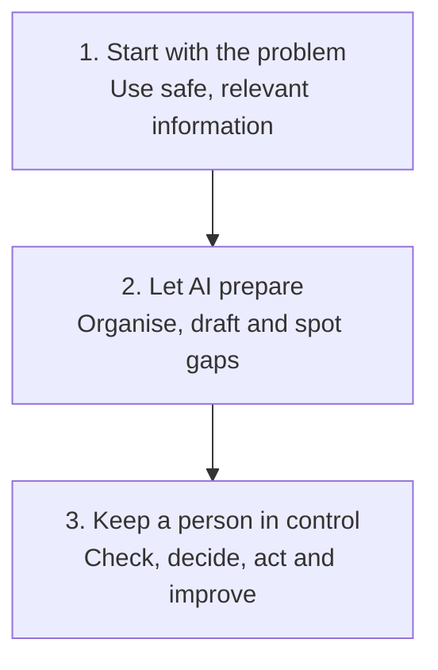

# Practical AI Sales Workflows

  
  
  

AI gets talked about a lot in sales. I wanted somewhere to document the things I have actually tried.

These are practical workflows for everyday sales jobs. Pick a problem, see what the workflow produces and use anything that helps.

> AI helps with the preparation. The salesperson is still responsible for the judgement.

**[Watch a skill actually work &rarr;](https://shaunmarsden.github.io/practical-ai-sales-workflows/)** See the real Northstar transcript turn into evidence-labelled output live, with every line traced back to where it came from, before reading anything else.

## 🧰 Set Up Your Own AI for Sales

Before anything else, most people get a fraction of what a modern AI tool can do because every conversation starts from a blank page. This works in Claude, ChatGPT, Gemini, Copilot, or anything else with a custom instructions or system prompt field. If Copilot is the only one your organisation gives you access to, that is a completely normal starting point, not a lesser one, and a lot of the people I actually speak with are in exactly that position.

**Start here:** [Fill in the About Me Worksheet](templates/about-me-worksheet.md) · [Copy the AI Sales Setup Prompt](templates/ai-sales-setup-prompt.md) · [Read where to paste it](guides/set-up-your-ai-for-sales.md)

Once that stops being enough on its own: [Get More From Your AI](guides/get-more-from-your-ai.md) covers projects and knowledge bases, turning repeated prompts into skills, and connecting real tools like a CRM or a transcription app.

**New here?** [Find your starting point](guides/where-to-start.md) based on how much you have actually used AI already, from never touched it to already building your own workflows.

## 🎯 Choose a Sales Problem

### 🔎 Find the Next Prospect

Pick a target and draft a first-touch message worth a reply, without a generic hook or a meeting-led ask.

**Use with AI:** [Plan outbound prospecting](.agents/skills/outbound-prospecting/SKILL.md)

### 📞 Prepare for a Sales Call

Pull scattered information into one short call card that you can scan during the conversation.

**Start here:** [Open the workflow](workflows/01-pre-call-preparation.md) · [See the Northstar example](examples/northstar-pre-call.md) · [Use the card template](templates/pre-call-card.md)

### ✉️ Follow Up After a Sales Call

Turn a transcript or clear notes into a summary, actions, email draft and CRM suggestions without inventing momentum.

**Start here:** [Open the workflow](workflows/02-post-call-follow-up.md) · [See the finished output](examples/northstar-post-call-output.md) · [Use the prompt](templates/post-call-follow-up-prompt.md)

**Use with AI:** [Learn what a sales AI skill is](guides/what-is-a-sales-ai-skill.md) · [Extract evidence from the call](.agents/skills/extract-post-call-evidence/SKILL.md) · [Draft the follow-up email](.agents/skills/draft-follow-up-email/SKILL.md)

### 📄 Build a Business Case

Turn call evidence into a tailored business case for the person who was not on the call.

**Use with AI:** [Build or audit a business case](.agents/skills/build-business-case/SKILL.md)

### 🔁 Chase a Quiet Prospect

Decide what, if anything, to send next, rather than working through a fixed run of increasingly persistent emails.

**Use with AI:** [Plan the chase sequence](.agents/skills/plan-chase-sequence/SKILL.md)

### 🙅 Handle an Objection

Diagnose what is actually driving a stated objection before answering it, rather than arguing with the surface wording.

**Use with AI:** [Respond to an objection](.agents/skills/objection-response/SKILL.md)

### 🤝 Hand Over an Opportunity

Pass the current position, evidence, risks and next action to another person without making the deal sound further along than it is.

**Start here:** [Open the workflow](workflows/03-opportunity-handover.md) · [See the Northstar handover](examples/northstar-opportunity-handover.md) · [Use the prompt](templates/opportunity-handover-prompt.md)

### 📪 Review a Lost Opportunity

Work out honestly whether a closed or stalled deal is actually over, or just blocked, before deciding whether there is a real way back in.

**Start here:** [Open the workflow](workflows/04-lost-opportunity-review.md) · [See the Northstar analysis](examples/northstar-lost-opportunity-analysis.md) · [Use the prompt](templates/lost-opportunity-review-prompt.md)

**Use with AI:** [Review a lost opportunity](.agents/skills/review-lost-opportunity/SKILL.md)

## 🧭 How I Approach It

The full approach is explained in the [methodology](METHODOLOGY.md), with the public data boundaries in [responsible use](RESPONSIBLE-USE.md).

New to using AI at work at all? Start with [getting started with AI](guides/getting-started-with-ai.md). The [writing style guide](guides/writing-style-and-formatting.md) is the standing tone and formatting reference behind every draft in this repository.

## 🧪 See One Complete Test

The Northstar example follows one fictional sales conversation from the call to the finished follow up.

**[Read the transcript](examples/northstar-post-call-transcript.md)** → **[See the finished output](examples/northstar-post-call-output.md)** → **[Read the honest review](evaluations/northstar-post-call-review.md)**

You can also score your own result using the [sales AI output rubric](evaluations/sales-ai-output-rubric.md).

Curious whether the model actually matters? [See the same test run cold in Claude, ChatGPT and Gemini](evaluations/cross-model-post-call-comparison.md), scored the same way.

## 🛡️ Rules That Matter

- Keep facts, estimates and assumptions separate
- Do not invent commitments, dates or customer intent
- Keep sensitive information out of unapproved tools
- Require a person to approve emails and CRM changes

## About Me

I am Shaun Marsden and I work in B2B sales. I am using this project to learn what AI is genuinely useful for in the job and to share the things worth keeping.

This is an independent learning project. Every company, person and conversation in the examples is fictional.

## What I Want to Try Next

- ~~Compare the same workflow in ChatGPT, Claude and Gemini~~ — [done](evaluations/cross-model-post-call-comparison.md), worth repeating with a messier transcript before drawing a real conclusion
- Make CRM and pipeline reviews less painful
- Test a handover with conflicting notes and a change of contact
- Find sensible ways to measure time saved and output quality
