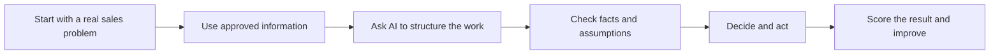

# Practical AI Sales Workflows

  
  
  

AI gets talked about a lot in sales. I wanted somewhere to document the things I have actually tried.

This project is a collection of workflows for the everyday parts of B2B sales, such as preparing for calls, writing follow up and keeping CRM records useful.

> The aim is simple: use AI where it genuinely helps, keep a person responsible for the important decisions and be honest about what works.

## 🧭 How I Approach It

AI can organise information, spot gaps and produce a useful first draft. The salesperson is still responsible for checking it and deciding what to do.

The full approach is explained in the [methodology](METHODOLOGY.md), with the public data boundaries in [responsible use](RESPONSIBLE-USE.md).

## 📚 Workflow Library

| Workflow | The Problem | What You Can Use | Status |
| --- | --- | --- | --- |
| [AI Pre Call Preparation](workflows/01-pre-call-preparation.md) | Useful information is scattered and preparation takes too long | [Card template](templates/pre-call-card.md) and [Northstar example](examples/northstar-pre-call.md) | Ready |
| [Post Call Follow Up](workflows/02-post-call-follow-up.md) | Facts, actions, emails and CRM notes become inconsistent | [Reusable prompt](templates/post-call-follow-up-prompt.md), [transcript](examples/northstar-post-call-transcript.md) and [worked output](examples/northstar-post-call-output.md) | Ready to test |
| Opportunity Handover | Important context gets lost between stages or people | Coming next | Planned |

## 🧪 The First Post Call Test

The Northstar example follows one fictional sales conversation from preparation to follow up.

1. Read the [pre call example](examples/northstar-pre-call.md).
2. Read the [fictional call transcript](examples/northstar-post-call-transcript.md).
3. Try the [Post Call Follow Up prompt](templates/post-call-follow-up-prompt.md).
4. Compare your result with the [worked output](examples/northstar-post-call-output.md).
5. Score it using the [sales AI output rubric](evaluations/sales-ai-output-rubric.md).
6. Read my [test review and lessons](evaluations/northstar-post-call-review.md).

## 🛡️ Things I Will Not Compromise On

- Start with a real problem
- Keep facts, estimates and assumptions separate
- Do not invent commitments, dates or customer intent
- Keep sensitive information out of unapproved tools
- Require a person to approve emails and CRM changes
- Measure whether the new process is actually better

## About Me

I am Shaun Marsden and I work in B2B sales. I am using this project to learn what AI is genuinely useful for in the job and to share the things worth keeping.

This is an independent learning project. Every company, person and conversation in the examples is fictional.

## What I Want to Try Next

- Compare the same workflow in ChatGPT, Claude and Gemini
- Build a better opportunity handover
- Make CRM and pipeline reviews less painful
- Find sensible ways to measure time saved and output quality
