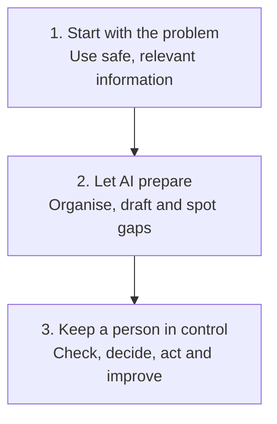

# Practical AI Sales Workflows

  
  
  

AI gets talked about a lot in sales. I wanted somewhere to document the things I have actually tried.

These are practical workflows for everyday sales jobs. Pick a problem, see what the workflow produces and use anything that helps.

> AI helps with the preparation. The salesperson is still responsible for the judgement.

## 🎯 Choose a Sales Problem

### 📞 Prepare for a Sales Call

Pull scattered information into one short call card that you can scan during the conversation.

**Start here:** [Open the workflow](workflows/01-pre-call-preparation.md) · [See the Northstar example](examples/northstar-pre-call.md) · [Use the card template](templates/pre-call-card.md)

### ✉️ Follow Up After a Sales Call

Turn a transcript or clear notes into a summary, actions, email draft and CRM suggestions without inventing momentum.

**Start here:** [Open the workflow](workflows/02-post-call-follow-up.md) · [See the finished output](examples/northstar-post-call-output.md) · [Use the prompt](templates/post-call-follow-up-prompt.md)

**Use with AI:** [Learn what a sales AI skill is](guides/what-is-a-sales-ai-skill.md) · [View the portable evidence skill](.agents/skills/extract-post-call-evidence/SKILL.md)

### 🤝 Hand Over an Opportunity

Keep the important context when an opportunity moves between stages or people.

**Status:** Coming next

## 🧭 How I Approach It

The full approach is explained in the [methodology](METHODOLOGY.md), with the public data boundaries in [responsible use](RESPONSIBLE-USE.md).

## 🧪 See One Complete Test

The Northstar example follows one fictional sales conversation from the call to the finished follow up.

**[Read the transcript](examples/northstar-post-call-transcript.md)** → **[See the finished output](examples/northstar-post-call-output.md)** → **[Read the honest review](evaluations/northstar-post-call-review.md)**

You can also score your own result using the [sales AI output rubric](evaluations/sales-ai-output-rubric.md).

## 🛡️ Rules That Matter

- Keep facts, estimates and assumptions separate
- Do not invent commitments, dates or customer intent
- Keep sensitive information out of unapproved tools
- Require a person to approve emails and CRM changes

## About Me

I am Shaun Marsden and I work in B2B sales. I am using this project to learn what AI is genuinely useful for in the job and to share the things worth keeping.

This is an independent learning project. Every company, person and conversation in the examples is fictional.

## What I Want to Try Next

- Compare the same workflow in ChatGPT, Claude and Gemini
- Build a better opportunity handover
- Make CRM and pipeline reviews less painful
- Find sensible ways to measure time saved and output quality
