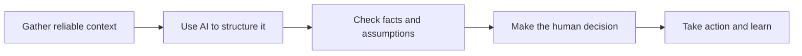

# Practical AI Sales Workflows

Human-led AI workflows for real B2B sales work.

This repository shows practical ways salespeople can use AI to reduce administration, prepare more effectively and follow up consistently—without handing judgement or customer relationships over to automation.

## Why this exists

Sales teams hear a lot about what AI *could* do. This project focuses on the work that actually fills a salesperson's day:

- Researching accounts and contacts
- Preparing for calls
- Turning conversations into clear next steps
- Writing relevant follow-up
- Keeping CRM records useful
- Handing opportunities over without losing context

Each workflow starts with a real sales problem and provides a repeatable process, a reusable template and a fictional worked example.

## The workflow library

| Workflow | Problem | Status |
| --- | --- | --- |
| [AI pre-call preparation](workflows/01-pre-call-preparation.md) | Useful context is scattered and call preparation takes too long | Ready |
| Post-call follow-up | Notes, actions and emails are inconsistent | Planned |
| Opportunity handover | Important context gets lost between stages or people | Planned |

## How the approach works

AI is used to organise information, suggest useful questions and draft material. The salesperson remains responsible for accuracy, judgement and the decision to act.

## Start here

1. Read the [AI pre-call preparation workflow](workflows/01-pre-call-preparation.md).
2. Copy the [pre-call card template](templates/pre-call-card.md).
3. Compare it with the [fictional worked example](examples/harbour-pine-pre-call.md).
4. Adapt it to your role, sales motion and approved tools.

## Principles

- **Useful beats impressive.** Solve a recurring sales problem before adding complexity.
- **Evidence before invention.** Separate confirmed facts from assumptions.
- **Human judgement stays in the loop.** AI prepares; the salesperson decides.
- **Minimum necessary data.** Do not paste confidential customer or company information into unapproved tools.
- **Measure the workflow.** Track whether it saves time or improves consistency.

## About me

I'm Shaun Marsden, a sales operator exploring practical ways AI can improve everyday B2B sales work. I share working processes, templates and lessons from building AI-assisted sales workflows.

This is an independent learning project. All examples are fictional and should be adapted to your organisation's policies, systems and sales process.

## What's next

- Post-call transcript to actions and follow-up
- Opportunity handover pack
- CRM hygiene and pipeline review
- Responsible workflow measurement

