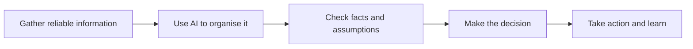
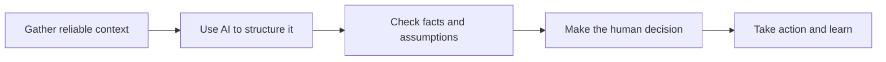

# Practical AI Sales Workflows

AI gets talked about a lot in sales. I wanted somewhere to document the things I have actually tried.

This project is a collection of workflows for the everyday parts of B2B sales, such as preparing for calls, writing follow up and keeping CRM records up to date.

The aim is simple: use AI where it genuinely helps, keep a person responsible for the important decisions and be honest about what works.

## Why I Started This

A lot of AI advice sounds impressive but does not say much about how to use it during a normal working day.

I am more interested in questions like:

- Can this save me time before a call?
- Can it help me remember the important follow up?
- Can it reduce repetitive administration?
- Can I trust the output?
- Is the new process actually better than the old one?

Each workflow starts with a real sales problem. I then share the process, a template you can copy and an example of how it works.

## Workflow Library

| Workflow | The Problem | Status |
| --- | --- | --- |
| [AI Pre Call Preparation](workflows/01-pre-call-preparation.md) | Useful information is scattered and preparing properly takes too long | Ready |
| Post Call Follow Up | Notes, actions and emails are inconsistent | Planned |
| Opportunity Handover | Important context gets lost between stages or people | Planned |

## How I Approach It

AI can organise information, suggest questions and produce a useful first draft. The salesperson is still responsible for checking it and deciding what to do.

## Start Here

1. Read the [AI Pre Call Preparation workflow](workflows/01-pre-call-preparation.md).
2. Copy the [Pre Call Card template](templates/pre-call-card.md).
3. Look at the [fictional worked example](examples/northstar-pre-call.md).
4. Adapt it to your job, your sales process and the tools your company allows.

## Things I Will Not Compromise On

- The workflow needs to solve a real problem
- Facts and assumptions need to be clearly separated
- A person makes the final decision
- Sensitive information stays out of unapproved tools
- A new process should save time or improve the result

## About Me

I am Shaun Marsden and I work in B2B sales. I am using this project to learn what AI is genuinely useful for in the job and to share the things worth keeping.

This is an independent learning project. The examples are fictional, so anything here should be adapted to your own company, systems and policies.

## What I Want to Try Next

- Turning call notes into actions and follow up
- Building a better opportunity handover
- Making CRM and pipeline reviews less painful
- Finding a sensible way to measure the time saved
# Practical AI Sales Workflows

Human-led AI workflows for real B2B sales work.

This repository shows practical ways salespeople can use AI to reduce administration, prepare more effectively and follow up consistently, without handing judgement or customer relationships over to automation.

## Why This Exists

Sales teams hear a lot about what AI *could* do. This project focuses on the work that actually fills a salesperson's day:

- Researching accounts and contacts
- Preparing for calls
- Turning conversations into clear next steps
- Writing relevant follow-up
- Keeping CRM records useful
- Handing opportunities over without losing context

Each workflow starts with a real sales problem and provides a repeatable process, a reusable template and a fictional worked example.

## The Workflow Library

| Workflow | Problem | Status |
| --- | --- | --- |
| [AI Pre Call Preparation](workflows/01-pre-call-preparation.md) | Useful context is scattered and call preparation takes too long | Ready |
| Post Call Follow Up | Notes, actions and emails are inconsistent | Planned |
| Opportunity Handover | Important context gets lost between stages or people | Planned |

## How the Approach Works

AI is used to organise information, suggest useful questions and draft material. The salesperson remains responsible for accuracy, judgement and the decision to act.

## Start Here

1. Read the [AI Pre Call Preparation workflow](workflows/01-pre-call-preparation.md).
2. Copy the [Pre Call Card template](templates/pre-call-card.md).
3. Compare it with the [fictional worked example](examples/northstar-pre-call.md).
4. Adapt it to your role, sales motion and approved tools.

## Principles

- **Useful beats impressive.** Solve a recurring sales problem before adding complexity.
- **Evidence before invention.** Separate confirmed facts from assumptions.
- **Human judgement stays in the loop.** AI prepares; the salesperson decides.
- **Minimum necessary data.** Do not paste confidential customer or company information into unapproved tools.
- **Measure the workflow.** Track whether it saves time or improves consistency.

## About Me

I'm Shaun Marsden, a sales operator exploring practical ways AI can improve everyday B2B sales work. I share working processes, templates and lessons from building AI-assisted sales workflows.

This is an independent learning project. All examples are fictional and should be adapted to your organisation's policies, systems and sales process.

## What's Next

- Post-call transcript to actions and follow-up
- Opportunity handover pack
- CRM hygiene and pipeline review
- Responsible workflow measurement
