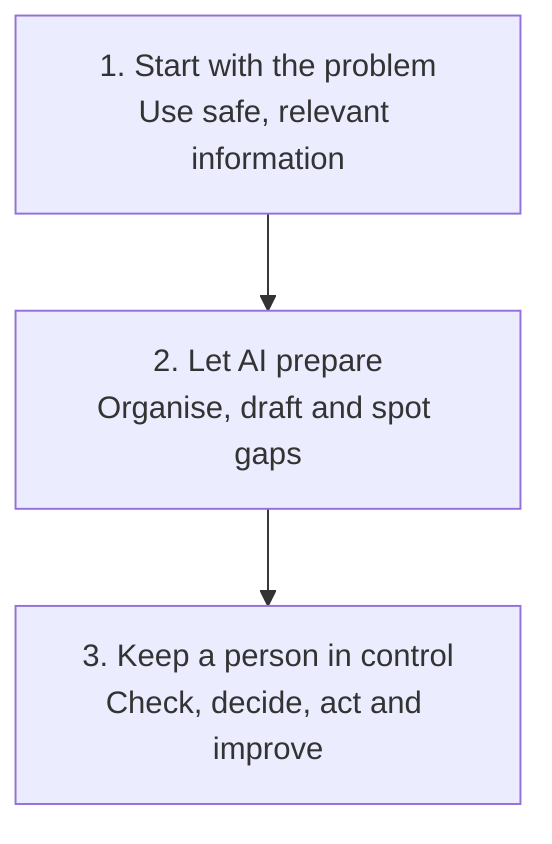

# Practical AI Sales Workflows

  
  
  

AI gets talked about a lot in sales. I wanted somewhere to document the things I have actually tried.

These are practical workflows for everyday sales jobs. Pick a problem, see what the workflow produces and use anything that helps.

> AI helps with the preparation. The salesperson is still responsible for the judgement.

**Want the repository to guide you?** Open it in Codex or Claude Code and say "help me get started". The agent can give you a tour, set up private sales context, run a fictional example or route you to the right workflow. [See the simple guide](guides/run-this-repository-with-an-ai-coding-agent.md).

## 🧭 Three Ways to Start

**🌱 New to AI, or want to set it up properly first?** [Find your starting point](guides/where-to-start.md) based on how much you have actually used AI already, then [fill in the About Me Worksheet](templates/about-me-worksheet.md) and [copy the setup prompt](templates/ai-sales-setup-prompt.md), or skip the worksheet and use the [interactive setup prompt](templates/interactive-setup-prompt.md), which asks you the same questions in conversation and writes the finished prompt for you. This works in Claude, ChatGPT, Gemini, Copilot, or anything else with a custom instructions field. If Copilot is the only one your organisation gives you access to, that is a completely normal starting point, not a lesser one.

**🎯 Know the sales problem you want help with?** Jump straight to [Choose a Sales Problem](#-choose-a-sales-problem) below and pick from prospecting, call prep, follow-up, business case, chasing, objections, handover, or a lost-opportunity review.

**🧪 Want to see it work before you read anything else?** [Watch a skill actually work &rarr;](https://shaunmarsden.github.io/practical-ai-sales-workflows/). It shows the fictional Northstar transcript turning into evidence-labelled output, live, with every line traced back to where it came from. Then check the [honest scores](evaluations/sales-ai-output-rubric.md) and the [cross-model comparison](evaluations/cross-model-post-call-comparison.md) rather than taking the demo's word for it.

Once a single setup prompt stops being enough on its own, [Get More From Your AI](guides/get-more-from-your-ai.md) covers projects and knowledge bases, turning repeated prompts into skills, and connecting real tools like a CRM or a transcription app.

## 🎯 Choose a Sales Problem

### 🔎 Find the Next Prospect

Pick a target and draft a first-touch message worth a reply, without a generic hook or a meeting-led ask.

**Use with AI:** [Plan outbound prospecting](.agents/skills/outbound-prospecting/SKILL.md)

### 📞 Prepare for a Sales Call

Pull scattered information into one short call card that you can scan during the conversation.

**Start here:** [Open the workflow](workflows/01-pre-call-preparation.md) · [See the Northstar example](examples/northstar-pre-call.md) · [Use the card template](templates/pre-call-card.md)

### ✉️ Follow Up After a Sales Call

Turn a transcript or clear notes into a summary, actions, email draft and CRM suggestions without inventing momentum.

**Start here:** [Open the workflow](workflows/02-post-call-follow-up.md) · [See the finished output](examples/northstar-post-call-output.md) · [Use the prompt](templates/post-call-follow-up-prompt.md)

**Use with AI:** [Learn what a sales AI skill is](guides/what-is-a-sales-ai-skill.md) · [Extract evidence from the call](.agents/skills/extract-post-call-evidence/SKILL.md) · [Draft the follow-up email](.agents/skills/draft-follow-up-email/SKILL.md)

### 📄 Build a Business Case

Turn call evidence into a tailored business case for the person who was not on the call.

**Start here:** [See the Northstar transcript](examples/northstar-business-case-transcript.md) · [See the finished business case](examples/northstar-business-case-output.md) · [Read the honest review](evaluations/northstar-business-case-review.md)

**A second, different test:** [See the Bramfield transcript](examples/bramfield-business-case-transcript.md) · [See the finished business case](examples/bramfield-business-case-output.md) · [Read the honest review](evaluations/bramfield-business-case-review.md): a conditional two-year price instead of a flat figure, and a Finance Director reader who was never on a call

**Use with AI:** [Build or audit a business case](.agents/skills/build-business-case/SKILL.md)

### 🔁 Chase a Quiet Prospect

Decide what, if anything, to send next, rather than working through a fixed run of increasingly persistent emails.

**Use with AI:** [Plan the chase sequence](.agents/skills/plan-chase-sequence/SKILL.md)

### 🙅 Handle an Objection

Diagnose what is actually driving a stated objection before answering it, rather than arguing with the surface wording.

**Start here:** [Open the workflow](workflows/05-objection-handling.md) · [See the Northstar response](examples/northstar-objection-response.md) · [Use the prompt](templates/objection-handling-prompt.md)

**Use with AI:** [Respond to an objection](.agents/skills/objection-response/SKILL.md)

### 🕰️ Move a Stalled Decision

Help a willing buyer who keeps delaying the final yes, by making the decision safer rather than selling harder, once you have confirmed it is genuine indecision and not something else.

**Start here:** [Open the workflow](workflows/07-buyer-indecision.md) · [See the Calderwood scenario](examples/calderwood-indecision-input.md) · [See the completed response](examples/calderwood-indecision-response.md) · [Use the prompt](templates/buyer-indecision-prompt.md)

**Use with AI:** [Identify buyer indecision](.agents/skills/identify-buyer-indecision/SKILL.md), a diagnosis-only skill that pairs with the prompt above

### 🤝 Hand Over an Opportunity

Pass the current position, evidence, risks and next action to another person without making the deal sound further along than it is.

**Start here:** [Open the workflow](workflows/03-opportunity-handover.md) · [See the Northstar handover](examples/northstar-opportunity-handover.md) · [Use the prompt](templates/opportunity-handover-prompt.md)

### 📪 Review a Lost Opportunity

Work out honestly whether a closed or stalled deal is actually over, or just blocked, before deciding whether there is a real way back in.

**Start here:** [Open the workflow](workflows/04-lost-opportunity-review.md) · [See the Northstar analysis](examples/northstar-lost-opportunity-analysis.md) · [Use the prompt](templates/lost-opportunity-review-prompt.md)

**Use with AI:** [Review a lost opportunity](.agents/skills/review-lost-opportunity/SKILL.md)

### 📊 Review Your Pipeline

Check whether the stages, close dates and next steps in your CRM are actually supported by the evidence you hold, rather than trusting the pipeline because it is written down.

**Start here:** [Open the workflow](workflows/06-pipeline-evidence-review.md) · [See the fictional pipeline snapshot](examples/fictional-pipeline-snapshot.md) · [See the completed review](examples/fictional-pipeline-review.md) · [Use the prompt](templates/pipeline-evidence-review-prompt.md)

## 🧭 How I Approach It

The full approach is explained in the [methodology](METHODOLOGY.md), with the public data boundaries in [responsible use](RESPONSIBLE-USE.md). [Contributing](CONTRIBUTING.md) sets out when a workflow or skill actually counts as complete.

New to using AI at work at all? Start with [getting started with AI](guides/getting-started-with-ai.md). The [writing style guide](guides/writing-style-and-formatting.md) is the standing tone and formatting reference behind every draft in this repository.

## 🧪 See One Complete Test

The Northstar example follows one fictional sales conversation from the call to the finished follow up.

**[Read the transcript](examples/northstar-post-call-transcript.md)** → **[See the finished output](examples/northstar-post-call-output.md)** → **[Read the honest review](evaluations/northstar-post-call-review.md)**

You can also score your own result using the [sales AI output rubric](evaluations/sales-ai-output-rubric.md).

Curious whether the model actually matters? [See the same test run cold in Claude, ChatGPT and Gemini](evaluations/cross-model-post-call-comparison.md), scored the same way.

## 🛡️ Rules That Matter

- Keep facts, estimates and assumptions separate
- Do not invent commitments, dates or customer intent
- Keep sensitive information out of unapproved tools
- Require a person to approve emails and CRM changes

## About Me

I am Shaun Marsden and I work in B2B sales. I am using this project to learn what AI is genuinely useful for in the job and to share the things worth keeping.

This is an independent learning project. Every company, person and conversation in the examples is fictional.

## What I Want to Try Next

**Right now:** real usability feedback, getting even one or two actual salespeople to try a workflow and say honestly whether it saved time or just moved the work around, rather than trusting my own judgement of my own output.

**After that:**

- CRM hygiene (duplicates, ownership, stale records), building on the pipeline evidence review already here
- A genuine way to measure time saved and output quality, not just assume a workflow helps because it reads well
- Purposeful visuals for sharing, a social preview card and a cross-model comparison graphic, best done as a concentrated session rather than squeezed in

See [ROADMAP.md](ROADMAP.md) for the full picture, including the longer backlog of ideas still to validate.
