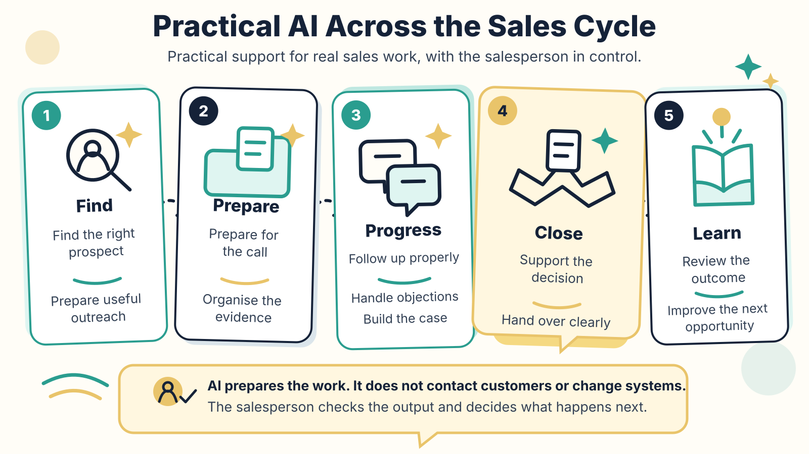

# Practical AI Sales Workflows

  
  
  
  

AI gets talked about a lot in sales. I wanted somewhere to document the things I have actually tried.

These are practical workflows for everyday sales jobs. Pick a problem, see what the workflow produces and use anything that helps.

> AI helps with the preparation. The salesperson is still responsible for the judgement.

**Not sure where to begin?** [Find the starting point that sounds most like you](guides/where-to-start.md). You can start from scratch, see a finished example or go straight to a sales problem. You do not need any technical knowledge.

## 📑 Contents

- [Three Ways to Start](#-three-ways-to-start)
- [Choose a Sales Problem](#-choose-a-sales-problem)
- [Give Me Blunt Feedback](#-give-me-blunt-feedback)
- [How I Approach It](#-how-i-approach-it)
- [What Has Actually Been Tested](#-what-has-actually-been-tested)
- [See One Complete Test](#-see-one-complete-test)
- [Rules That Matter](#-rules-that-matter)
- [About Me](#about-me)
- [What I Want to Try Next](#what-i-want-to-try-next)

## 🧭 Three Ways to Start

**🌱 Want help setting up your AI for sales?** [Start with the simple setup guide](guides/set-up-your-ai-for-sales.md). It works with ChatGPT, Claude, Gemini, Copilot and other general AI tools.

**🎯 Know the sales problem you want help with?** Jump straight to [Choose a Sales Problem](#-choose-a-sales-problem) below and pick from prospecting, call prep, follow-up, business case, objections, or pipeline review, the six featured there, or [browse all sixteen](recipes/README.md) for chasing, handover, a lost-opportunity review and more. Not sure which one actually fits, or two sound similar? The [workflow router](guides/workflow-router.md) reads your situation in plain English and hands off to the right one. Would rather start from your own job title? [Choose your route by role](guides/role-based-routes.md) instead.

**🧪 Want to see it work before you read anything else?** [Watch a skill actually work &rarr;](https://shaunmarsden.github.io/practical-ai-sales-workflows/). It shows the fictional Hartwell transcript turning into evidence-labelled output, live, with every line traced back to where it came from. Then check the [honest scores](evaluations/sales-ai-output-rubric.md) and the [cross-model comparison](evaluations/cross-model-post-call-comparison.md) rather than taking the demo's word for it.

Once a single setup prompt stops being enough on its own, [Get More From Your AI](guides/get-more-from-your-ai.md) covers projects and knowledge bases, turning repeated prompts into skills, and connecting real tools like a CRM or a transcription app.

Already coordinating several workflows and approved connected tools? [Build an Approval-Gated Sales Copilot](guides/build-an-approval-gated-sales-copilot.md) shows the composition method, reusable template, fictional test and evidence boundary.

**Already use Codex or Claude Code?** The repository can guide you, set up private sales context, run a fictional example or route you to the right workflow. [See the coding agent guide](guides/run-this-repository-with-an-ai-coding-agent.md).

## 🎯 Choose a Sales Problem

These are six useful places to begin, not a ranking. Want a different sales job? [Browse all sixteen one-page recipe cards](recipes/README.md), or [open the printable cheat sheet](https://shaunmarsden.github.io/practical-ai-sales-workflows/cheat-sheet.html).

The visual shows the main sales cycle. Some jobs, including pipeline review, run alongside it rather than at one particular stage.

### 🔎 Find the Next Prospect

Pick a target and draft a first-touch message worth a reply, without a generic hook or a meeting-led ask.

**Start here:** [Open the one-page recipe card](recipes/find-the-next-prospect.md)

### 📞 Prepare for a Sales Call

Pull scattered information into one short call card that you can scan during the conversation.

**Start here:** [Open the one-page recipe card](recipes/prepare-for-a-sales-call.md)

### ✉️ Follow Up After a Sales Call

Turn a transcript or clear notes into a summary, actions, email draft and CRM suggestions without inventing momentum.

**Start here:** [Open the one-page recipe card](recipes/follow-up-after-a-sales-call.md)

### 📄 Build a Business Case

Turn call evidence into a tailored business case for the person who was not on the call.

**Start here:** [Open the one-page recipe card](recipes/build-a-business-case.md)

### 🙅 Handle an Objection

Diagnose what is actually driving a stated objection before answering it, rather than arguing with the surface wording.

**Start here:** [Open the one-page recipe card](recipes/handle-an-objection.md)

### 📊 Review Your Pipeline

Check whether the stages, close dates and next steps in your CRM are actually supported by the evidence you hold, rather than trusting the pipeline because it is written down.

**Start here:** [Open the one-page recipe card](recipes/review-your-pipeline.md)

Looking for chasing, fit checking, champion support, handover, CRM hygiene, weekly reporting or another job? [Browse all sixteen recipe cards](recipes/README.md).

## 💬 Give Me Blunt Feedback

Tried one of the workflows? Tell me what worked, where you got stuck and the one thing you would change. The private form takes about two minutes and does not collect your email address automatically. For public feedback, you can now use the [structured feedback template](https://github.com/shaunmarsden/practical-ai-sales-workflows/issues/new?template=workflow-feedback.md) or start a discussion.

**[Give Quick Private Feedback &rarr;](https://docs.google.com/forms/d/e/1FAIpQLSdBC8yOUiylKemlvzrZc2FJ9QD0Pjz592ebPaItAubBRwCUbA/viewform)** · **[Share Public Feedback &rarr;](https://github.com/shaunmarsden/practical-ai-sales-workflows/discussions/new?category=feedback)**

Please do not include customer, employer or confidential information.

Want to go deeper? The [structured usability test](evaluations/usability-test-round-one.md) is there for people happy to spend longer working through one task.

**You Said, I Changed:** feedback should lead somewhere visible. I will keep a public [visitor feedback log](evaluations/visitor-feedback-log.md) showing what people found, what changed and anything I chose not to change.

## 🧭 How I Approach It

The full approach is explained in the [methodology](METHODOLOGY.md), with the public data boundaries in [responsible use](RESPONSIBLE-USE.md). [Contributing](CONTRIBUTING.md) sets out when a workflow or skill actually counts as complete.

New to using AI at work at all? Start with [getting started with AI](guides/getting-started-with-ai.md). The [writing style guide](guides/writing-style-and-formatting.md) is the standing tone and formatting reference behind every draft in this repository.

## 🔬 What Has Actually Been Tested

Available does not mean proven. The [evidence-status matrix](EVIDENCE-STATUS.md) shows which of the sixteen jobs has a workflow, a reusable skill, a fictional test, evidence from real sales work or independent use.

The biggest gap is visible on purpose: nobody has used the [feedback form](https://docs.google.com/forms/d/e/1FAIpQLSdBC8yOUiylKemlvzrZc2FJ9QD0Pjz592ebPaItAubBRwCUbA/viewform) or [Discussions](https://github.com/shaunmarsden/practical-ai-sales-workflows/discussions) yet. A single honest line from someone who tried one workflow, however short, counts.

## 🧪 See One Complete Test

The Hartwell example follows one fictional sales conversation from the call to the finished follow up.

**[Read the transcript](examples/hartwell-post-call-transcript.md)** → **[See the finished output](examples/hartwell-post-call-output.md)** → **[Read the honest review](evaluations/hartwell-post-call-review.md)**

You can also score your own result using the [sales AI output rubric](evaluations/sales-ai-output-rubric.md), and [log your own time saved](guides/measure-time-and-quality.md) rather than assuming a workflow helps because it reads well.

Curious whether the model actually matters? [See the same test run cold in Claude, ChatGPT and Gemini](evaluations/cross-model-post-call-comparison.md), scored the same way.

## 🛡️ Rules That Matter

- Keep facts, estimates and assumptions separate
- Do not invent commitments, dates or customer intent
- Keep sensitive information out of unapproved tools
- Require a person to approve emails and CRM changes

## About Me

I am Shaun Marsden, a solutions consultant at AiCore. This project is where I keep track of what I've actually found useful, and share it.

This is an independent learning project. Every company, person and conversation in the examples is fictional.

Outside sales specifically, I also build a family of similar free tools for other jobs; see [sibling-projects](https://github.com/shaunmarsden/sibling-projects) for the full list, including [book-to-skill](https://github.com/shaunmarsden/book-to-skill).

Still inside sales, but at team rather than individual level: [AI for Commercial Teams](https://github.com/shaunmarsden/ai-for-commercial-teams), [Sales Conversation Gym](https://github.com/shaunmarsden/sales-conversation-gym), [Sales Proof Bench](https://github.com/shaunmarsden/sales-proof-bench), and [Sales Value Workshop](https://github.com/shaunmarsden/sales-value-workshop) generalise some of the same patterns here for commercial teams more broadly.

Broader than sales entirely: [Practical AI Adoption](https://github.com/shaunmarsden/practical-ai-adoption) applies the same evidence-first approach to using AI well at work generally, not just in sales.

## What I Want to Try Next

**Right now:** keep testing these workflows against real sales work as it comes up, and get honest feedback from salespeople trying the repository for themselves.

The useful evidence now comes from seeing what holds up, what saves time and what still needs fixing, rather than adding more material before anyone has used what is already here.

See the [roadmap](ROADMAP.md) for current priorities, the [evidence-status matrix](EVIDENCE-STATUS.md) for what has actually been tested and the [changelog](CHANGELOG.md) for completed work.

Got a use case this does not cover? [Start a discussion](https://github.com/shaunmarsden/practical-ai-sales-workflows/discussions). Tried something that did not work for you? [Give quick private feedback](https://docs.google.com/forms/d/e/1FAIpQLSdBC8yOUiylKemlvzrZc2FJ9QD0Pjz592ebPaItAubBRwCUbA/viewform) or [share it publicly](https://github.com/shaunmarsden/practical-ai-sales-workflows/discussions/new?category=feedback). That is genuinely more useful to me than a comment saying it looks good.

  

