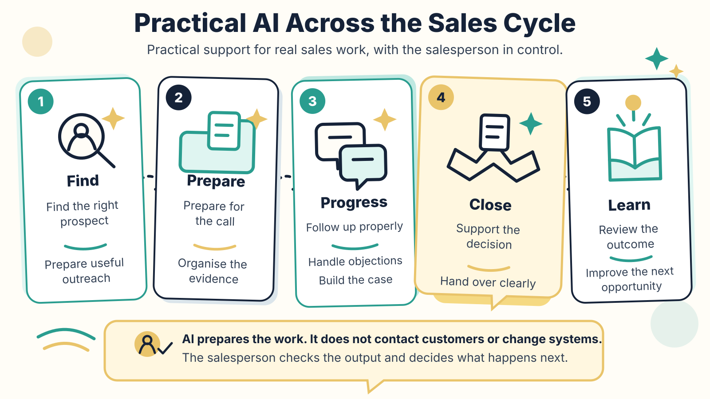

# Practical AI Sales Workflows

  
  
  
  

AI gets talked about a lot in sales. I wanted somewhere to document the things I have actually tried.

These are practical workflows for everyday sales jobs. Pick a problem, see what the workflow produces and use anything that helps.

> AI helps with the preparation. The salesperson is still responsible for the judgement.

**Not sure where to begin?** [Find the starting point that sounds most like you](guides/where-to-start.md). You can start from scratch, see a finished example or go straight to a sales problem. You don't need any technical knowledge.

## 📑 Contents

- [Three Ways to Start](#-three-ways-to-start)
- [Choose a Sales Problem](#-choose-a-sales-problem)
- [Give Me Blunt Feedback](#-give-me-blunt-feedback)
- [How I Approach It](#-how-i-approach-it)
- [What Has Actually Been Tested](#-what-has-actually-been-tested)
- [Comparison With Similar Projects](COMPARISON.md)
- [See One Complete Test](#-see-one-complete-test)
- [Rules That Matter](#-rules-that-matter)
- [About Me](#about-me)
- [What I Want to Try Next](#what-i-want-to-try-next)

## 🧭 Three Ways to Start

**🌱 Want help setting up your AI for sales?** [Start with the simple setup guide](guides/set-up-your-ai-for-sales.md). It works with ChatGPT, Claude, Gemini, Copilot and other general AI tools.

**🎯 Know the sales problem you want help with?** Go to [Choose a Sales Problem](#-choose-a-sales-problem) below. It has six: prospecting, call prep, follow-up, business case, objections and pipeline review. Or [browse all seventeen](recipes/README.md) for chasing, handover, a lost-opportunity review and more. Not sure which fits, or two sound alike? Describe your situation in plain English and the [workflow router](guides/workflow-router.md) sends you to the right one. Rather start from your job title? [Choose your route by role](guides/role-based-routes.md) instead.

**🧪 Want to see it work before you read anything else?** [Watch a skill work &rarr;](https://shaunmarsden.github.io/practical-ai-sales-workflows/). It turns the fictional Hartwell transcript into evidence-labelled output, live, and traces every line back to where it came from. Then check the [scores](evaluations/sales-ai-output-rubric.md) and the [cross-model comparison](evaluations/cross-model-post-call-comparison.md) rather than taking the demo's word for it.

When one setup prompt is no longer enough, [Get More From Your AI](guides/get-more-from-your-ai.md) covers projects and knowledge bases, turning prompts you repeat into skills, and connecting real tools like a CRM or a transcription app.

Already running several workflows with approved connected tools? [Build an Approval-Gated Sales Copilot](guides/build-an-approval-gated-sales-copilot.md) shows how to combine them, with a reusable template, a fictional test and what the evidence does and doesn't show.

**Already use Codex or Claude Code?** The repository can guide you, set up private sales context, run a fictional example or route you to the right workflow. [See the coding agent guide](guides/run-this-repository-with-an-ai-coding-agent.md).

## 🎯 Choose a Sales Problem

These are six good places to start, not a ranking. Want a different sales job? [Browse all seventeen one-page recipe cards](recipes/README.md), or [open the printable cheat sheet](https://shaunmarsden.github.io/practical-ai-sales-workflows/cheat-sheet.html).

The picture shows the main sales cycle. Some jobs, such as pipeline review, run alongside it rather than at one stage.

### 🔎 Find the Next Prospect

Pick a target and draft a first-touch message worth a reply, without a generic hook or a meeting-led ask.

**Start here:** [Open the one-page recipe card](recipes/find-the-next-prospect.md)

### 📞 Prepare for a Sales Call

Pull scattered information into one short call card you can scan during the call.

**Start here:** [Open the one-page recipe card](recipes/prepare-for-a-sales-call.md)

### ✉️ Follow Up After a Sales Call

Turn a transcript or clear notes into a summary, actions, email draft and CRM suggestions without inventing momentum.

**Start here:** [Open the one-page recipe card](recipes/follow-up-after-a-sales-call.md)

### 📄 Build a Business Case

Turn what was said on the call into a business case for the person who wasn't there.

**Start here:** [Open the one-page recipe card](recipes/build-a-business-case.md)

### 🙅 Handle an Objection

Work out what's behind an objection before you answer it, rather than arguing with the words on the surface.

**Start here:** [Open the one-page recipe card](recipes/handle-an-objection.md)

### 📊 Review Your Pipeline

Check whether the evidence you hold backs up the stages, close dates and next steps in your CRM. Don't trust the pipeline just because it's written down.

**Start here:** [Open the one-page recipe card](recipes/review-your-pipeline.md)

Looking for chasing, fit checking, champion support, handover, CRM hygiene, weekly reporting or another job? [Browse all seventeen recipe cards](recipes/README.md).

## 💬 Give Me Blunt Feedback

Tried one of the workflows? Tell me what worked, where you got stuck and the one thing you'd change. The private form takes about two minutes and doesn't collect your email address automatically. For public feedback, use the [feedback template](https://github.com/shaunmarsden/practical-ai-sales-workflows/issues/new?template=workflow-feedback.md) or start a discussion.

**[Give Quick Private Feedback &rarr;](https://docs.google.com/forms/d/e/1FAIpQLSdBC8yOUiylKemlvzrZc2FJ9QD0Pjz592ebPaItAubBRwCUbA/viewform)** · **[Share Public Feedback &rarr;](https://github.com/shaunmarsden/practical-ai-sales-workflows/discussions/new?category=feedback)**

Please don't include customer, employer or confidential information.

Want to go further? The [usability test](evaluations/usability-test-round-one.md) is for people happy to spend longer on one task.

Feedback should lead somewhere you can see. I keep a public [visitor feedback log](evaluations/visitor-feedback-log.md) of what people found, what I changed and anything I chose not to change.

## 🧭 How I Approach It

The [methodology](METHODOLOGY.md) explains the full approach, and [responsible use](RESPONSIBLE-USE.md) sets out what data stays out of a public project. [Contributing](CONTRIBUTING.md) says when a workflow or skill counts as complete.

New to using AI at work? Start with [getting started with AI](guides/getting-started-with-ai.md). Every draft here follows the [writing style guide](guides/writing-style-and-formatting.md) for tone and formatting.

## 🔬 What Has Actually Been Tested

Available doesn't mean proven. The [evidence-status matrix](EVIDENCE-STATUS.md) shows which of the seventeen jobs has a workflow, a reusable skill, a fictional test, evidence from real sales work or use by someone else.

The biggest gap: nobody has used the [feedback form](https://docs.google.com/forms/d/e/1FAIpQLSdBC8yOUiylKemlvzrZc2FJ9QD0Pjz592ebPaItAubBRwCUbA/viewform) or [Discussions](https://github.com/shaunmarsden/practical-ai-sales-workflows/discussions) yet. One line from someone who tried one workflow counts, however short.

Got 15 minutes to disagree with me? [Score one output yourself](evaluations/score-this-yourself.md). Every score here is mine. One score from someone else would be the most useful thing anyone could add.

Wondering how this compares with other public AI sales repositories? [Comparison With Similar Projects](COMPARISON.md) puts it in a table with six of them, including where this one loses: two stars, fewer jobs than most, and no score from anyone but me.

## 🧪 See One Complete Test

The Hartwell example follows one fictional sales call through to the finished follow up.

**[Read the transcript](examples/hartwell-post-call-transcript.md)** → **[See the finished output](examples/hartwell-post-call-output.md)** → **[Read the review](evaluations/hartwell-post-call-review.md)**

You can also score your own result with the [sales AI output rubric](evaluations/sales-ai-output-rubric.md), and [log the time you save](guides/measure-time-and-quality.md) rather than assuming a workflow helps because it reads well.

**Wondering which AI mistakes are worth guarding against?** [Which AI Mistakes Actually Get Through](guides/which-ai-mistakes-get-through.md) lists every real fault found in the scored runs here, sorted by whether a careful reader would have noticed. The ones that are easy to laugh at cost nothing. An invented pronoun repeated four times inside a Confirmed Evidence section is the expensive kind.

Does the model matter? [See the same test run in Claude, ChatGPT and Gemini with no other context](evaluations/cross-model-post-call-comparison.md), scored the same way.

## 🛡️ Rules That Matter

- Keep facts, estimates and assumptions separate
- Don't invent commitments, dates or customer intent
- Keep sensitive information out of unapproved tools
- Require a person to approve emails and CRM changes

## About Me

I am Shaun Marsden, a solutions consultant at AiCore. This project is where I keep track of what I've actually found useful, and share it.

This is an independent learning project. Every company, person and conversation in the examples is fictional.

Outside sales, I also build similar free tools for other jobs. [sibling-projects](https://github.com/shaunmarsden/sibling-projects) has the full list, including [book-to-skill](https://github.com/shaunmarsden/book-to-skill).

For sales teams rather than one seller, [AI for Commercial Teams](https://github.com/shaunmarsden/ai-for-commercial-teams), [Sales Conversation Gym](https://github.com/shaunmarsden/sales-conversation-gym), [Sales Proof Bench](https://github.com/shaunmarsden/sales-proof-bench) and [Sales Value Workshop](https://github.com/shaunmarsden/sales-value-workshop) take some of the same ideas and apply them to whole commercial teams.

Beyond sales, [Practical AI Adoption](https://github.com/shaunmarsden/practical-ai-adoption) takes the same evidence-first approach to using AI well at work in general.

## What I Want to Try Next

Right now I want to keep testing these workflows on real sales work as it comes up, and hear from salespeople who try them.

The useful evidence now is what holds up, what saves time and what still needs fixing. Adding more before anyone has used what's here won't tell me that.

See the [roadmap](ROADMAP.md) for current priorities, the [evidence-status matrix](EVIDENCE-STATUS.md) for what I've tested and the [changelog](CHANGELOG.md) for finished work.

Got a use case this doesn't cover? [Start a discussion](https://github.com/shaunmarsden/practical-ai-sales-workflows/discussions). Tried something that didn't work for you? [Give quick private feedback](https://docs.google.com/forms/d/e/1FAIpQLSdBC8yOUiylKemlvzrZc2FJ9QD0Pjz592ebPaItAubBRwCUbA/viewform) or [share it publicly](https://github.com/shaunmarsden/practical-ai-sales-workflows/discussions/new?category=feedback). That helps me more than a comment saying it looks good.

  

