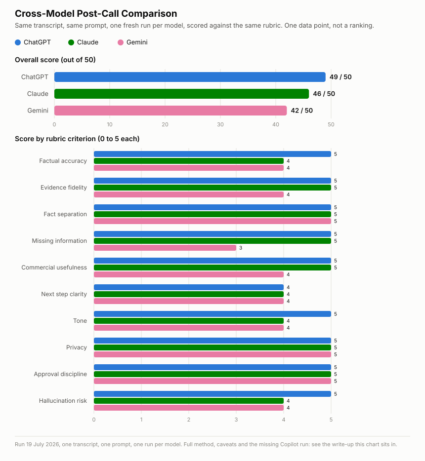

# Cross-Model Post-Call Comparison

Run 19 July 2026. I pasted the same [Hartwell transcript](../examples/hartwell-post-call-transcript.md) and the same [post-call follow-up prompt](../templates/post-call-follow-up-prompt.md) as one message into a fresh conversation in Claude, ChatGPT and Gemini, with no earlier context in any of them. I scored each output against the same [sales AI output rubric](sales-ai-output-rubric.md).

This compares how many corrections each needed, not which reads most polished. A fluent answer that quietly invents a confirmed meeting is worse than a plainer one that says the time is still pending.

## Method Note

I ran Claude in a new conversation, separate from any earlier one, so the result wasn't Claude repeating an answer it had already been told. I ran ChatGPT and Gemini directly, because this environment's browser tools can't reach either site, and pasted the raw outputs back unedited before scoring.

**Microsoft Copilot isn't in this run.** A full comparison would cover it. It's often the only AI tool a salesperson has, because plenty of organisations limit the choice to whatever IT has already rolled out. Copilot users deserve the same evidence as everyone else, not an assumption that the other three are the default. It's missing for a plain reason: I didn't have access to it, and this environment couldn't reach it, so I couldn't run the test fairly. If that changes, it's the first thing to add.

## Result

The chart shows the same numbers as the tables below. It doesn't replace them.

| Model | Score |
| --- | ---: |
| ChatGPT | 49 / 50 |
| Claude | 46 / 50 |
| Gemini | 42 / 50 |

**Automatic failure: none of the three.** No model invented a confirmed meeting, claimed an external action as done, or presented an estimate as measured fact.

## Scoring Detail

| Area | ChatGPT | Claude | Gemini |
| --- | ---: | ---: | ---: |
| Factual accuracy | 5 | 4 | 4 |
| Evidence fidelity | 5 | 5 | 4 |
| Fact separation | 5 | 5 | 5 |
| Missing information | 5 | 5 | 3 |
| Commercial usefulness | 5 | 5 | 4 |
| Next step clarity | 4 | 4 | 4 |
| Tone | 5 | 4 | 4 |
| Privacy | 5 | 5 | 5 |
| Approval discipline | 5 | 5 | 5 |
| Hallucination risk | 5 | 4 | 4 |

## What All Three Got Right

- Labelled the 15 to 30 minute admin figure as Alex's own unmeasured estimate, in every section where it appeared.
- Kept every conditional word. The transcript approval, Thursday afternoon and Tuesday morning all stayed pending rather than turning into firm commitments.
- Didn't invent a product, price or implementation date, and noticed the transcript never names what I'm selling.
- Framed every CRM update and email draft as a suggestion for human review, not a completed action.
- No em dashes, no invented urgency and no filler phrases in any of the three follow-up emails.

## Where Each Model Differed

### Claude: one real self-check miss

Claude's email draft opens the meeting-time paragraph with "I have checked my diary and can offer the following slots," and follows it straight away with a placeholder: "[INSERT CONFIRMED TIME OPTIONS BEFORE SENDING.]" The two lines contradict each other. The diary hasn't been checked yet, which is the whole reason for the placeholder. Claude's own "Final Accuracy Check" section caught several other risks but not this one. It's a real flaw, and a reminder that having a self-check section doesn't make the check thorough.

### Gemini: thinnest missing-information section, one soft overreach

Gemini's "Missing Information" section listed four items, against ChatGPT's ten and Claude's eight. It didn't flag that the call date itself is unknown, so relative timings can't be turned into calendar dates, a rule the prompt states directly. Nor did it notice that no product or service is named anywhere in the transcript.

Separately, Gemini's email sign-off reads "I look forward to reviewing the results together next week," which is milder than Claude's diary error but still overstates things. No meeting is confirmed, and "next week" sounds firmer than "a review was proposed, pending a time." Gemini's own accuracy check didn't catch this either.

### ChatGPT: most thorough, one minor clarity blur

ChatGPT's actions table listed Alex and me as joint owners on two rows: running the example together, and reviewing the result together. That's a fair description of those steps, but it's less clear on "who owns the next move" than a single-owner row. That cost it a point on next step clarity, the only area where it didn't score 5.

Otherwise this was the strongest run. It cited the prompt's own call-date rule. It added an "Inferences: none relied upon" line, showing it had checked itself for hidden assumptions. And its Final Accuracy Check used a consistent "this would overstate it, corrected to X" structure that matched real risks rather than restating obvious rules.

## What This Suggests

In this one run, ChatGPT needed the fewest corrections, Claude needed one real one, and Gemini needed a couple, including a self-check that missed what its own email got slightly wrong. That isn't the same as "ChatGPT is better at this task." It's one transcript, one prompt and one run per model, with no control over each provider's default settings, reasoning effort or model version when I ran mine.

## Caveat and Next Test

This is one data point. Before drawing any real conclusion about which model to use by default for this work, the comparison needs repeating with three changes. Use a different transcript, ideally one with an unclear or messy signal rather than another clean case made only of traps. Run each model more than once, to see how much the corrections vary between runs of the same model. And note the exact model version and any relevant settings for each provider, since these change often enough that a comparison from July 2026 may not hold in a few months.
