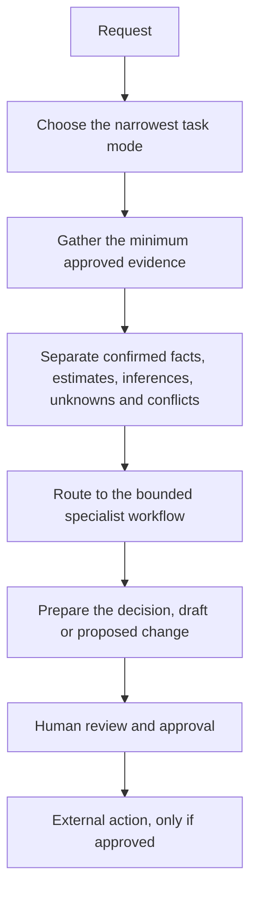

# Build an Approval-Gated Sales Copilot

A sales copilot is useful when one request needs more than one source or workflow. It might check a meeting, read the related email thread, compare the CRM record with what was actually agreed, choose the right specialist method and prepare the next piece of work.

The important word is **prepare**. The copilot can gather, compare, route and draft. A person still approves customer messages, CRM changes, meeting changes and commercial decisions.

This guide is based on the method behind my private sales copilot, which I report using in live work. The public version does not reproduce its private instructions, connected records or employer-specific process. See the [sanitised internal-use finding](../evaluations/sales-copilot-internal-use-finding.md) for the evidence boundary.

[Composing Longer Workflows](composing-longer-workflows.md) sets out the wider principles a more integrated tool should hold to. This copilot is a first concrete step toward them: it keeps a manual route, separates judgement from mechanics and gates every external action behind approval.

## At a Glance

| Question | Answer |
| --- | --- |
| What is it? | A composition layer that chooses and coordinates bounded sales workflows |
| What does it read? | Only the minimum approved evidence needed for the request |
| What does it produce? | A decision, prepared output, proposed action and visible evidence gaps |
| What can it change by itself? | Nothing external by default |
| What keeps it safe? | Evidence labels, narrow routing, stop conditions and explicit approval gates |
| Where is the reusable version? | [Approval-Gated Sales Copilot Template](../templates/approval-gated-sales-copilot-template.md) |

## Prompt, Skill, Workflow or Agent?

These terms overlap across tools, so use the behaviour rather than the product label.

| Form | What it does |
| --- | --- |
| Prompt | Gives one instruction for one conversation |
| Skill | Reuses one bounded method, such as preparing for a call |
| Workflow | Connects several steps for one sales job |
| Orchestrating agent | Interprets the request, gathers the right evidence, chooses the bounded workflow and assembles the result |

My Sales Copilot fits the last category. Its main job is not writing every output itself. Its job is deciding what matters, which evidence is relevant and which specialist workflow should do the work.

## The Method

A connector makes retrieval faster. It does not make the connected record true. Calendar, meeting notes, email and CRM can disagree, so the copilot must show the conflict rather than silently choosing the convenient version.

## Five Hard Controls

1. **Verify every named route.** Before handing work to a specialist workflow, confirm that the route is installed, available and current. If it is not, say "[route name] is not available right now" rather than hiding the failure behind a generic answer.
2. **Check real permissions, not only written rules.** A sentence saying "ask before sending" does not remove a write permission granted to a connected app. Treat every customer-facing, record-changing or difficult-to-reverse action as approval-gated even when the tool could technically perform it.
3. **Keep qualification provisional.** Do not call an opportunity qualified, eligible, approved or ready while budget, authority, timeline, procurement or another material condition is open. Use "promising fit", "current evidence supports" or "subject to verification" instead.
4. **Use the source hierarchy under disagreement.** Fixed commitments come first, then approved notes or transcripts, current correspondence, CRM fields, internal documents and finally public research. State the disagreement rather than silently picking the first source checked.
5. **Ask for the exact write.** Sending, creating an in-system draft, changing a CRM record, creating a task, moving a stage, changing a calendar event, changing a message or editing a document all require an explicit instruction naming that exact action.

## Start With Five Clear Modes

A useful copilot does not need dozens of commands. Five cover most of the coordination work:

1. **Sales brief:** return no more than three priorities supported by current evidence.
2. **What should I do next?:** return one action, why it matters and what can be prepared now.
3. **Prepare my next meeting:** identify the actual attendee, objective, gaps, questions and close.
4. **Process my latest call:** separate what was confirmed, agreed, suggested, missing and contradictory before preparing follow-up work.
5. **Deep pipeline scan:** review the wider pipeline only when explicitly requested, not as the default response to every question.

Interpret the request by meaning, not only the exact phrase. Keep several requests separate so evidence from one opportunity does not leak into another.

## Gather Less, Not More

Use a source only when it can change the decision.

A sensible order is:

1. Fixed commitments, such as the calendar.
2. What was actually said, from approved notes or a transcript.
3. Current correspondence and promises.
4. CRM ownership, stage, dates and recorded next steps.
5. Approved internal reference material.
6. Public research only when current external information is genuinely needed.

Keep a manual route. Someone without connectors should be able to paste an approved calendar summary, email thread, CRM snapshot and meeting notes into the same method.

## Label the Evidence

Use the same labels throughout the result:

- **Confirmed:** directly supported by an approved source.
- **Estimate:** a figure or view that has not been measured.
- **Inference:** a reasonable interpretation that still needs human judgement.
- **Unknown:** important information is missing.
- **Conflicting:** reliable sources disagree.

This adds one label to the repository's usual four from [Methodology](../METHODOLOGY.md), which folds a contradiction into Unknown. A single-source workflow rarely needs to tell the two apart, but a copilot reading a calendar, CRM, email and meeting notes at once does. "Nobody has said what the close date is" and "the CRM says the 18th and the email says otherwise" call for different next actions, so Conflicting stays a label of its own here rather than a kind of Unknown. [Do These Actually Match?](https://github.com/shaunmarsden/do-these-actually-match) pulls this exact judgement out as its own standalone tool, for the more general case of two whole records that are supposed to agree.

Do not turn a CRM stage into proof of progress, a discussed action into an agreed action or a likely stakeholder into a confirmed decision-maker.

## Route, Do Not Rebuild

The copilot should diagnose and hand off. A specialist workflow should do the bounded work.

Examples:

- meeting preparation goes to a pre-call workflow;
- a completed call goes to evidence extraction before an email draft;
- a stale pipeline question goes to an evidence review;
- a proof request goes to an approved proof-selection method;
- an ended opportunity goes to a loss review, not automatically to another chase.

Do not build a new router if a suitable one already exists. This repository's own [Workflow Router](workflow-router.md) already reads a plain-English description and hands off to the workflow that fits; a copilot working inside this repository should use it rather than inventing a second, less tested version of the same judgement.

Keep the handoff visible using the same six fields as [Skill Handoff Contracts](skill-handoff-contracts.md): what is confirmed, what is inferred or estimated, what is missing, which source supports each point, what the next workflow is allowed to do with it, and what still requires a person. State which workflow was selected and what it returned in those terms, rather than a looser summary.

Verify that every named route is installed and available before using it, every time, rather than assuming a route that worked before is still current. If the route is missing, renamed or unsuitable, say "[route name] is not available right now" instead of improvising a hidden replacement.

## Keep Writes Behind Approval

| Action | Copilot may prepare | Copilot may perform without approval |
| --- | --- | --- |
| Analyse approved evidence | Yes | Yes |
| Prioritise work | Yes | Yes |
| Draft an email in the response | Yes | Yes |
| Create a draft inside an email system | Only when asked | No |
| Propose a CRM change | Yes | No |
| Change a CRM record or stage | Yes, as a proposal | No |
| Suggest a meeting change | Yes | No |
| Send, book, share, archive or delete | No | No |
| Make a final commercial or eligibility decision | No | No |

Before any approved write, check the tool's actual permission behaviour, then show the exact record or destination, current value, proposed value and supporting evidence. Stop and ask for approval naming the exact action, even if the connected tool would technically allow it without another prompt. Never describe an action as completed unless the connected tool confirms it.

## Give It Permission to Stop

A useful sales copilot must be able to say:

- wait until the agreed date;
- the next move belongs to the buyer or another internal owner;
- the CRM record needs verification before it changes;
- the evidence supports archiving rather than chasing;
- the required source or specialist workflow is unavailable;
- there is no safe AI role in this decision.

Generic follow-up is not a fallback for missing evidence.

## Test the Orchestration, Not Just the Writing

A polished email can hide a bad decision. Test the points where coordination fails:

- the CRM stage overstates the evidence;
- meeting notes and email disagree;
- an old draft is no longer suitable;
- an agreed timing boundary must be preserved;
- a likely fit must not become a final qualification decision;
- a tool or specialist route is unavailable;
- the right answer is to wait or stop;
- an external change requires approval.

Start with the [fictional source pack](../examples/fictional-sales-copilot-source-pack.md), then compare the [completed output](../examples/fictional-sales-copilot-output.md) with the [honest evaluation](../evaluations/fictional-sales-copilot-review.md).

## What This Does Not Prove

- **One fictional run** shows that the method can produce a useful result under those conditions.
- **Builder-reported internal use** shows that a private version is being used.
- **A [sanitised live-run finding](../evaluations/sales-copilot-live-run-finding.md)** shows the public method handled one real request safely, prioritising a fixed commitment, keeping retrieval narrow and surfacing an identity ambiguity rather than guessing.

None of this proves reliability, measured time saving or successful independent adoption.

It also does not yet keep a working folder or run log, show progress mid-run, or need a spend checkpoint, since each command mode here is a single request and response rather than a longer unattended run. See [Composing Longer Workflows](composing-longer-workflows.md) for what a more integrated version would need to add.

The next useful evidence is an honest attempt by someone outside the project, not more command modes.
