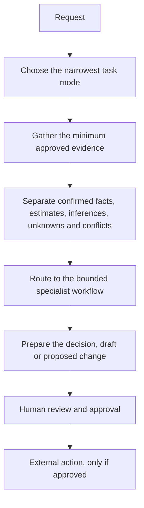

# Build an Approval-Gated Sales Copilot

A sales copilot helps when one request needs more than one source or workflow. It might check a meeting, read the email thread, compare the CRM record with what was agreed, pick the right method and prepare the next piece of work.

The key word is **prepare**. The copilot can gather, compare, route and draft. A person still approves customer messages, CRM changes, meeting changes and commercial decisions.

This guide follows the method behind my private sales copilot. I use it in live work, though that's my own report. The public version leaves out its private instructions, connected records and employer-specific process. The [sanitised internal-use finding](../evaluations/sales-copilot-internal-use-finding.md) sets out what the evidence does and doesn't cover.

[Composing Longer Workflows](composing-longer-workflows.md) sets out the rules a more joined-up tool should follow. This copilot is a first step towards them. It keeps a manual route, keeps judgement apart from mechanics, and puts every outside action behind approval.

## At a Glance

| Question | Answer |
| --- | --- |
| What is it? | A layer that picks and coordinates single-job sales workflows |
| What does it read? | Only the approved evidence the request needs |
| What does it produce? | A decision, prepared output, proposed action and the gaps in the evidence |
| What can it change by itself? | Nothing external by default |
| What keeps it safe? | Evidence labels, narrow routing, points where it stops, and approval before any action |
| Where is the reusable version? | [Approval-Gated Sales Copilot Template](../templates/approval-gated-sales-copilot-template.md) |

## Prompt, Skill, Workflow or Agent?

These words mean different things in different tools, so go by what each one does, not the label.

| Form | What it does |
| --- | --- |
| Prompt | Gives one instruction for one conversation |
| Skill | Reuses one method for one job, such as preparing for a call |
| Workflow | Joins several steps for one sales job |
| Orchestrating agent | Reads the request, gathers the right evidence, picks the workflow and puts the result together |

My Sales Copilot is the last kind. Its main job isn't writing every output. It decides what matters, which evidence counts and which workflow should do the work.

## The Method

```mermaid
flowchart TD
    A[Request] --> B[Choose the narrowest task mode]
    B --> C[Gather the minimum approved evidence]
    C --> D[Separate confirmed facts, estimates, inferences, unknowns and conflicts]
    D --> E[Route to the bounded specialist workflow]
    E --> F[Prepare the decision, draft or proposed change]
    F --> G[Human review and approval]
    G --> H[External action, only if approved]
```

A connector makes records quicker to fetch. It doesn't make them true. The calendar, meeting notes, email and CRM can disagree, so the copilot must show the conflict rather than quietly pick the handy version.

## Five Hard Controls

1. **Check every named route.** Before handing work to a workflow, check each time that it's installed, available and current, even if it worked before. If it's missing, renamed or unsuitable, say "[route name] is not available right now" rather than hiding the failure or quietly improvising a replacement.
2. **Check what the tool can do, not only the written rules.** A line saying "ask before sending" doesn't remove a write permission a connected app already has. Treat every action that reaches a customer, changes a record or is hard to undo as needing approval, even when the tool could do it.
3. **Keep qualification provisional.** Don't call an opportunity qualified, eligible, approved or ready while budget, authority, timeline, procurement or another important condition is open. Say "promising fit", "current evidence supports" or "subject to verification" instead.
4. **Follow the source order when sources disagree.** Fixed commitments come first, then approved notes or transcripts, current emails, CRM fields, internal documents and, last, public research. State the disagreement rather than quietly taking the first source you checked.
5. **Ask for the exact write.** Sending, creating a draft inside a system, changing a CRM record, creating a task, moving a stage, changing a calendar event, changing a message or editing a document all need an instruction that names that exact action.

## Start With Five Clear Modes

A useful copilot doesn't need dozens of commands. Five cover most of the work:

1. "Sales brief" returns no more than three priorities, each backed by current evidence.
2. "What should I do next?" returns one action, why it matters and what can be prepared now.
3. "Prepare my next meeting" finds the real attendee, objective, gaps, questions and close.
4. "Process my latest call" sorts what was confirmed, agreed, suggested, missing and contradictory before preparing any follow-up.
5. "Deep pipeline scan" reviews the wider pipeline, but only when asked, not as the default answer to every question.

Read a request for its meaning, not only its exact words. Keep separate requests apart, so evidence from one opportunity doesn't leak into another.

## Gather Less, Not More

Use a source only when it could change the decision.

A sensible order is:

1. Fixed commitments, such as the calendar.
2. What was said, from approved notes or a transcript.
3. Current emails and promises.
4. CRM owner, stage, dates and recorded next steps.
5. Approved internal reference material.
6. Public research, only when you need current outside information.

Keep a manual route. Someone without connectors should be able to paste an approved calendar summary, email thread, CRM snapshot and meeting notes into the same method.

## Label the Evidence

Use the same labels all the way through:

- Confirmed: an approved source supports it directly.
- Estimate: a figure or view nobody has measured.
- Inference: a reasonable reading that still needs a person's judgement.
- Unknown: important information is missing.
- Conflicting: reliable sources disagree.

This adds one label to the usual four in [Methodology](../METHODOLOGY.md), which counts a contradiction as Unknown. A workflow reading one source rarely needs to tell the two apart. A copilot reading the calendar, CRM, email and meeting notes at once does. "Nobody has said what the close date is" and "the CRM says the 18th and the email says otherwise" need different next steps, so Conflicting gets its own label here. [Do These Actually Match?](https://github.com/shaunmarsden/do-these-actually-match) turns this same judgement into a separate tool, for the wider case of two whole records that should agree.

Don't treat a CRM stage as proof of progress, a discussed action as an agreed one, or a likely stakeholder as a confirmed decision-maker.

## Route, Do Not Rebuild

The copilot should work out what's needed and hand off. A workflow built for that job should do the work.

For example:

- meeting preparation goes to a pre-call workflow;
- a finished call goes to evidence extraction before an email draft;
- a stale pipeline question goes to an evidence review;
- a request for proof goes to an approved method for choosing it;
- an ended opportunity goes to a loss review, not straight to another chase.

Don't build a new router if one already exists. This repository's [Workflow Router](workflow-router.md) reads a plain-English description and hands off to the workflow that fits. A copilot working here should use it, not invent a second, less tested version.

Keep the handoff visible, using the same six fields as [Skill Handoff Contracts](skill-handoff-contracts.md): what's confirmed, what's inferred or estimated, what's missing, which source supports each point, what the next workflow may do with it, and what still needs a person. Say which workflow you chose and what it returned, in those terms.

## Keep Writes Behind Approval

| Action | Copilot may prepare | Copilot may perform without approval |
| --- | --- | --- |
| Analyse approved evidence | Yes | Yes |
| Prioritise work | Yes | Yes |
| Draft an email in the response | Yes | Yes |
| Create a draft inside an email system | Only when asked | No |
| Propose a CRM change | Yes | No |
| Change a CRM record or stage | Yes, as a proposal | No |
| Suggest a meeting change | Yes | No |
| Send, book, share, archive or delete | No | No |
| Make a final commercial or eligibility decision | No | No |

Before any approved write, check how the tool's permissions behave. Then show the exact record or destination, its current value, the proposed value and the evidence for it. Stop and ask for approval that names the exact action, even if the tool would let you go ahead without asking. Never say an action is done unless the tool confirms it.

## Give It Permission to Stop

A useful sales copilot must be able to say:

- wait until the agreed date;
- the next move belongs to the buyer or another internal owner;
- the CRM record needs checking before it changes;
- the evidence supports archiving rather than chasing;
- the source or workflow it needs is unavailable;
- there is no safe role for AI in this decision.

A generic follow-up is no substitute for missing evidence.

## Test the Orchestration, Not Just the Writing

A polished email can hide a bad decision. Test the points where coordination breaks down:

- the CRM stage overstates the evidence;
- meeting notes and email disagree;
- an old draft no longer fits;
- an agreed timing limit must be kept;
- a likely fit must not become a final qualification decision;
- a tool or workflow is unavailable;
- the right answer is to wait or stop;
- an outside change needs approval.

Start with the [fictional source pack](../examples/fictional-sales-copilot-source-pack.md), then compare the [completed output](../examples/fictional-sales-copilot-output.md) with the [evaluation](../evaluations/fictional-sales-copilot-review.md).

## What This Does Not Prove

One fictional run shows the method can produce a useful result under those conditions. My own report of internal use shows a private version is in use. A [sanitised live-run finding](../evaluations/sales-copilot-live-run-finding.md) shows the public method handled one real request safely. It put a fixed commitment first, kept retrieval narrow and flagged an unclear identity rather than guessing.

None of this proves it's reliable, that it saves measured time, or that anyone else has taken it up successfully.

It also doesn't yet keep a working folder or run log, show progress during a run, or need a spending checkpoint. Each mode here is a single request and reply, not a longer run left unattended. [Composing Longer Workflows](composing-longer-workflows.md) covers what a more joined-up version would need to add.

The next useful evidence is someone outside the project trying it for real, not more modes.
