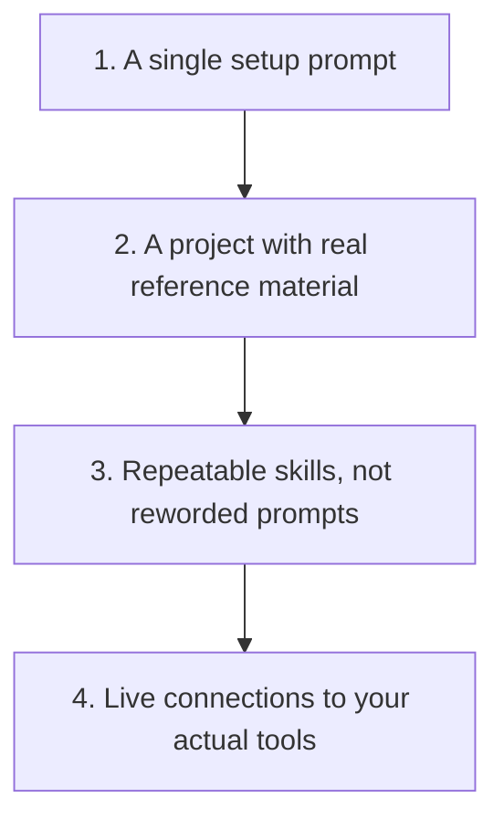

# Get More From Your AI

The [setup prompt](../templates/ai-sales-setup-prompt.md) gets you a well-briefed assistant. This is what is on the other side of that, once a single prompt stops being enough.

## Remember These Three Things

### 📚 More Context Beats a Cleverer Prompt

A better-written prompt still only knows what fits in that one message. A project full of your actual reference material knows your job.

### 🔁 Repeatable Beats Reworded

If you are writing a new version of the same prompt every week, that is a sign the method should become a skill instead, not a sign you need a better prompt.

### 🔌 Live Data Beats Pasted Data

Copying and pasting a transcript or a CRM record works, but it is the slowest version of this. A live connection removes the copying, not the checking.

## Layer 2: Projects and Knowledge Bases

A project is a persistent workspace you can attach real reference material to, so the AI answers from your actual context every time, not just from what fits in one prompt.

Worth setting up once you notice you are pasting the same background information into more than a couple of conversations a week.

What is actually worth uploading:

- A short product or service one-pager, in plain English
- Your ICP and typical buyer description
- A handful of your own past outputs you are happy with, as a style reference, sanitised of anything sensitive
- Your own playbooks or methodology notes, such as your objection responses or your chase sequence rules

The same privacy rule applies here as everywhere else: check what your company allows before uploading anything that could identify a real customer, deal, or internal process.

<strong>Where is this in each tool?</strong>

- **Claude**: Projects, with files attached to the project's knowledge.
- **ChatGPT**: a Custom GPT's knowledge files, or Projects, depending on which you are using.
- **Gemini**: a Gem with files attached, or a connected Workspace document.
- **Copilot**: usually tied to files already stored in your organisation's SharePoint or OneDrive, so what is available depends heavily on your company's setup.

Exact menu names and available storage change over time, so look for "knowledge," "files," or "attach" inside whichever project or assistant feature your tool offers.

## Layer 3: Skills Instead of Reworded Prompts

A skill captures a method once: what good output looks like, what to check before presenting it, and what the AI must never invent or decide on its own. Instead of writing a fresh prompt every time you do the same recurring task, you install the method once and it applies consistently.

This repository's own [skills library](what-is-a-sales-ai-skill.md#try-the-skills-library) is a working set of these for common sales tasks. Install one instead of starting from scratch.

To build your own, the "How do I adapt one for my sales process?" section in [What Is a Sales AI Skill?](what-is-a-sales-ai-skill.md) walks through the questions to ask. The actual skill files in this repository's [`.agents/skills/`](https://github.com/shaunmarsden/practical-ai-sales-workflows/tree/main/.agents/skills) folder are a real, copyable template for the shape one takes: what it is for, the checks it runs, what it must never do without you.

<strong>Where is this in each tool?</strong>

- **Claude**: Skills, uploaded to a Project's knowledge or added as a standalone skill depending on your plan.
- **ChatGPT**: a Custom GPT's instructions, or a saved prompt you reuse deliberately rather than rewrite.
- **Gemini**: a Gem built around one specific task.
- **Copilot**: a custom agent, where your organisation allows building one.

Whichever tool you use, the important thing is that the method lives somewhere reusable, not that it uses this exact terminology.

## Layer 4: Connectors and Integrations

A connector gives your AI tool live access to a system you already use, a CRM, a calendar, email, or a transcription tool, so it reads real, current context instead of you copying it in by hand each time.

Where this genuinely helps: pulling a call transcript automatically instead of pasting it, checking a CRM record before drafting a follow-up, or seeing your calendar to suggest realistic meeting times.

The honest caveat: this is the layer most likely to need IT or admin approval, especially at a larger company, and the layer where "what am I actually allowed to connect this to" matters the most. If you do not have admin control over your AI tool, a lot of this may simply not be available to you, and that is fine. Layers 2 and 3 work perfectly well without it.

<strong>Where is this in each tool?</strong>

- **Claude**: connectors, where available on your plan, for tools such as a CRM, calendar, or email.
- **ChatGPT**: connectors or Actions, depending on your plan and what your organisation has enabled.
- **Gemini**: Workspace integration, since Gemini already sits inside Gmail, Calendar, and Docs for many users.
- **Copilot**: Microsoft Graph connectors, almost always configured centrally by your organisation rather than by an individual user.

Availability changes often and varies a great deal by plan tier and company policy, so treat this section as a starting point for what to ask for, not a guarantee of what you already have.

## Which Layer Is Worth Your Time Right Now

- Re-explaining the same background information every time you start a conversation: set up a project.
- Rewriting a version of the same prompt every week: turn it into a skill.
- Constantly copying and pasting from another tool into your AI conversation, and your company allows it: look at a connector.

Move up a layer when the one you are on stops saving you anything, not because the next one sounds more advanced.
