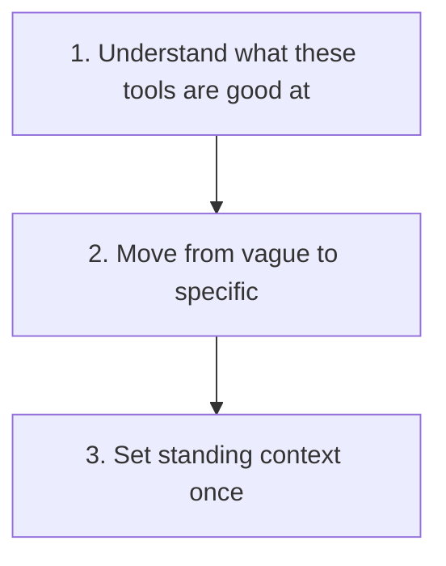

# Getting Started with AI at Work

For anyone who has not used an AI assistant seriously yet, or tried once and did not get much out of it. Read this before [what a sales AI skill is](what-is-a-sales-ai-skill.md); this one is about the tools themselves, that one is about the structured version this repository builds on top of them.

## What These Tools Actually Are

AI assistants such as Claude and ChatGPT are text based. You type something in, they respond. They are good at a specific set of tasks: drafting, summarising, structuring ideas, explaining something clearly, working through large amounts of text quickly.

They are not search engines and they are not magic. What they produce depends almost entirely on how well you ask.

## Remember These Three Things

### ✍️ They Are Strong at Drafting and Structure

Turning rough notes into something coherent, rewriting for tone or length, spotting a gap in an argument.

### 🔍 They Are Weak Without Verification

They can state a figure or a fact confidently and be wrong. Anything specific needs checking before it goes anywhere real.

### 🎯 The Biggest Gain Is Specificity, Not Cleverness

Moving from a vague request to a specific one improves the output more than any other single change.

**Vague:** "Write an email about the project update."
**Specific:** "Write a two paragraph email to my team lead saying the migration is two weeks behind because of a vendor delay. Direct and calm, not alarmed."

<strong>What are they good at, in practice?</strong>

- Drafting emails, summaries, and proposals
- Rewriting something already written to be clearer or shorter
- Turning rough notes into a structured document
- Comparing options and laying out the trade-offs
- Doing the same task consistently across multiple pieces of content

<strong>What are they not good at?</strong>

- Giving you a figure or fact without checking it first
- Real time information, unless a search feature is explicitly enabled
- Replacing your judgement about what is right for your situation
- Genuinely novel thinking; they recombine patterns from existing material

<strong>How do I set up standing context?</strong>

Most AI tools let you set custom instructions or a system prompt that applies to every conversation. Once it is set, you stop re-explaining yourself each time.

Worth including:

- What you actually do day to day, not just your job title
- Your preferred tone for written communication
- Phrases or formats you want avoided
- Recurring tasks you want handled the same way each time

This repository's own [writing style guide](writing-style-and-formatting.md) is one example of standing context, written up as a document you can paste in directly.

<strong>How do I actually start?</strong>

Pick one task you already do regularly that involves writing or structuring information, something that takes longer than it should or that you do on autopilot.

Try it once with an AI tool. If the result is not right, say what is wrong and ask again: "too formal", "make the second paragraph shorter", "more direct." Two or three rounds usually gets close.

Before pasting anything in, check what your organisation's policy says about sharing information with third-party AI tools, and use fictional or anonymised detail wherever the real version is not necessary to get a useful answer.

## Where This Repository Picks Up

Once a task is worth doing the same way every time, a plain conversation stops being enough on its own; that is what [a sales AI skill](what-is-a-sales-ai-skill.md) is for.
