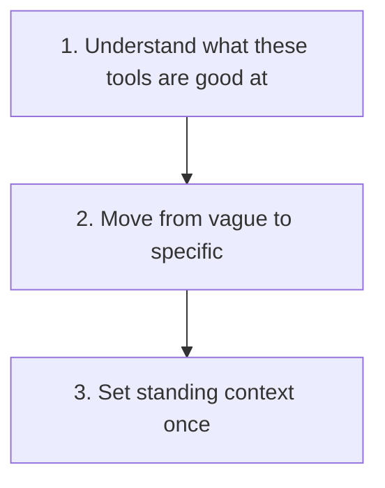

# Getting Started with AI at Work

This is for anyone who hasn't used an AI assistant much yet, or tried once and didn't get much out of it. Read it before [what a sales AI skill is](what-is-a-sales-ai-skill.md). This page is about the tools themselves. That one is about the structured version this repository builds on top of them.

```mermaid
flowchart TB
    A["1. Understand what these tools are good at"]
    B["2. Move from vague to specific"]
    C["3. Set standing context once"]
    A --> B --> C
```

## What These Tools Actually Are

AI assistants such as Claude and ChatGPT work in text. You type something in, and they reply. They're good at a certain set of tasks: drafting, summarising, organising ideas, explaining something clearly, and getting through a lot of text quickly.

They aren't search engines and they aren't magic. What you get out depends almost entirely on how well you ask.

## Remember These Three Things

### ✍️ They Are Strong at Drafting and Structure

Turning rough notes into something that hangs together, rewriting for tone or length, spotting a gap in an argument.

### 🔍 They Are Weak Without Verification

They can state a figure or a fact with confidence and be wrong. Check anything specific before it goes anywhere real.

### 🎯 The Biggest Gain Is Specificity, Not Cleverness

Going from a vague request to a specific one improves the output more than any other single change.

**Vague:** "Write an email about the project update."
**Specific:** "Write a two paragraph email to my team lead saying the migration is two weeks behind because of a vendor delay. Direct and calm, not alarmed."

<strong>What are they good at, in practice?</strong>

- Drafting emails, summaries and proposals
- Rewriting something to make it clearer or shorter
- Turning rough notes into a structured document
- Comparing options and setting out the trade-offs
- Doing the same task the same way across several pieces of content

<strong>What are they not good at?</strong>

- Giving you a figure or fact you can use without checking
- Up-to-date information, unless a search feature is switched on
- Replacing your judgement about what's right for your situation
- New thinking; they recombine patterns from existing material

<strong>How do I set up standing context?</strong>

Most AI tools let you set custom instructions or a system prompt that applies to every conversation. Once it's set, you stop explaining yourself each time.

Worth including:

- What you do day to day, not just your job title
- The tone you like for written work
- Phrases or formats you want avoided
- Tasks you do often and want handled the same way each time

This repository's [writing style guide](writing-style-and-formatting.md) is one example of standing context, written as a document you can paste straight in.

<strong>How do I actually start?</strong>

Pick one task you already do often that involves writing or organising information. Choose something that takes longer than it should, or that you do on autopilot.

Try it once with an AI tool. If the result isn't right, say what's wrong and ask again: "too formal", "make the second paragraph shorter", "more direct." Two or three rounds usually get close.

Before you paste anything in, check what your organisation's policy says about sharing information with outside AI tools. Use made-up or anonymised detail wherever you don't need the real version to get a useful answer.

## Where This Repository Picks Up

Once a task is worth doing the same way every time, a plain conversation isn't enough on its own. That's what [a sales AI skill](what-is-a-sales-ai-skill.md) is for.
