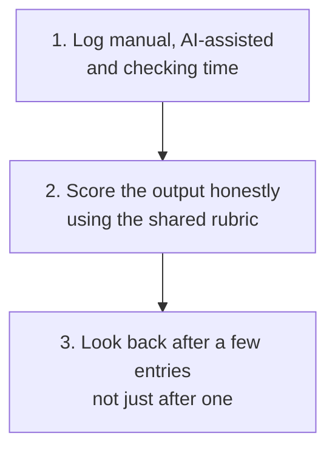

# Measure Time Saved and Output Quality

Do not assume a workflow helps because it reads well. Log your own time and score your own output, so you actually know rather than guess.

## Remember These Three Things

### ⏱️ Checking Time Counts

A fast draft that needed twenty minutes of correction did not save twenty minutes. Log the whole time, from starting the prompt to a version you would actually send, not just the exciting fast part.

### 🎯 Log the Misses, Not Just the Wins

A workflow that did not help, or took longer than doing it by hand, is real information. A log with only good results is not measuring anything, it is a highlight reel.

### 📊 One Entry Proves Nothing

The value is in comparing entries for the same workflow over a few weeks, not in one good or bad result. Your checking time on a workflow you have used five times should usually be lower than the first time; that is the actual signal worth watching.

<strong>What should I actually log?</strong>

Use the [time and quality log](../templates/time-and-quality-log.md): the workflow used, the task, an honest manual-time estimate, the AI-assisted time to a usable draft, the checking and correction time, whether you would use it again, and a note on whether this was your first attempt or a practised one.

<strong>How do I estimate manual time honestly?</strong>

If you genuinely do not know how long something would have taken by hand, say so, rather than inventing a precise-sounding number to make the comparison look better. "Roughly twenty minutes, not timed" is an honest entry. A guessed "35 minutes" dressed up as a measurement is not.

Watch for first-attempt bias in the other direction too: your first time using an unfamiliar workflow is usually slower than your fifth, both because you are learning it and because you are checking it more carefully. Note which attempt this is, so a slow first log does not get read as the workflow being genuinely slow.

<strong>How does this relate to the output rubric?</strong>

They measure two different things. The [sales AI output rubric](../evaluations/sales-ai-output-rubric.md) scores whether a given output is accurate, safe and useful. This log measures whether using the workflow was actually worth your time. A workflow can score well on the rubric and still not be worth using if the checking time eats the saving, and the reverse: a rougher output that still saved real time once you factor in how quick it was to fix. Use both, not one instead of the other.

## What to Do Once You Have a Few Entries

Look back at your own log every few weeks, not after a single use. Ask honestly: is checking time actually falling as you get more practised with a workflow, are there specific workflows you keep marking "would not use again," and is there a task you keep doing by hand that a workflow here could actually help with. Change what you use based on your own log, not on how convincing a workflow felt the first time you tried it.
