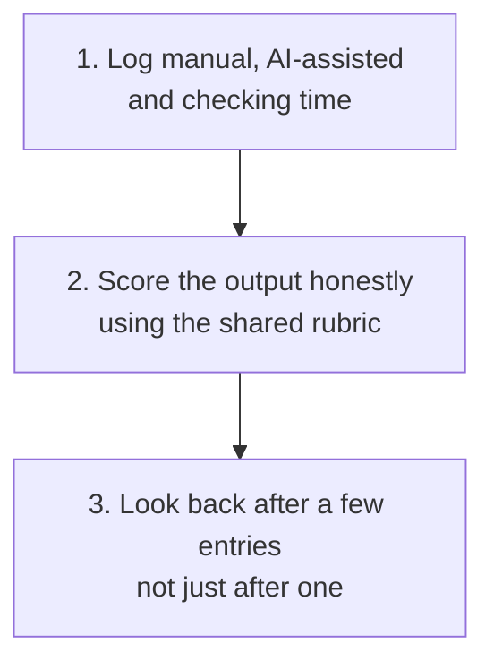

# Measure Time Saved and Output Quality

Don't assume a workflow helps because it reads well. Log your own time and score your own output, so you know rather than guess.

```mermaid
flowchart TB
    A["1. Log manual, AI-assisted<br/>and checking time"]
    B["2. Score the output honestly<br/>using the shared rubric"]
    C["3. Look back after a few entries<br/>not just after one"]
    A --> B --> C
```

## Remember These Three Things

### ⏱️ Checking Time Counts

A fast draft that needed 20 minutes of fixing didn't save 20 minutes. Log the whole time, from starting the prompt to a version you'd send, not just the quick part.

### 🎯 Log the Misses, Not Just the Wins

A workflow that didn't help, or took longer than doing it by hand, tells you something. A log of only good results isn't measuring anything.

### 📊 One Entry Proves Nothing

What counts is comparing entries for the same workflow over a few weeks, not one good or bad result. Your checking time on a workflow you've used five times should usually be lower than the first time. That's the thing to watch.

<strong>What should I actually log?</strong>

Use the [time and quality log](../templates/time-and-quality-log.md). Record the workflow, the task, a fair guess at how long it would take by hand, the time to a usable AI-assisted draft, the time spent checking and fixing, whether you'd use it again, and whether this was your first go or you'd done it before.

<strong>How do I estimate manual time honestly?</strong>

If you don't know how long something would have taken by hand, say so. Don't invent a precise-sounding number to make the comparison look better. "Roughly twenty minutes, not timed" is a fair entry. A guessed "35 minutes" passed off as a measurement isn't.

Watch for the opposite bias too. Your first go at a new workflow is usually slower than your fifth, because you're learning it and checking it more carefully. Note which attempt it is, so nobody reads a slow first entry as a slow workflow.

<strong>How does this relate to the output rubric?</strong>

They measure different things. The [sales AI output rubric](../evaluations/sales-ai-output-rubric.md) scores whether an output is accurate, safe and useful. This log measures whether using the workflow was worth your time. A workflow can score well on the rubric and still not be worth using if checking eats the time it saved. The reverse happens too: a rougher output can still save real time once you count how quick it was to fix. Use both.

## What to Do Once You Have a Few Entries

Look back at your log every few weeks, not after a single use. Is checking time falling as you get used to a workflow? Are there workflows you keep marking "would not use again," and tasks you keep doing by hand that a workflow here could help with? Change what you use based on your own log, not on how convincing a workflow felt the first time.
