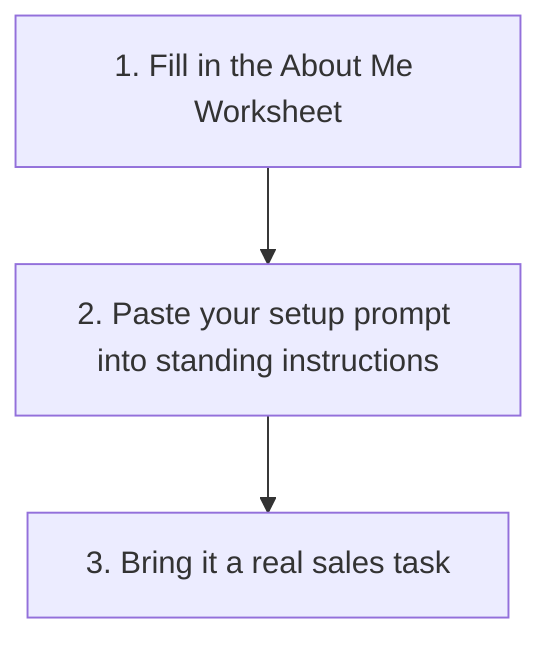

# Set Up Your Own AI for Sales

Most people get a fraction of what a modern AI tool can do because every conversation starts from a blank page. Setting it up once with real context about you and your job changes that, and it takes about fifteen minutes.

## Remember These Three Things

### 🧩 Set Up Once, Reuse Every Conversation

This is not a prompt you retype each time. It is standing context that applies automatically, the same way a good new starter briefing only has to happen once.

### 🗣️ Generic Input Gets Generic Output

An AI tool told nothing about your product, your buyer, or your tone will write like a template. The [About Me Worksheet](../templates/about-me-worksheet.md) is what fixes that, not a cleverer prompt.

### 🔐 Check What You're Allowed to Paste

Standing instructions are a good place for your own tone and process. They are not automatically a safe place for real company or customer information. Check your employer's policy before adding anything beyond your own working style.

## Do This

1. Fill in the [About Me Worksheet](../templates/about-me-worksheet.md).
2. Copy the [AI Sales Setup Prompt](../templates/ai-sales-setup-prompt.md) and replace every bracket with your own answers.
3. Paste the whole thing into your AI tool's standing instructions, not a one-off message. See below for roughly where that lives in each tool.
4. Bring it a real task and see what comes back before you trust it with anything that matters.

<strong>Where do I paste this in Claude?</strong>

Inside a Claude Project, the project's custom instructions field. Anything there applies to every conversation inside that project. Exact menu wording changes from time to time, so look for "instructions" or "how Claude should behave" in your project's settings.

<strong>Where do I paste this in ChatGPT?</strong>

Either the account-wide custom instructions setting, which applies to every new conversation, or a Custom GPT's own instructions field, which applies only inside that GPT. Use the account-wide setting unless you specifically want a separate, dedicated assistant.

<strong>Where do I paste this in Gemini?</strong>

Saved information or a Gem's own instructions, depending on which Gemini surface you use. A Gem behaves like a dedicated assistant built around this prompt, similar to a Custom GPT.

<strong>Where do I paste this in Copilot?</strong>

Saved instructions or a custom agent's instructions, depending on your organisation's setup. Copilot's options vary more between companies than the others, since it is usually configured centrally, so check with whoever administers it if you can't find the setting yourself.

## Once You're Set Up

The setup prompt gets you a capable, well-briefed general assistant. For a specific task you want done the same way every time, with its own checklist and known failure modes already worked out, move on to [where to start](where-to-start.md) or straight to the [skills library](what-is-a-sales-ai-skill.md#try-the-skills-library).
