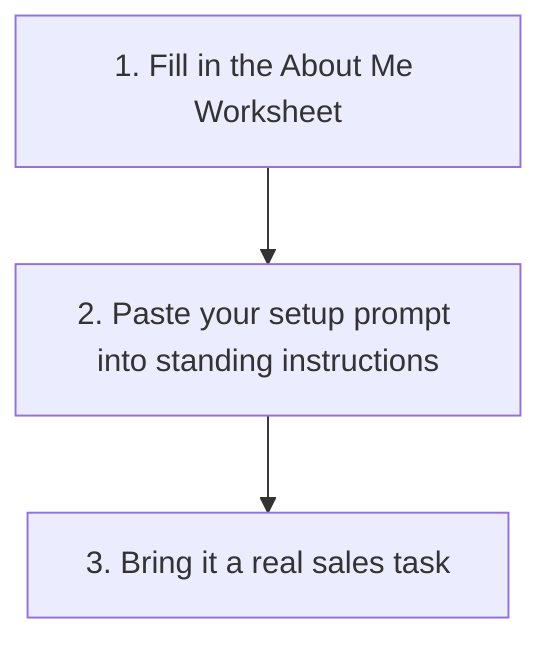

# Set Up Your Own AI for Sales

Many people get a fraction of what an AI tool can do, because every conversation starts from a blank page. Setting it up once with real context about you and your job changes that. It takes one sitting, not an ongoing effort.

```mermaid
flowchart TB
    A["1. Fill in the About Me Worksheet"]
    B["2. Paste your setup prompt into standing instructions"]
    C["3. Bring it a real sales task"]
    A --> B --> C
```

## Remember These Three Things

### 🧩 Set Up Once, Reuse Every Conversation

This isn't a prompt you retype each time. It's standing context that applies by itself, just as a good briefing for a new starter only has to happen once.

### 🗣️ Generic Input Gets Generic Output

An AI tool told nothing about your product, your buyer or your tone will write like a template. The [About Me Worksheet](../templates/about-me-worksheet.md) fixes that. A cleverer prompt doesn't.

### 🔐 Check What You're Allowed to Paste

Standing instructions are a good place for your own tone and process. That doesn't make them a safe place for real company or customer information. Check your employer's policy before adding anything beyond your own working style.

## Do This

1. Fill in the [About Me Worksheet](../templates/about-me-worksheet.md).
2. Copy the [AI Sales Setup Prompt](../templates/ai-sales-setup-prompt.md) and replace every bracket with your own answers.
3. Paste the whole thing into your AI tool's standing instructions, not a one-off message. See below for roughly where that lives in each tool.
4. Bring it a real task and see what comes back before you trust it with anything that matters.

<strong>Where do I paste this in Claude?</strong>

Inside a Claude Project, use the project's custom instructions field. Anything there applies to every conversation in that project. Menu wording changes from time to time, so look for "instructions" or "how Claude should behave" in your project's settings.

<strong>Where do I paste this in ChatGPT?</strong>

Use either the account-wide custom instructions setting, which applies to every new conversation, or a Custom GPT's instructions field, which applies only inside that GPT. Use the account-wide setting unless you want a separate assistant just for this.

<strong>Where do I paste this in Gemini?</strong>

Use saved information or a Gem's instructions, depending on which version of Gemini you use. A Gem works like a separate assistant built around this prompt, much like a Custom GPT.

<strong>Where do I paste this in Copilot?</strong>

Use saved instructions or a custom agent's instructions, depending on how your organisation has set it up. If Copilot is the only AI tool your company gives you, that's common, and everything in this guide still applies. The main difference is that whoever runs Copilot at your company controls more of the setup than you would in a personal ChatGPT or Claude account. Ask them what's already available rather than assuming the option doesn't exist.

## Once You're Set Up

The setup prompt gets you a capable, well-briefed general assistant. For a task you want done the same way every time, with its own checklist and known failure points already worked out, move on to [where to start](where-to-start.md) or straight to the [skills library](what-is-a-sales-ai-skill.md#try-the-skills-library).
