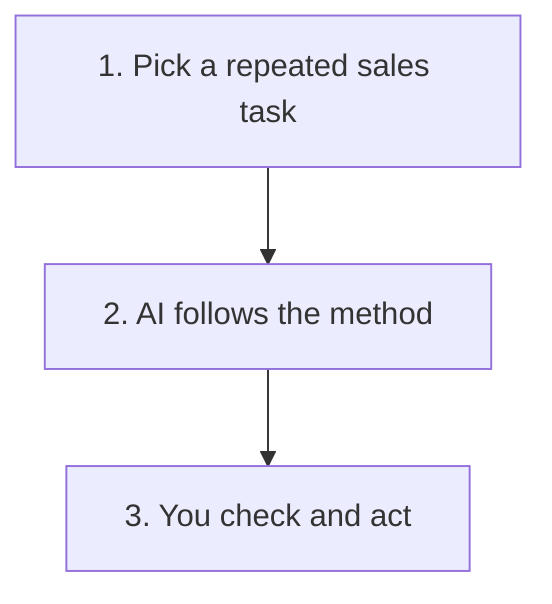

# What Is a Sales AI Skill?

A sales AI skill gives an AI assistant a repeatable way to handle one sales task.

Think of it as a set of working instructions. It tells the AI what to look for, what a useful answer should contain and where a person must stay in control.

## Remember These Three Things

### 🔁 It Makes Repeated Work More Consistent

You do not need to explain the same process every time.

### 👀 It Prepares the Work, You Judge It

The AI can organise, check and draft. You still own the decision, customer relationship and final action.

### 🛡️ It Needs Clear Boundaries

A good skill says what the AI must not invent, decide or do without approval.

## Try the First Example

The first portable skill in this repository [extracts evidence from a sales call](../.agents/skills/extract-post-call-evidence/SKILL.md).

It separates facts from assumptions, spots missing information and suggests a next step. It uses a fictional Northstar conversation, so it contains no real customer or employer information.

## Before You Use a Skill on Real Work

- Start with a repeated business problem
- Check which AI tools your company allows
- Use only the information genuinely needed
- Keep facts and assumptions separate
- Review the answer before acting
- Keep customer messages and CRM changes under human control

<strong>What can a sales AI skill help with?</strong>

A skill can help with work such as:

- Turning call notes into consistent evidence
- Preparing a first draft
- Spotting missing information
- Applying the same checks every time
- Learning from repeated errors

It is most useful when the task happens regularly and a good result has a recognisable shape.

<strong>What should it never do on its own?</strong>

A skill should not:

- Invent facts, dates or commitments
- Send customer messages automatically
- Change CRM records without approval
- Treat weak evidence as proof that a prospect is qualified
- Replace your company's policies
- Use information you are not allowed to process

<strong>How do I adapt one for my sales process?</strong>

Start with the business problem, not the AI tool.

Ask:

1. What task are we trying to improve?
2. What information is genuinely needed?
3. What should the answer contain?
4. Which decisions still belong to a person?
5. What would make the result unsafe or misleading?
6. How will we know whether it is better than the current process?

Then change the terminology, fields and checks to match your sales process. Keep company policies, customer information and system access in approved environments.

<strong>How do I test it safely?</strong>

Start with a fictional example that includes a few traps, such as an estimated number, a conditional commitment or an unconfirmed meeting.

Check whether the skill:

- Preserves uncertainty
- Identifies missing information
- Avoids inventing momentum
- Produces something useful
- Makes the human checks obvious

If the same mistake appears more than once, improve the instructions and test it again.

