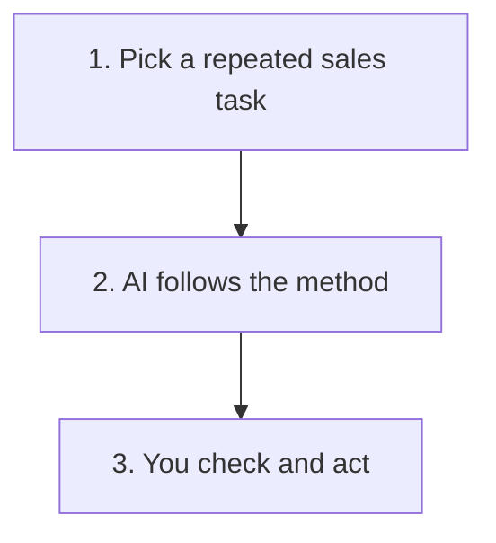

# What Is a Sales AI Skill?

New to using AI at work at all? Start with [getting started with AI](getting-started-with-ai.md) first, then come back here.

A sales AI skill gives an AI assistant a repeatable way to handle one sales task.

Think of it as a set of working instructions. It tells the AI what to look for, what a useful answer should contain and where a person must stay in control.

## Remember These Three Things

### 🔁 It Makes Repeated Work More Consistent

You do not need to explain the same process every time.

### 👀 It Prepares the Work, You Judge It

The AI can organise, check and draft. You still own the decision, customer relationship and final action.

### 🛡️ It Needs Clear Boundaries

A good skill says what the AI must not invent, decide or do without approval.

## Try the Skills Library

Most skills here use the same fictional Hartwell conversation, so none of them contain real customer or employer information. Outbound prospecting uses a separate fictional scenario, since outbound happens before any call exists.

- [Extract Post Call Evidence](../.agents/skills/extract-post-call-evidence/SKILL.md) — separates facts from assumptions after a call and suggests a next step
- [Build Business Case](../.agents/skills/build-business-case/SKILL.md) — turns call evidence into a tailored business case for the actual decision maker
- [Champion Enablement](../.agents/skills/champion-enablement/SKILL.md) — prepares an internal champion to carry that case to other stakeholders, without guessing what they care about
- [Draft Follow-Up Email](../.agents/skills/draft-follow-up-email/SKILL.md) — personalises a fixed post-call email template, including for multiple recipients
- [Plan Chase Sequence](../.agents/skills/plan-chase-sequence/SKILL.md) — decides what, if anything, to send a prospect who has gone quiet
- [Respond to an Objection](../.agents/skills/objection-response/SKILL.md) — diagnoses what is actually driving a stated objection before answering it
- [Plan Outbound Prospecting](../.agents/skills/outbound-prospecting/SKILL.md) — selects a cold target and drafts a first-touch message worth a reply
- [Review a Lost Opportunity](../.agents/skills/review-lost-opportunity/SKILL.md) — works out if a closed or stalled deal is genuinely over, or just blocked

Running two of these in sequence on the same call? [Skill Handoff Contracts](skill-handoff-contracts.md) covers what should actually pass between them.

Not sure which of these actually fits a situation you're describing? The [Workflow Router](../.agents/skills/workflow-router/SKILL.md) reads it in plain English and hands off to the right one, see the [full guide](workflow-router.md) for a worked example.

## Before You Use a Skill on Real Work

- Start with a repeated business problem
- Check which AI tools your company allows
- Use only the information genuinely needed
- Keep facts and assumptions separate
- Review the answer before acting
- Keep customer messages and CRM changes under human control

<strong>What can a sales AI skill help with?</strong>

A skill can help with work such as:

- Turning call notes into consistent evidence
- Preparing a first draft
- Spotting missing information
- Applying the same checks every time
- Learning from repeated errors

It is most useful when the task happens regularly and a good result has a recognisable shape.

<strong>What should it never do on its own?</strong>

A skill should not:

- Invent facts, dates or commitments
- Send customer messages automatically
- Change CRM records without approval
- Treat weak evidence as proof that a prospect is qualified
- Replace your company's policies
- Use information you are not allowed to process

<strong>How do I adapt one for my sales process?</strong>

Start with the business problem, not the AI tool.

Ask:

1. What task are we trying to improve?
2. What information is genuinely needed?
3. What should the answer contain?
4. Which decisions still belong to a person?
5. What would make the result unsafe or misleading?
6. How will we know whether it is better than the current process?

Then change the terminology, fields and checks to match your sales process. Keep company policies, customer information and system access in approved environments.

<strong>How do I test it safely?</strong>

Start with a fictional example that includes a few traps, such as an estimated number, a conditional commitment or an unconfirmed meeting.

Check whether the skill:

- Preserves uncertainty
- Identifies missing information
- Avoids inventing momentum
- Produces something useful
- Makes the human checks obvious

If the same mistake appears more than once, improve the instructions and test it again.

