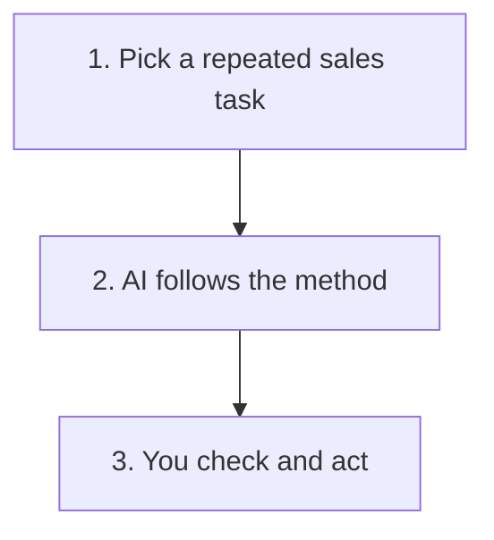

# What Is a Sales AI Skill?

New to using AI at work? Start with [getting started with AI](getting-started-with-ai.md), then come back here.

A sales AI skill gives an AI assistant a repeatable way to handle one sales task.

Think of it as a set of working instructions. It tells the AI what to look for, what a useful answer should contain and where a person must stay in charge.

```mermaid
flowchart TB
    A["1. Pick a repeated sales task"]
    B["2. AI follows the method"]
    C["3. You check and act"]
    A --> B --> C
```

## Remember These Three Things

### 🔁 It Makes Repeated Work More Consistent

You don't need to explain the same process every time.

### 👀 It Prepares the Work, You Judge It

The AI can organise, check and draft. You still own the decision, the customer relationship and the final action.

### 🛡️ It Needs Clear Boundaries

A good skill says what the AI must not invent, decide or do without approval.

## Try the Skills Library

You don't need to set anything up to try one of these. Open any skill below, copy the whole file, and paste it as your first message in whatever AI tool you already use. Once you know you want to use one often, [Selective Installation](selective-installation.md) covers loading it properly into a Project or Custom GPT.

Most skills here use the same fictional Hartwell conversation, so none of them contain real customer or employer information. Four use a different made-up company, because Hartwell doesn't fit what they need: outbound prospecting uses Cedarwell, since outbound happens before any call exists; the fit and limitations review uses Kellow Distribution, which raises several use cases at once; real blocker diagnosis uses Rowcastle Group, where a call gains an unplanned attendee; and identify buyer indecision uses Apex Logistics, a late-stage deal that keeps slipping. Three work across a whole made-up dataset rather than one conversation: the pipeline evidence review, the CRM hygiene review and the objection pattern review. Building a business case uses Hartwell and adds a second Bramfield Insurance Group scenario. Every company, person and figure in all of them is invented.

- [Extract Post Call Evidence](../.agents/skills/extract-post-call-evidence/SKILL.md): separates facts from assumptions after a call and suggests a next step
- [Prepare for a Sales Call](../.agents/skills/prepare-for-sales-call/SKILL.md): turns approved account context into a concise, evidence-led call card
- [Fit and Limitations Review](../.agents/skills/fit-and-limitations-review/SKILL.md): sorts each use case a prospect raised into a good fit, a poor fit or genuinely uncertain, before anyone builds a business case around one that was never going to work
- [Build a Business Case](../.agents/skills/build-business-case/SKILL.md): turns call evidence into a tailored business case for the actual decision maker
- [Champion Enablement](../.agents/skills/champion-enablement/SKILL.md): prepares an internal champion to carry that case to other stakeholders, without guessing what they care about
- [Draft a Follow-Up Email](../.agents/skills/draft-follow-up-email/SKILL.md): personalises a fixed post-call email template, including for multiple recipients
- [Plan a Chase Sequence](../.agents/skills/plan-chase-sequence/SKILL.md): decides what, if anything, to send a prospect who has gone quiet
- [Real Blocker Diagnosis](../.agents/skills/real-blocker-diagnosis/SKILL.md): checks whether the person raising a concern is the decision-maker, and whether the stated objection is the real one or covers for something unsaid
- [Respond to an Objection](../.agents/skills/objection-response/SKILL.md): works out what's driving a stated objection before answering it
- [Review Objection Patterns](../.agents/skills/review-objection-patterns/SKILL.md): tells repeated wording apart from real shared causes across several deals
- [Identify Buyer Indecision](../.agents/skills/identify-buyer-indecision/SKILL.md): checks whether a delay is real indecision, an approval step or a hidden objection, before deciding how to respond
- [Opportunity Handover](../.agents/skills/opportunity-handover/SKILL.md): prepares a handover based on evidence, so the person taking over a live deal knows what's confirmed and what isn't
- [Plan Outbound Prospecting](../.agents/skills/outbound-prospecting/SKILL.md): picks a cold target and drafts a first-touch message worth replying to
- [Pipeline Evidence Review](../.agents/skills/pipeline-evidence-review/SKILL.md): checks whether evidence supports the stages, close dates and next steps in a pipeline, not just whether the CRM records them
- [CRM Hygiene Review](../.agents/skills/crm-hygiene-review/SKILL.md): checks a CRM export for duplicates, missing fields, stale records and close dates that don't fit their stage
- [Review a Lost Opportunity](../.agents/skills/review-lost-opportunity/SKILL.md): works out whether a closed or stalled deal is really over, or just blocked

Running two of these one after the other on the same call? [Skill Handoff Contracts](skill-handoff-contracts.md) covers what should pass between them.

Not sure which of these fits your situation? Describe it in plain English to the [Workflow Router](../.agents/skills/workflow-router/SKILL.md) and it hands off to the right one. The [full guide](workflow-router.md) has a worked example.

## Before You Use a Skill on Real Work

- Start with a repeated business problem
- Check which AI tools your company allows
- Use only the information you need
- Keep facts and assumptions separate
- Review the answer before acting
- Keep customer messages and CRM changes under human control

<strong>What can a sales AI skill help with?</strong>

A skill can help with work such as:

- Turning call notes into consistent evidence
- Preparing a first draft
- Spotting missing information
- Applying the same checks every time
- Learning from repeated errors

It's most useful when the task comes up often and a good result has a recognisable shape.

<strong>What should it never do on its own?</strong>

A skill should not:

- Invent facts, dates or commitments
- Send customer messages automatically
- Change CRM records without approval
- Treat weak evidence as proof that a prospect is qualified
- Replace your company's policies
- Use information you aren't allowed to process

<strong>How do I adapt one for my sales process?</strong>

Start with the business problem, not the AI tool.

Ask:

1. What task are we trying to improve?
2. What information do we need?
3. What should the answer contain?
4. Which decisions still belong to a person?
5. What would make the result unsafe or misleading?
6. How will we know whether it is better than the current process?

Then change the wording, fields and checks to match your sales process. Keep company policies, customer information and system access in approved places.

<strong>How do I test it safely?</strong>

Start with a fictional example that includes a few traps, such as an estimated number, a conditional commitment or an unconfirmed meeting.

Check whether the skill:

- Preserves uncertainty
- Identifies missing information
- Avoids inventing momentum
- Produces something useful
- Makes the human checks obvious

If the same mistake appears more than once, improve the instructions and test it again.

