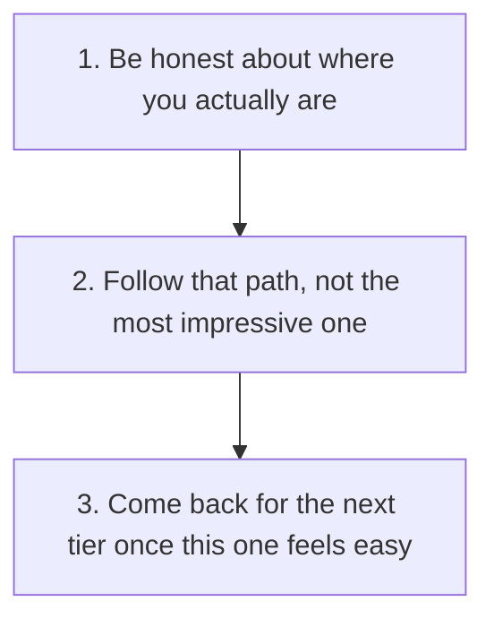

# Where Should You Start?

This repository has grown into workflows, guides, templates and portable skills. Where to start depends on how much you have actually used AI in your job already, not how much you would like to have used.

## Remember These Three Things

### 🎯 Match the Tier to Reality, Not Ambition

Starting too advanced just means re-reading the basics later anyway. Starting too basic wastes ten minutes, not ten hours.

### 🔁 Every Tier Leads Back Here

None of these paths are a closed loop. Follow one, then come back and move up when it stops teaching you anything new.

### 📈 Move Up When It Feels Easy, Not Before

The tiers are ordered by how much still feels new, not by seniority or how it looks to skip ahead.

## Pick Your Starting Point

### 🌱 Starting From Scratch

You have not used ChatGPT, Claude, or a similar tool seriously yet, or you tried once and did not get much out of it.

1. [Getting Started with AI](getting-started-with-ai.md) — what these tools actually are, and how to get a useful answer out of one
2. [Set Up Your Own AI for Sales](set-up-your-ai-for-sales.md) — give it real context about you and your job, once, instead of starting from a blank page every time
3. [Prepare for a Sales Call](../workflows/01-pre-call-preparation.md) — the simplest workflow here, a good first real task to try
4. Come back to this page once that feels easy, not effortful

### 🌿 Used It a Bit

You have used AI for the odd email or quick question, but have not built anything repeatable out of it yet.

1. [Set Up Your Own AI for Sales](set-up-your-ai-for-sales.md) — the single biggest jump from generic answers to useful ones is standing context, not a cleverer one-off prompt
2. [What Is a Sales AI Skill?](what-is-a-sales-ai-skill.md) — the idea of turning a one-off prompt into something repeatable
3. [Follow Up After a Sales Call](../workflows/02-post-call-follow-up.md) and its [worked example](../examples/northstar-post-call-output.md) — see the quality bar before trying it on your own work

### 🌳 Used It a Lot

AI is already part of your regular workflow. What you actually want is more consistency and less re-explaining yourself each time.

1. If you have not already standardised your own setup, [Set Up Your Own AI for Sales](set-up-your-ai-for-sales.md) is worth the fifteen minutes
2. The [skills library](what-is-a-sales-ai-skill.md#try-the-skills-library) — install one of these instead of writing the same prompt from scratch every time
3. [Get More From Your AI](get-more-from-your-ai.md) — projects, skills, and connectors, once a single prompt has stopped being enough
4. [Sales AI Output Rubric](../evaluations/sales-ai-output-rubric.md) — start scoring your own results instead of trusting them because they read well

### 🌲 AI Wizard

You are already comfortable building and adapting AI workflows, and you might want to adapt this repository rather than just use it as-is.

1. [Get More From Your AI](get-more-from-your-ai.md) — if you have not already, connect real reference material and live tools rather than working from a single prompt
2. Read a couple of the [evaluations](../evaluations/) alongside their outputs, to see how the honest-review habit actually works in practice, including where a result fell short
3. [Responsible Use](../RESPONSIBLE-USE.md) and [Methodology](../METHODOLOGY.md) — the guardrails and reasoning worth keeping if you adapt any of this for your own role
4. Adapt a skill for yourself: the "How do I adapt one for my sales process?" section in [What Is a Sales AI Skill?](what-is-a-sales-ai-skill.md) walks through it directly
