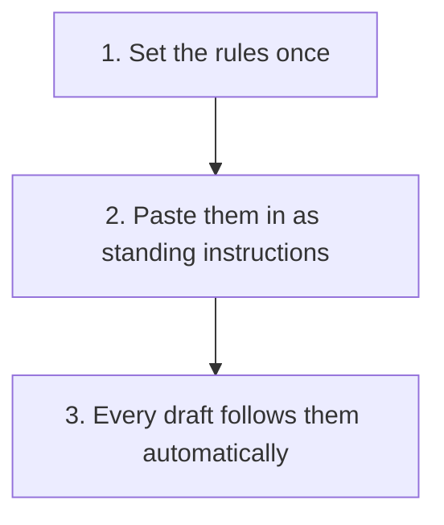

# Writing Style and Formatting

Standing instructions for tone and formatting that work across emails, documents, scripts and chases. Paste this into any AI tool's custom instructions or system prompt when you start somewhere new, and change the details to fit your own voice.


```mermaid
flowchart TB
    A["1. Set the rules once"]
    B["2. Paste them in as standing instructions"]
    C["3. Every draft follows them automatically"]
    A --> B --> C
```

## Remember These Three Things

### 🗣️ Say It Plainly

Direct, plain, human. Short sentences. Contractions. Don't hedge or over-qualify.

Not: "I just wanted to reach out to see if you might have had a chance to look at the resources I sent over."
Yes: "Did the business case land? Happy to answer anything before you share it on."

### 🚫 Skip the Filler

Cut "just checking in", "hope you're well", "I'd love to", and anything else that fills space rather than saying something.

### 📐 Keep the Format Consistent, Every Time

Same sign-off, same date style, same link style, in every draft, not just the ones you remember to check.

<details>
<summary><strong>What makes writing plain?</strong></summary>

George Orwell set out six rules in his 1946 essay *Politics and the English Language*. In plain words:

1. Drop stock phrases and metaphors you've seen so often you no longer notice them, like "move the needle" or "low-hanging fruit".
2. Use the short word when it does the job: "use", not "utilise"; "help", not "facilitate".
3. Cut every word you can. If the sentence still works without it, it goes.
4. Write in the active voice: "I sent the proposal", not "the proposal was sent".
5. Use everyday words, not jargon: "decided in advance", not "pre-registered".
6. Break any of these rules rather than write something clumsy.

</details>

<details>
<summary><strong>What phrases should I avoid?</strong></summary>

- "Just checking in" or "just circling back"
- "Hope you're well"
- "I'm excited to" or "I'd love to"
- "Diving deeper", "aligned on", "leverage", "unlock", "seamless", "eye-opening"
- Anything that fills space rather than saying something

</details>

<details>
<summary><strong>What are the exact formatting rules?</strong></summary>

- No em dashes. Rewrite using a comma, colon or full stop instead.
- No smart quotes or curly apostrophes. Use the straight ASCII forms. Word processors and some note apps swap in the curly ones without telling you, so check after pasting anything in.
- No emojis in customer-facing writing, unless the recipient uses them first.
- No bold-colon formatting in bullet lists.
- Dates always with an ordinal suffix: 21st May, 3rd July, 20th August. Never "May 21st" or "21 May".
- Spell out numbers one to nine in prose; numerals for 10 and above.
- Percentages in numerals: 95%, not ninety-five per cent.
- Currency figures in full: £18,000, not eighteen thousand pounds.
- Prose over lists where you can; lists are for real lists of items, not for padding out a reply.
- No headers inside emails; headers are for documents, not messages.
- Short paragraphs, one idea per paragraph.

</details>

<details>
<summary><strong>How do I sign off and link things?</strong></summary>

Sign-off, on two lines, not one:

```
Best,
[Your name]
```

Not "Best, [Name]" on the same line.

Links:

- Descriptive label text: "Business Case for Alex", "Book a Call".
- Never a bare URL displayed as text.
- Never markdown link syntax where it won't render, such as most CRM rich text fields.

</details>

<details>
<summary><strong>How do I adapt this for myself?</strong></summary>

This file is general on purpose. What helps is having one standing reference, rather than explaining your tone again in every new conversation.

Copy it and change the details: your sign-off name, any phrases your industry should avoid, and currency and date rules if you don't write in British English. Then keep it as the one place these rules live.

</details>

## Keep Diagrams Consistent

Use the [Gemini Visual Style Prompt](../templates/gemini-visual-style-prompt.md) when you make a new diagram for this repository. It has the approved colours, layout, accessibility rules and reference image, plus the checks to run before you publish anything it generates.
