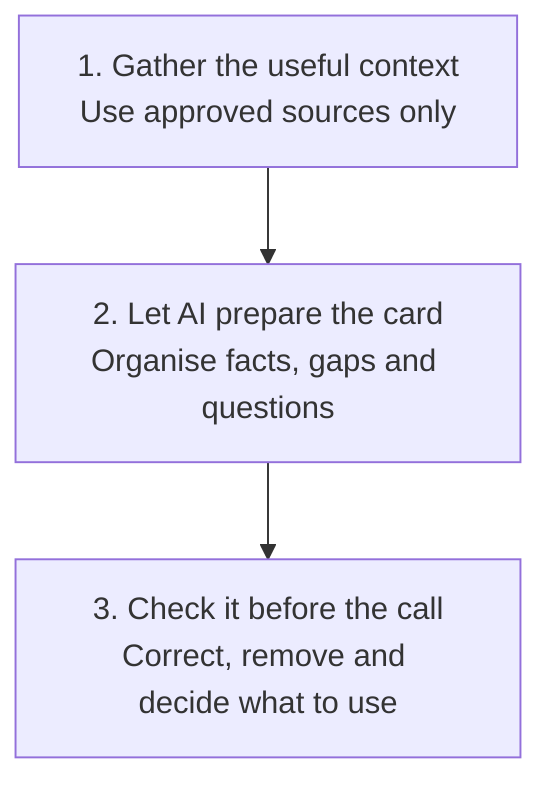

# AI Pre Call Preparation

Turn scattered account information into one short call card you can use during the conversation.

## 👀 At a Glance

| | |
| --- | --- |
| **Use this when** | You have a sales call and the useful context is spread across different places |
| **What you need** | Contact details, meeting purpose, relevant notes and approved public information |
| **What you get** | A concise call card with facts, gaps, questions and conversation paths |
| **Your responsibility** | Check the facts and decide what is appropriate to use |

## 🔄 How It Works



## 🚀 Start Here

- [Use the Pre Call Card template](../templates/pre-call-card.md)
- [See the completed Northstar example](../examples/northstar-pre-call.md)
- Once your card is done, [practise pushback before the call](../templates/pre-call-objection-roleplay-prompt.md), optional, [see what it produces](../examples/northstar-pre-call-roleplay.md)

<details>
<summary><strong>See the information you need</strong></summary>

Use only information you are permitted to process:

1. Contact name, role and company
2. Purpose of the meeting
3. Relevant CRM notes or previous interactions
4. Public company information from reliable sources
5. Your offer and the outcome you want from the call

Do not include passwords, payment information, sensitive personal data, confidential documents or unnecessary customer information.

</details>

<details>
<summary><strong>See the full method</strong></summary>

### 1. Define the Job of the Call

Write one sentence describing what a good outcome looks like. For an early conversation, this may simply be confirming whether a problem is important enough to explore further.

### 2. Build a Compact Account Snapshot

Organise the approved inputs into confirmed company facts, contact context, relevant previous interactions and missing information.

Require links or source labels for public claims. If something cannot be verified, label it as an assumption.

### 3. Form a Relevance Hypothesis

Create a short, testable idea connecting the prospect's likely situation to the problem you help solve.

**Avoid:** "They need AI."

**Try:** "If the revenue operations team is manually consolidating call notes and CRM updates, reducing that administration may be worth exploring."

The hypothesis is a starting point for a question, not a claim about the prospect.

### 4. Prepare the Conversation Paths

Prepare three lightweight routes:

- The contact recognises the problem
- The initial idea is wrong or not a priority
- You reach voicemail or get no answer

### 5. Run the Human Check

Confirm the person and company are correct, factual claims have sources, assumptions are labelled and the questions invite discovery.

</details>

<details>
<summary><strong>Copy the AI instruction</strong></summary>

```text
Act as a sales preparation assistant. Use only the information I provide.

Create a concise pre call card using the supplied template. Separate confirmed facts from assumptions. Do not invent company initiatives, challenges, budgets, technologies or personal details. If evidence is missing, state "Unknown" and suggest a discovery question.

Keep the card practical enough to scan during a live call. The salesperson will verify the output and decide what to use.
```

Attach the completed template and your approved source material beneath the instruction.

</details>

## ✅ Check Before You Use It

- Is the named person and company correct?
- Can you trace every factual claim to a source?
- Are assumptions clearly labelled?
- Do the questions sound natural?
- Is the next step right for this stage?

## 📏 What to Measure

- Preparation time
- Factual corrections needed
- Whether the card helped produce a clear next step
- Which parts you actually used during the call

The aim is better preparation with less avoidable effort, not more text.
