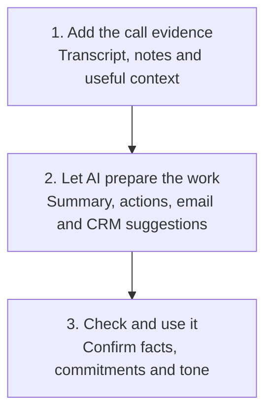

# Post Call Follow Up

Turn a transcript or clear notes into the things you need after a sales call, without inventing commitments or momentum.

## 👀 At a Glance

| | |
| --- | --- |
| **Use this when** | You have finished a sales call and need to follow up properly |
| **What you need** | A transcript or clear notes, plus relevant CRM or email context |
| **What you get** | Summary, actions, missing information, email draft and CRM suggestions |
| **Your responsibility** | Check the output, send the email and approve any CRM changes |

## 🔄 How It Works

## 🚀 Start Here

- [Use the Post Call Follow Up prompt](../templates/post-call-follow-up-prompt.md)
- [Read the fictional Northstar transcript](../examples/northstar-post-call-transcript.md)
- [See the completed output](../examples/northstar-post-call-output.md)
- [Read the scored review](../evaluations/northstar-post-call-review.md)

<strong>See exactly what it produces</strong>

1. A short call summary
2. Confirmed facts and estimates
3. Agreed actions with owners and dates
4. Missing information and points to check
5. A natural follow up email draft
6. Suggested CRM updates

The workflow prepares these items. It does not send the email or update the CRM.

<strong>See the full method</strong>

### 1. Extract the Evidence

Separate what was directly stated, what was estimated, what was discussed without agreement and what is still unknown.

### 2. Check the Commitments

For every action, record the owner, exact commitment, date or timing and evidence from the call. Do not turn a suggestion into an agreement.

### 3. Draft the Follow Up

Write a short email that sounds like the salesperson. Include only agreed actions and use placeholders where a time or detail still needs checking.

### 4. Suggest CRM Updates

Prepare CRM notes and fields for review. Clearly label them as suggestions and do not claim they have been saved.

### 5. Run the Human Check

Check every important statement, estimate, date and commitment before using the output.

## ✅ Check Before You Use It

- Is every important statement supported by the call?
- Are estimates clearly labelled?
- Are dates, owners and commitments exact?
- Has the AI invented a meeting or next step?
- Does the email sound like you?
- Are CRM changes still waiting for approval?

## 📏 What to Measure

- Time from transcript to checked output
- Factual corrections needed
- Invented or overstated claims
- Whether every action has the right owner and timing
- How much of the email and CRM draft you keep
