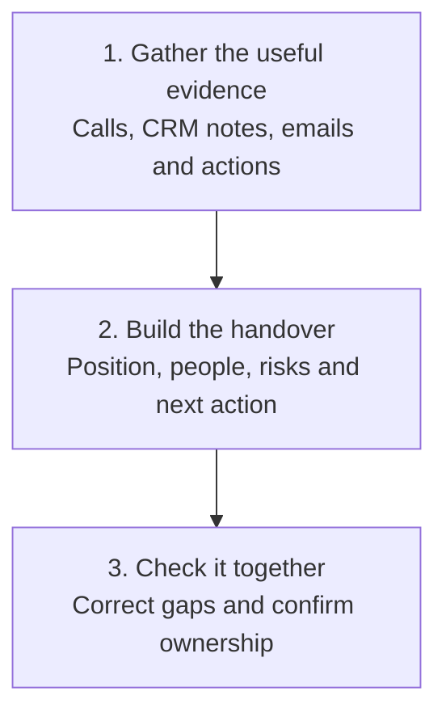

# Opportunity Handover

Pass a sales opportunity to another person without losing the useful context or making the deal sound further along than it is.

## 👀 At a Glance

| | |
| --- | --- |
| **Use this when** | An opportunity is moving to another person, team or stage |
| **What you need** | Recent call evidence, CRM notes, relevant emails and agreed actions |
| **What you get** | A short handover with the current position, evidence, risks and next action |
| **Your responsibility** | Check the handover and speak to the person receiving it |

## 🔄 How It Works

## 🚀 Start Here

- [Use the Opportunity Handover prompt](../templates/opportunity-handover-prompt.md)
- [See the completed Northstar handover](../examples/northstar-opportunity-handover.md)
- [Read the honest review](../evaluations/northstar-opportunity-handover-review.md)

<strong>See exactly what it produces</strong>

1. A 30 second brief
2. The current position
3. People involved and their confirmed roles
4. Business problem and desired outcome
5. Confirmed evidence
6. Estimates, assumptions and unknowns
7. Actions, risks and recommended next step
8. Links to the useful source material

<strong>See the full method</strong>

### 1. Gather the Evidence

Use the most recent approved sources. Include useful call notes, CRM history, customer emails, proposals and agreed actions. Leave out background that will not help the next person.

### 2. Separate Evidence from Interpretation

Keep confirmed facts, customer estimates, your own assumptions and unknowns clearly separated. Preserve conditions such as subject to approval or timing to be confirmed.

### 3. Write for the Next Person

Put the current position and next action first. The recipient should not have to read the entire history to understand where things stand.

### 4. Link to the Sources

Summarise the evidence, but keep links to the useful records. A handover should help someone navigate the history, not replace it with an unsupported summary.

### 5. Complete the Handover Together

Talk through important judgement, risks and gaps. Confirm who owns the next action and what the receiving person still needs to check.

## ✅ Check Before You Hand It Over

- Can someone understand the current position in 30 seconds?
- Is every important claim supported by a source?
- Are estimates and assumptions clearly labelled?
- Are tentative stakeholders still described as tentative?
- Does every action have the right owner and timing?
- Is the recommended next step appropriate for the evidence?
- Has the receiving person accepted ownership?

## 📏 What to Measure

- Time needed to prepare and understand the handover
- Questions the receiving person still has
- Factual corrections needed
- Missed actions or duplicated work after the handover
- Whether the next step happened with the right context

The aim is continuity and good judgement, not a longer summary.
