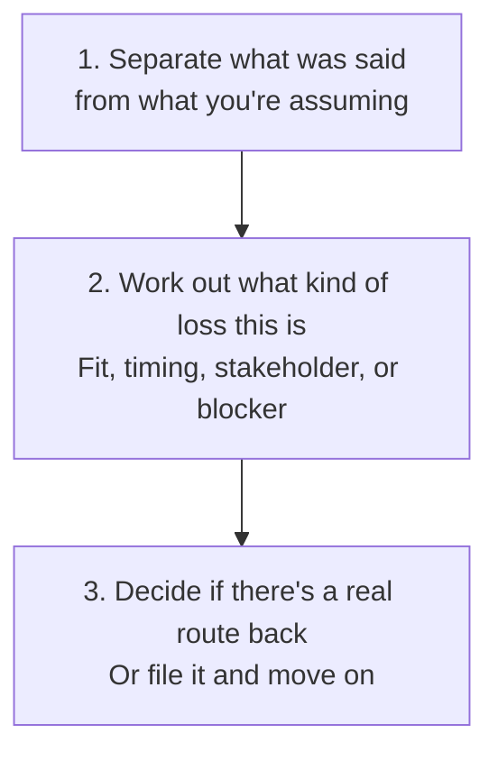

# Lost Opportunity Review

Look back at a deal that did not close and work out honestly whether it is actually over, or just blocked, before deciding whether there is a real way back in.

## 👀 At a Glance

| | |
| --- | --- |
| **Use this when** | An opportunity has closed without a sale, or has gone quiet long enough that it deserves a proper review rather than another chase |
| **What you need** | CRM history, the final message or stated reason, and anything you know about what changed on the other side |
| **What you get** | An honest read on why it likely did not close, whether it is genuinely over, and what, if anything, would justify approaching it again |
| **Your responsibility** | Decide whether and when to re-approach; do not let this become a reason to chase someone who has clearly said no |

## 🔄 How It Works

## 🚀 Start Here

- [Use the Lost Opportunity Review prompt](../templates/lost-opportunity-review-prompt.md)
- [See the completed Hartwell analysis](../examples/hartwell-lost-opportunity-analysis.md)
- [Read the honest review](../evaluations/hartwell-lost-opportunity-review.md)

<strong>See exactly what it produces</strong>

1. What was actually said, kept separate from what's being assumed
2. The most likely reason, or reasons, this did not close
3. Whether the underlying problem still exists, independent of who raised it
4. Whether this is a genuine disqualification or a paused opportunity
5. What would justify a future approach, and roughly when
6. What not to do next

<strong>See the full method</strong>

### 1. Separate Fact from Assumption

Start with exactly what was said or shown, not the story that would make the most sense of it. A stated reason often blends more than one factor together. Do not collapse it into a single tidy explanation the evidence does not actually support.

### 2. Check Whether the Underlying Problem Still Exists

The reason given for a loss is not always the same thing as the opportunity itself. A champion leaving, a stakeholder changing, or one objection landing badly does not automatically mean the business problem this deal was solving has gone away. Check whether the evidence for that problem still stands on its own, separately from why this particular attempt did not work.

### 3. Classify the Loss

Work out which of these is the closest fit, and say so honestly rather than defaulting to the most comfortable answer:

- **Genuine disqualification**: the fit was never really there, or a hard blocker such as budget, compliance, or authority is real and unlikely to change.
- **Timing**: the fit is real, but now is not the right moment. A stated cycle, a reorganisation, or a stated future point often means exactly that, not a polite no.
- **Stakeholder change**: the specific person the deal ran through is no longer the route in, but the underlying evidence and problem may still be usable through someone else.
- **Unresolved objection or blocker**: something specific was raised, an answer or a workaround was actually sent back, and it was rejected, or a genuine back-and-forth happened without landing.
- **No decision at all**: something specific was raised, an answer or a workaround was sent back, and then contact from both sides simply stops. Nobody said no. This is a live thread nobody returned to, not the prospect quietly deciding against it, and the right next action is following up on the answer already sent, not waiting for an external trigger.

### 4. Decide What Would Justify Coming Back

Do not default to either extreme: silently writing it off forever, or scheduling another chase straight away. If there is a real trigger, a stated future cycle, a new stakeholder in the role, new evidence, name it specifically. If there genuinely is not one, say that plainly instead of inventing a hopeful plan to soften the loss.

### 5. Keep the Reusable Evidence

Anything measured, proven, or genuinely useful from the work already done, a pilot result, a business case, a proof point, does not expire just because this particular opportunity did not close. Keep it somewhere it can be reused for the next approach to this prospect, or for a different one entirely.

## ✅ Check Before You File This Away

- Is the stated reason for the loss kept separate from what you are inferring?
- Does the reason blend more than one factor that should really be considered separately?
- Have you checked whether the underlying business problem still exists, regardless of who raised it or who left?
- Is this labelled a genuine disqualification only because the evidence actually supports that, not just because contact has gone quiet?
- If contact went quiet after your side sent an answer or a workaround, have you checked whether the prospect ever actually replied, rather than assuming silence means no?
- If there is a real reason to revisit this later, is it specific, not vague hope dressed up as a plan?
- Would chasing this again right now contradict something the prospect actually said?
- If the CRM stage itself is an internal or company-specific label, do you actually know what it means, or are you assuming from its name or position?

## 📏 What to Measure

- How often opportunities marked lost are later reclassified as paused or reopened
- How often a stated reason turns out to be more than one factor once reviewed properly
- Whether reusable evidence from a lost deal, such as a proof point or pilot result, actually gets reused elsewhere
- Time between a deal closing lost and any honest review of it actually happening
