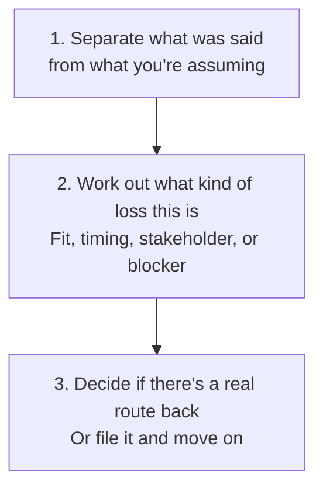

# Lost Opportunity Review

Look back at a deal that didn't close and work out whether it's over or just blocked, before you decide whether there's a real way back in.

## 👀 At a Glance

| | |
| --- | --- |
| **Use this when** | An opportunity has closed without a sale, or has gone quiet long enough to deserve a proper review rather than another chase |
| **What you need** | CRM history, the final message or stated reason, and anything you know about what changed on the other side |
| **What you get** | An honest view of why it probably didn't close, whether it's over, and what, if anything, would justify approaching it again |
| **Your responsibility** | Decide whether and when to go back. Don't let this become a reason to chase someone who has clearly said no |

## 🔄 How It Works

```mermaid
flowchart TB
    A["1. Separate what was said<br/>from what you're assuming"]
    B["2. Work out what kind of loss this is<br/>Fit, timing, stakeholder, or blocker"]
    C["3. Decide if there's a real route back<br/>Or file it and move on"]
    A --> B --> C
```

## 🚀 Start Here

- [Use the Lost Opportunity Review prompt](../templates/lost-opportunity-review-prompt.md)
- [See the completed Hartwell analysis](../examples/hartwell-lost-opportunity-analysis.md)
- [Read the honest review](../evaluations/hartwell-lost-opportunity-review.md)
- [Use with AI: the review-lost-opportunity skill](../.agents/skills/review-lost-opportunity/SKILL.md)
- [Read the real-use finding](../CHANGELOG.md#real-use-findings): a real stalled deal showed that one type of loss, no decision at all, was missing
- [Read the recovery finding](../evaluations/lost-opportunity-recovery-real-use-finding.md): a real opportunity that had gone quiet was reviewed, a different route in was found, and approved outreach got a reply and a booked call

<strong>See exactly what it produces</strong>

1. What was said, kept separate from what's assumed
2. The most likely reason, or reasons, it didn't close
3. Whether the underlying problem still exists, whoever raised it
4. Whether this is a genuine disqualification or a paused opportunity
5. What would justify a future approach, and roughly when
6. What not to do next

<strong>See the full method</strong>

### 1. Separate Fact from Assumption

Start with exactly what was said or shown, not the story that would best explain it. A stated reason often mixes more than one factor. Don't squash it into one tidy explanation the evidence doesn't support.

### 2. Check Whether the Underlying Problem Still Exists

The reason given for a loss isn't the same thing as the opportunity. A champion leaving, a stakeholder changing or one objection landing badly doesn't mean the business problem has gone away. Check whether the evidence for that problem still stands on its own, apart from why this attempt didn't work.

### 3. Classify the Loss

Work out which of these fits best, and say so honestly rather than picking the most comfortable answer:

- **Genuine disqualification** means the fit was never really there, or a hard blocker such as budget, compliance or authority is real and unlikely to change.
- **Timing** means the fit is real, but now isn't the right moment. A stated cycle, a reorganisation or a future point they named often means just that, not a polite no.
- **Stakeholder change** means the person the deal ran through is no longer the way in, but the evidence and the problem may still be usable through someone else.
- **Unresolved objection or blocker** means something specific was raised, your side sent back an answer or a workaround, and they rejected it, or there was a real back-and-forth that never settled.
- **No decision at all** means something specific was raised, your side sent back an answer or a workaround, and then both sides simply stopped. Nobody said no. This is a live thread nobody went back to, not the prospect quietly deciding against it. The right next step is to follow up on the answer already sent, not to wait for an outside trigger.

Never treat an internal CRM stage label specific to your company as evidence for one of these unless something in the record defines it. A stage name that looks self-explanatory often isn't. Confirm what it means before you use it to support a classification, or say plainly that it's unconfirmed.

### 4. Decide What Would Justify Coming Back

Avoid both extremes: quietly writing it off for good, or booking another chase straight away. If there's a real trigger, such as a stated future cycle, a new person in the role or new evidence, name it. If there isn't one, say so plainly instead of inventing a hopeful plan to soften the loss.

### 5. Keep the Reusable Evidence

Anything measured, proven or useful from the work already done, such as a pilot result, a business case or a proof point, doesn't expire because this opportunity didn't close. Keep it where you can reuse it for the next approach to this prospect, or for a different one.

## ✅ Check Before You File This Away

- Is the stated reason for the loss kept separate from what you're inferring?
- Does the reason mix more than one factor that you should look at separately?
- Have you checked whether the business problem still exists, whoever raised it or left?
- Is it labelled a genuine disqualification only because the evidence supports that, not just because contact has gone quiet?
- If contact went quiet after your side sent an answer or a workaround, have you checked whether the prospect ever replied, rather than assuming silence means no?
- If there's a real reason to revisit this later, is it specific, not vague hope passed off as a plan?
- Would chasing this again now go against something the prospect said?
- If the CRM stage is an internal or company-specific label, do you know what it means, or are you guessing from its name or position?

## 📏 What to Measure

- How often opportunities marked lost are later reclassified as paused or reopened
- How often a stated reason turns out to be more than one factor after a proper review
- Whether reusable evidence from a lost deal, such as a proof point or pilot result, gets reused elsewhere
- Time between a deal closing lost and anyone reviewing it honestly

## 💬 Tried It?

[Share structured workflow feedback](https://github.com/shaunmarsden/practical-ai-sales-workflows/issues/new?template=workflow-feedback.md) about what worked, where you got stuck and what you would change. Please do not include customer, employer or confidential information.
