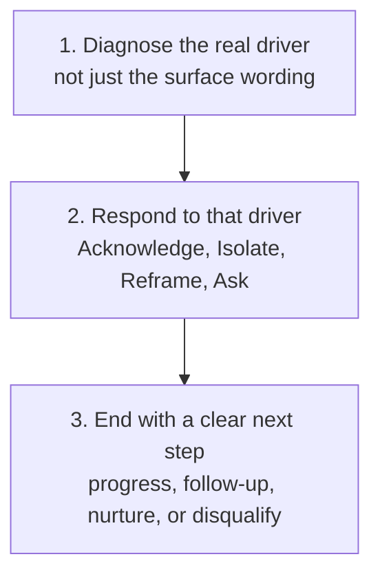

# Objection Handling

Work out what is actually driving an objection before answering it, so you address the real concern rather than arguing with the surface wording.

## 👀 At a Glance

| | |
| --- | --- |
| **Use this when** | A prospect has raised a specific concern, pushback, or blocker, spoken or written, and you need to respond well rather than react |
| **What you need** | The objection as stated, what you know about the person's role and authority, and whether you need a live spoken answer or a written reply |
| **What you get** | A diagnosis of what is really driving the objection, a structured response, and an honest read on what the pipeline should do next |
| **Your responsibility** | Decide what to actually say or send, and never let a stated objection be answered with an invented fact or an unauthorised commitment |

## 🔄 How It Works

## 🚀 Start Here

- [Use the Objection Handling prompt](../templates/objection-handling-prompt.md)
- [See the completed Hartwell response](../examples/hartwell-objection-response.md)
- [Read the honest review](../evaluations/hartwell-objection-review.md)
- [Use with AI: the objection-response skill](../.agents/skills/objection-response/SKILL.md)

<strong>See exactly what it produces</strong>

1. The objection restated exactly as it was raised, without softening it
2. Which bucket is actually driving it, with the reasoning, not just a label
3. A response built from Acknowledge, Isolate, Reframe, Ask
4. A specific next step, never an answer that just trails off
5. An honest pipeline decision, including disqualification where that is the right call

<strong>See the full method</strong>

### 1. Gather the Inputs

Start with the objection quoted or closely paraphrased, not summarised into a vaguer version of itself. Note what you already know about the person's role, authority, and stage in the process, whether you need a fast spoken answer or a considered written reply, and any objection already raised earlier in this deal, so the same one is not re-litigated from scratch.

### 2. Identify the Real Driver

The same surface wording can sit in different buckets depending on context. Work out which one is actually driving this objection:

- **Circumstances**: timing, budget, "too busy", "not now"
- **Other people**: needs sign-off, a stakeholder to convince, someone else to check with
- **Self**: needs to think it over, wants more information, genuine uncertainty
- **Competitor or tooling**: already has something in place, sees this as redundant
- **Information**: a specific factual question, wants proof, wants to understand a risk
- **Disqualification**: this genuinely does not fit, and is the wrong conversation

"I need to check with my manager" from someone who holds real budget authority is a circumstances objection. The same words from someone who was never the decision-maker is closer to a disqualification signal, and deserves a completely different response.

### 3. Respond Using Acknowledge, Isolate, Reframe, Ask

- **Acknowledge**: show the objection was heard, without agreeing it is fatal
- **Isolate**: confirm whether this is the only thing in the way, or one of several
- **Reframe**: address the real concern from the bucket above, not the surface wording
- **Ask**: end with a specific question or concrete next step, never just an explanation

### 4. Apply the Guardrails

- Never invent a fact, statistic, or guarantee to win the objection.
- Never argue with a genuine disqualification. A prospect who does not fit is not a harder sell, they are the wrong conversation.
- Do not let a single-issue objection turn into a five-point pitch. Answer what was actually raised.
- Keep any comparison to a named competitor or existing tool positioning-neutral. Never disparage it by name.

### 5. End With a Real Next Step

Every objection response should end in one of four places: the conversation progresses, a dated follow-up is agreed, it moves to a longer nurture, or it is honestly disqualified. Answering the objection and then drifting with no next step at all is the most common way a handled objection still loses the deal.

## ✅ Check Before You Send

- Have you diagnosed the real driver, or just answered the surface words?
- Does the bucket you chose actually fit this person's role and authority, not just their phrasing?
- Is the response answering only what was raised, rather than expanding into a full pitch?
- Is every claim in it something you can actually stand behind, with no invented fact or guarantee?
- If a competitor or existing tool is mentioned, is it kept neutral and never disparaged by name?
- Does it end with a specific next step, and is the pipeline decision honest, including disqualification if that is the truth?

## 📏 What to Measure

- How often the diagnosed driver turns out to differ from the surface wording once the prospect responds
- How often an objection response actually moves to a clear next step rather than trailing off
- How often the same objection has to be handled twice because the first answer addressed the wrong driver
- How often a genuine disqualification is called honestly, rather than argued with
