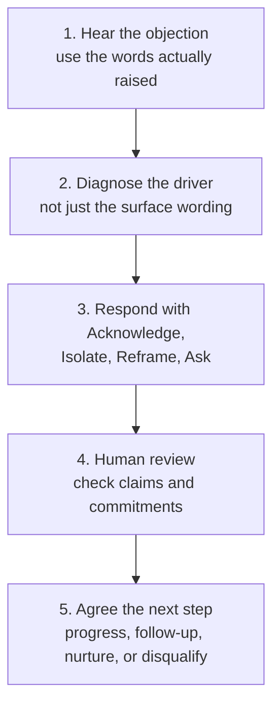

# Objection Handling

Work out what is behind an objection before you answer it, so you deal with the real concern rather than arguing with the words.

> **Choose the right route**
>
> For a specific objection, use this workflow. If the prospect has gone quiet, use the [chase sequence skill](../.agents/skills/plan-chase-sequence/SKILL.md). If the issue is legal, unclear or unauthorised, stop and check first.

## 👀 At a Glance

| | |
| --- | --- |
| **Use this when** | A prospect has raised a specific concern, pushback or blocker, spoken or written, and you need to respond well rather than react |
| **What you need** | The objection as stated, what you know about the person's role and authority, and whether you need a live spoken answer or a written reply |
| **What you get** | A view of what is really behind the objection, a structured response, and a proposed pipeline decision |
| **Your responsibility** | Decide what to say or send, and never answer an objection with an invented fact or a commitment nobody approved |

## 🔄 How It Works

```mermaid
flowchart TB
    A["1. Hear the objection<br/>use the words actually raised"]
    B["2. Diagnose the driver<br/>not just the surface wording"]
    C["3. Respond with Acknowledge,<br/>Isolate, Reframe, Ask"]
    D["4. Human review<br/>check claims and commitments"]
    E["5. Agree the next step<br/>progress, follow-up, nurture, or disqualify"]
    A --> B --> C --> D --> E
```

## 🚀 Start Here

- [Use the Objection Handling prompt](../templates/objection-handling-prompt.md)
- [See the completed Hartwell response](../examples/hartwell-objection-response.md)
- [Read the honest review](../evaluations/hartwell-objection-review.md)
- [See a harder test: a contractual stop condition](../examples/wrenford-objection-response.md), [and its review](../evaluations/wrenford-objection-review.md)
- [See a third test: the correct answer to the surface wording is the wrong move](../examples/thornbury-objection-response.md), [and its review](../evaluations/thornbury-objection-review.md)
- [See a stability test across three models](../evaluations/hartwell-objection-ambiguous-test.md). I ran it nine times on an objection built to have no clear answer. The guardrails held every time but the diagnosis didn't: one model picked a different main driver in each of its three runs
- [Use with AI: the objection-response skill](../.agents/skills/objection-response/SKILL.md)

<strong>See exactly what it produces</strong>

1. The objection restated exactly as it was raised, without softening it
2. Which bucket is really driving it, with the reasoning, not just a label
3. A response built from Acknowledge, Isolate, Reframe, Ask
4. A specific next step, never an answer that just trails off
5. An honest pipeline decision, including disqualification where that's the right call

<strong>See the full method</strong>

### 1. Gather the Inputs

Start with the objection quoted or closely paraphrased, not summarised into something vaguer. Note what you know about the person's role, authority and stage in the process. Note whether you need a fast spoken answer or a considered written reply. And note any objection raised earlier in this deal, so you don't argue the same one again from scratch.

### 2. Identify the Real Driver

The same words can sit in different buckets depending on context. Work out which one is driving this objection:

- **Circumstances**, such as timing, budget, "too busy" or "not now"
- **Other people**, such as needing sign-off, a stakeholder to convince or someone else to check with
- **Self**, such as needing to think it over, wanting more information, or real uncertainty
- **Competitor or tooling**, where they already have something in place and see this as redundant
- **Information**, such as a specific factual question, a request for proof, or wanting to understand a risk
- **Disqualification**, where this doesn't fit and is the wrong conversation

"I need to check with my manager" from someone who holds real budget authority is a circumstances objection. The same words from someone who was never the decision-maker are closer to a sign of disqualification, and need a completely different response.

Watch in particular for a sign that the *rationale* is shrinking, rather than the decision being delayed. An objection hinting that the case may no longer add up is a different problem from one about timing. In the nine-run test above, that was the sharpest reading available, and only one run in nine found it.

**Treat the bucket as a guess the reply can test, not a settled answer.** Run the same unclear objection twice and the main driver can change. That's why the response below checks whether this is the only thing in the way, rather than assuming the diagnosis is right.

### 3. Respond Using Acknowledge, Isolate, Reframe, Ask

- **Acknowledge** that you heard the objection, without agreeing it's fatal
- **Isolate** it: check whether this is the only thing in the way, or one of several
- **Reframe** it: deal with the real concern from the bucket above, not the words
- **Ask** a specific question or offer a concrete next step at the end, never just an explanation

### 4. Apply the Guardrails

- Never invent a fact, statistic or guarantee to win the objection.
- Never argue with a genuine disqualification. A prospect who doesn't fit isn't a harder sell. They're the wrong conversation.
- Don't let a single objection turn into a five-point pitch. Answer what was raised.
- Keep any comparison with a named competitor or existing tool neutral. Never run it down by name.

### 5. Stop When the Task Is Unsafe

Don't write a confident response when:

- The objection raises a legal, compliance or contract question beyond what's already confirmed
- The real blocker is still unclear even after you've tried to find the bucket
- A full answer would need a commitment, such as a discount, a guarantee or a timeline, that nobody has approved

Flag the gap and say what you need before you can answer with confidence, rather than answering around it.

### 6. End With a Real Next Step

Every objection response should end in one of four places: the conversation moves on, you agree a dated follow-up, it moves to a longer nurture, or you honestly disqualify it. Answering the objection and then drifting with no next step is a common way a handled objection still loses the deal.

## 👤 Human Review

The AI drafts the response and proposes the pipeline decision. You decide what to say or send. Nothing is sent, and no stage changes, without your approval.

## ✅ Check Before You Send or Say It

- Have you found the real driver, or just answered the words?
- Does the bucket you chose fit this person's role and authority, not just their phrasing?
- Does the response answer only what was raised, rather than growing into a full pitch?
- Can you stand behind every claim in it, with no invented fact or guarantee?
- If a competitor or existing tool comes up, is it kept neutral and never run down by name?
- Does it end with a specific next step, and is the pipeline decision honest, including disqualification if that's the truth?

## 📏 What to Measure

- How often the driver you found turns out to differ from the words, once the prospect responds
- How often an objection response moves to a clear next step rather than trailing off
- How often you have to handle the same objection twice because the first answer dealt with the wrong driver
- How often a genuine disqualification is called honestly, rather than argued with

## 💬 Tried It?

[Share structured workflow feedback](https://github.com/shaunmarsden/practical-ai-sales-workflows/issues/new?template=workflow-feedback.md) about what worked, where you got stuck and what you would change. Please do not include customer, employer or confidential information.
