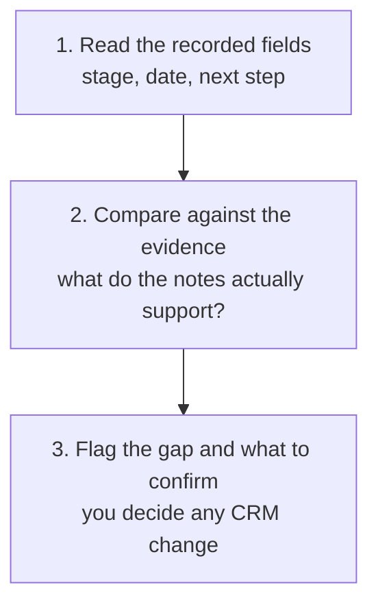

# Pipeline Evidence Review

Check whether the stages, close dates, stakeholders and next steps in your pipeline are actually supported by the evidence you hold, rather than trusting the CRM because it is written down.

## 👀 At a Glance

| | |
| --- | --- |
| **Use this when** | Your pipeline has drifted, a forecast feels optimistic, or you want an honest read before a pipeline review or one-to-one |
| **What you need** | An export or list of your open deals with their recorded stage, value, close date and last activity, plus whatever notes or evidence you hold on each |
| **What you get** | For each deal, the recorded position next to the evidence-supported position, the gap between them, and what to confirm, all read-only |
| **Your responsibility** | Decide what to actually change; the review suggests, you approve and update the CRM yourself |

## 🔄 How It Works

## 🚀 Start Here

- [Use the Pipeline Evidence Review prompt](../templates/pipeline-evidence-review-prompt.md)
- [See the fictional pipeline snapshot](../examples/fictional-pipeline-snapshot.md)
- [See the completed review](../examples/fictional-pipeline-review.md)
- [Read the honest review](../evaluations/fictional-pipeline-review-eval.md)

<strong>See exactly what it produces</strong>

1. A short summary table: each deal, its recorded stage, its evidence-supported state, and the main gap
2. Per deal, the recorded position and the evidence-supported position side by side
3. The specific gap between them, if any
4. What needs confirming before the recorded fields can be trusted
5. A suggested next step, left for you to approve
6. An explicit note where a deal is genuinely healthy, so the review is not just a list of problems

<strong>See the full method</strong>

### 1. Separate the Record from the Evidence

The recorded stage is a claim, not a fact. Start by holding the CRM fields and the actual evidence apart, so you can see where they agree and where they have drifted. A deal is only as advanced as the evidence supports, not as advanced as the stage says.

### 2. Check Each Field Against What You Hold

For every deal, ask whether the evidence actually supports the recorded stage, the close date, the named stakeholder and the next step. Common gaps:

- A stage that runs ahead of the evidence, such as Qualification recorded when qualification has barely started.
- A close date that has passed, or that nothing on file supports.
- A stage that rests on a stakeholder who has gone quiet or left.
- A next step that is blank, stale, or impossible as written.
- An action recorded as progress, such as "Proposal Sent", when the real state is silence.

### 3. Name a Working State From the Evidence

Separate from the recorded stage, say what state the evidence actually supports. Useful working states include exploring, qualification incomplete, problem confirmed, value case incomplete, stakeholder approval required, decision process unclear, paused with a dated reason, lost, or disqualified. These are a way to describe reality, not a replacement set of official stages, and they should match whatever your own CRM allows.

### 4. Flag, Do Not Change

The review is read-only. For each gap, say what to confirm and suggest a change, but leave the actual CRM edit to a person. Never treat the recorded stage as evidence, never accuse the salesperson, and never invent a reason, date or contact where the evidence only supports an unknown.

### 5. Call the Healthy Deals Healthy

A review that manufactures a problem on a sound deal will not be trusted on the deals that genuinely have one. Where the recorded fields match the evidence, say so plainly.

## ✅ Check Before You Update Anything

- Is each recorded field judged against actual evidence, not against how the deal feels?
- Are confirmed facts, inferences and unknowns kept separate, especially where a stakeholder change is only inferred?
- Have overdue or unsupported close dates been flagged, since they quietly distort any pipeline total?
- Is every suggested change left for you to approve, with nothing presented as already done?
- Does the review call out at least the genuinely healthy deals, rather than reading as a list of only problems?
- Would any suggested next step contradict something a prospect actually said?

## 📏 What to Measure

- How often a recorded stage turns out to be ahead of the evidence once reviewed
- How many open deals carry a close date that has already passed
- How often a late-stage deal rests on a single stakeholder with no backup contact
- Whether the corrected pipeline total differs materially from the recorded one
