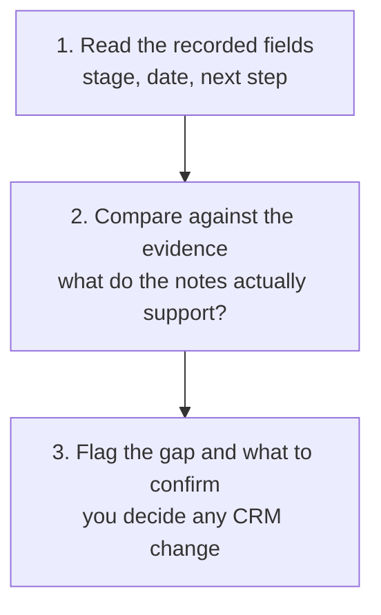

# Pipeline Evidence Review

Check whether the evidence you hold supports the stages, close dates, stakeholders and next steps in your pipeline, rather than trusting the CRM because it's written down.

## 👀 At a Glance

| | |
| --- | --- |
| **Use this when** | Your pipeline has drifted, a forecast feels optimistic, or you want an honest view before a pipeline review or one-to-one |
| **What you need** | An export or list of your open deals with their recorded stage, value, close date and last activity, plus whatever notes or evidence you hold on each |
| **What you get** | For each deal, what the CRM says next to what the evidence supports, the gap between them, and what to confirm. It changes nothing |
| **Your responsibility** | Decide what to change. The review suggests; you approve and update the CRM yourself |

## 🔄 How It Works

```mermaid
flowchart TB
    A["1. Read the recorded fields<br/>stage, date, next step"]
    B["2. Compare against the evidence<br/>what do the notes actually support?"]
    C["3. Flag the gap and what to confirm<br/>you decide any CRM change"]
    A --> B --> C
```

## 🚀 Start Here

- [Use the Pipeline Evidence Review prompt](../templates/pipeline-evidence-review-prompt.md)
- [See the fictional pipeline snapshot](../examples/fictional-pipeline-snapshot.md)
- [See the completed review](../examples/fictional-pipeline-review.md)
- [Read the honest review](../evaluations/fictional-pipeline-review-eval.md)
- [Use with AI: the pipeline-evidence-review skill](../.agents/skills/pipeline-evidence-review/SKILL.md)

<strong>See exactly what it produces</strong>

1. A short summary table: each deal, its recorded stage, the state the evidence supports, and the main gap
2. For each deal, the recorded position and the position the evidence supports, side by side
3. The specific gap between them, if any
4. What needs confirming before you can trust the recorded fields
5. A suggested next step, left for you to approve
6. A note where a deal is healthy, so the review isn't just a list of problems

<strong>See the full method</strong>

### 1. Confirm the Deal Is Actually Yours to Review

Before anything else, check that each record belongs in your own pipeline. If the source is meeting notes or a call log rather than a proper CRM export, being in a meeting isn't the same as owning the deal. A colleague's account can show up in your notes without ever being yours to act on. Drop anything you aren't responsible for before it gets treated as a gap in your pipeline.

### 2. Separate the Record from the Evidence

The recorded stage is a claim, not a fact. Start by holding the CRM fields and the evidence apart, so you can see where they agree and where they've drifted. A deal is only as far along as the evidence supports, not as far as the stage says.

### 3. Check Each Field Against What You Hold

For every deal, ask whether the evidence supports the recorded stage, the close date, the named stakeholder and the next step. Common gaps:

- A stage that runs ahead of the evidence, such as Qualification recorded when qualification has barely started.
- A close date that has passed, or that nothing on file supports.
- A stage that rests on a stakeholder who has gone quiet or left.
- A next step that is blank, stale or impossible as written.
- An action recorded as progress, such as "Proposal Sent", when the real state is silence.

### 4. Name a Working State From the Evidence

Apart from the recorded stage, say what state the evidence supports. Useful working states include exploring, qualification incomplete, problem confirmed, value case incomplete, stakeholder approval required, decision process unclear, commercial review, paused with a dated reason, lost, or disqualified. These describe what is really happening. They don't replace your official stages, and they should match whatever your own CRM allows.

Before suggesting any next step, put the recorded stage and the state the evidence supports side by side, name any conflict between them, and say what needs confirming before the deal can move. A next step that skips this, without the two states shown together, gets ahead of what the review has found.

### 5. Flag, Do Not Change

The review changes nothing. For each gap, say what to confirm and suggest a change, but leave the CRM edit to a person. Never treat the recorded stage as evidence, never accuse the salesperson, and never invent a reason, date or contact where the evidence only supports an unknown.

### 6. Call the Healthy Deals Healthy

A review that invents a problem on a sound deal won't be trusted on the deals that really have one. Where the recorded fields match the evidence, say so plainly.

## ✅ Check Before You Update Anything

- Does every record belong in your own pipeline, rather than showing up because you were in a meeting on someone else's account?
- Is each recorded field judged against real evidence, not against how the deal feels?
- Are confirmed facts, inferences and unknowns kept apart, especially where a stakeholder change is only inferred?
- Have you flagged overdue or unsupported close dates, since they quietly distort any pipeline total?
- Is every suggested change left for you to approve, with nothing presented as already done?
- Does the review name the healthy deals, rather than reading as a list of problems?
- Would any suggested next step go against something a prospect said?
- Does every deal show the recorded stage and the state the evidence supports side by side, with any conflict named, before a next step is suggested?

## 📏 What to Measure

- How often a recorded stage turns out to be ahead of the evidence once reviewed
- How many open deals carry a close date that has already passed
- How often a late-stage deal rests on a single stakeholder with no backup contact
- Whether the corrected pipeline total differs much from the recorded one

## 💬 Tried It?

[Share structured workflow feedback](https://github.com/shaunmarsden/practical-ai-sales-workflows/issues/new?template=workflow-feedback.md) about what worked, where you got stuck and what you would change. Please do not include customer, employer or confidential information.
