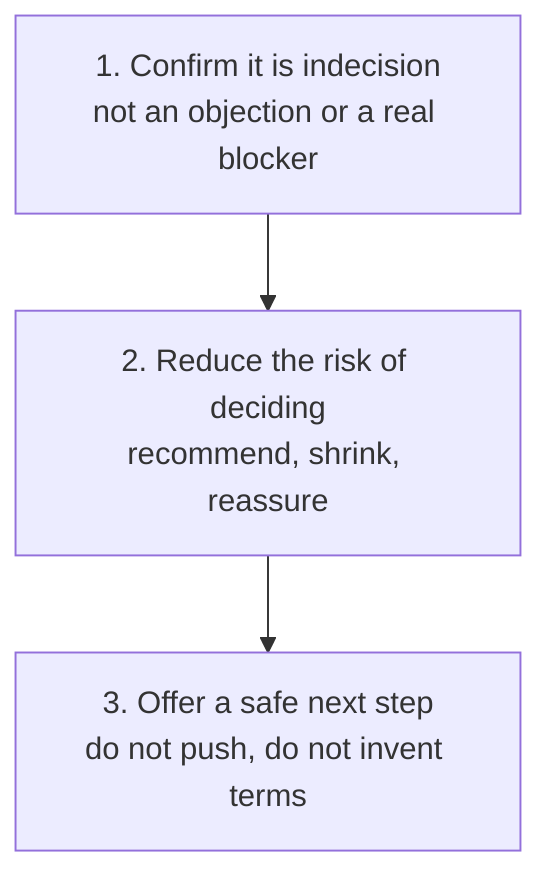

# Buyer Indecision

Help a willing buyer who keeps delaying the final decision, by reducing the risk and cost of deciding rather than selling harder, once you have confirmed the hold-up really is indecision and not something else.

## 👀 At a Glance

| | |
| --- | --- |
| **Use this when** | A late-stage buyer is positive and unblocked, but keeps finding new soft reasons to delay the final yes |
| **What you need** | The recent exchanges, what you know about their authority, and any objection or missing information already raised |
| **What you get** | A diagnosis of whether this is genuine indecision, and if so a response that shrinks the decision instead of pushing on it |
| **Your responsibility** | Only offer terms that are genuinely available; decide what to actually send and never manufacture urgency, discounts or guarantees |

## 🔄 How It Works

## 🚀 Start Here

- [Use the Buyer Indecision prompt](../templates/buyer-indecision-prompt.md)
- [See the fictional Calderwood scenario](../examples/calderwood-indecision-input.md)
- [See the completed response](../examples/calderwood-indecision-response.md)
- [Read the honest review](../evaluations/calderwood-indecision-review.md)

<strong>See exactly what it produces</strong>

1. A diagnosis of whether the hold-up is genuine indecision, or actually an objection, an approval gate, a timing issue or a disqualification
2. The reasoning for that read, based on the buyer's authority and behaviour, not just their words
3. A response that reduces decision risk: a clear recommendation, a smaller reversible first step, and the hesitation named gently
4. A specific, low-stakes next step
5. An honest pipeline call, including when to stop pushing

<strong>See the full method</strong>

### 1. Confirm It Really Is Indecision

Indecision looks like a willing buyer who keeps generating new, soft reasons to wait, while confirming there is no specific concern. Before treating it as such, rule out the things it is often mistaken for:

- **An objection**: there is a specific stated concern to answer. Use the [objection handling](05-objection-handling.md) workflow instead.
- **An approval gate**: the person genuinely needs someone else's sign-off. That is a real dependency, not indecision.
- **Gone quiet**: they have stopped replying. Use the chase approach instead.
- **A timing issue with a real reason**: a stated budget cycle or event, not a vague "after the quarter".
- **A disqualification**: the fit or value was never really there.

Only when it is a positive, unblocked buyer repeatedly self-generating delay is this the right workflow.

### 2. Understand Why Pressure Backfires

A buyer stuck in indecision is usually afraid of making the wrong call, not unconvinced. Pushing harder, adding urgency, or offering a discount or guarantee tends to confirm their fear that they are being rushed into a mistake. The goal is to make the decision feel smaller and safer, not more urgent.

### 3. Reduce the Risk of Deciding

- **Make a clear recommendation.** Open-ended choice feeds indecision. Say what you would do in their position, and why, grounded in their own evidence.
- **Offer a smaller, reversible first step.** A shorter initial term, a phased start, or beginning with the group that felt the benefit most. Only offer terms that genuinely exist.
- **Name the hesitation gently.** Reflect back that it sounds less like doubt and more like not wanting to get it wrong, and ask directly what would make deciding now feel safe.
- **Keep their own evidence in front of them.** What their team or their pilot actually reported is the strongest counterweight to the fear of a wrong choice, because it is theirs, not a vendor claim.

### 4. Offer a Safe Next Step, and Know When to Stop

End with a specific, low-stakes next step, not more pressure. If the buyer still defers after a genuine attempt to shrink the decision, treat that as a softer signal than it appears and consider whether something unspoken is in the way, rather than repeating the same push.

## ✅ Check Before You Send

- Have you actually confirmed this is indecision, not an objection, an approval gate, a timing issue or a disqualification?
- Does the response reduce the risk of deciding rather than increase the pressure to decide?
- Is every term you offer, such as a shorter first term or a phased start, genuinely available, not invented to close?
- Have you avoided manufacturing urgency, a discount, a guarantee or a deadline that does not really exist?
- Is the buyer's own evidence, rather than a vendor claim, doing the persuading?
- Does it end with a low-stakes next step, and does it recognise when to stop pushing?

## 📏 What to Measure

- How often a delay diagnosed as indecision turns out, once named, to be something else
- Whether offering a smaller first step moves stalled late-stage deals more than following up unchanged
- How often a deal stuck in indecision closes after the decision is made smaller, versus after more pressure
- How many late-stage deals sit unmoved for weeks with no specific blocker on record
