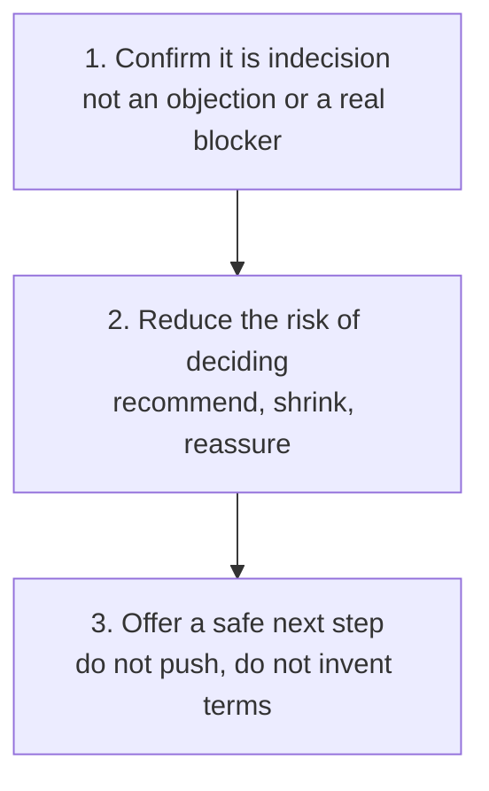

# Buyer Indecision

Help a willing buyer who keeps putting off the final decision. Once you've confirmed the hold-up really is indecision and not something else, make deciding less risky and less costly rather than selling harder.

## 👀 At a Glance

| | |
| --- | --- |
| **Use this when** | A late-stage buyer is positive and nothing is blocking them, but they keep finding new soft reasons to put off the final yes |
| **What you need** | The recent exchanges, what you know about their authority, and any objection or missing information already raised |
| **What you get** | Whether this really is indecision, and if so, a response that makes the decision smaller instead of pushing harder |
| **Your responsibility** | Only offer terms that really exist. Decide what to send, and never invent urgency, discounts or guarantees |

## 🔄 How It Works

```mermaid
flowchart TB
    A["1. Confirm it is indecision<br/>not an objection or a real blocker"]
    B["2. Reduce the risk of deciding<br/>recommend, shrink, reassure"]
    C["3. Offer a safe next step<br/>do not push, do not invent terms"]
    A --> B --> C
```

## 🚀 Start Here

- [Use the Buyer Indecision prompt](../templates/buyer-indecision-prompt.md)
- [See the fictional Calderwood scenario](../examples/calderwood-indecision-input.md)
- [See the completed response](../examples/calderwood-indecision-response.md)
- [Read the honest review](../evaluations/calderwood-indecision-review.md)
- [See a harder test: reasons that resolve, then repeat as something new](../examples/wrenmoor-indecision-response.md), [and its review](../evaluations/wrenmoor-indecision-review.md)
- [Read the real-use boundary finding](../evaluations/buyer-indecision-real-use-finding.md)

<strong>See exactly what it produces</strong>

1. Whether the hold-up is indecision, or really an objection, an approval gate, a timing issue or a disqualification
2. The reasoning behind that view, based on the buyer's authority and behaviour, not just their words
3. A response that makes deciding less risky: a clear recommendation, a smaller first step they can undo, and the hesitation named gently
4. A specific, low-stakes next step
5. An honest pipeline call, including when to stop pushing

<strong>See the full method</strong>

### 1. Confirm It Really Is Indecision

Indecision looks like a willing buyer who keeps coming up with new, soft reasons to wait, while confirming there's no specific concern. Before you treat it as indecision, rule out the things it's often mistaken for:

- **An objection** has a specific stated concern to answer. Use the [objection handling](05-objection-handling.md) workflow instead.
- **An approval gate** means the person needs someone else's sign-off. That's a real dependency, not indecision.
- **Gone quiet** means they've stopped replying. Use the chase approach instead.
- **A timing issue with a real reason** rests on a stated budget cycle or event, not a vague "after the quarter".
- **A disqualification** means the fit or value was never really there.

This is the right workflow only when a positive buyer, with nothing blocking them, keeps creating their own delays.

### 2. Understand Why Pressure Backfires

A buyer stuck in indecision is usually afraid of making the wrong call, not unconvinced. Pushing harder, adding urgency or offering a discount or guarantee tends to confirm their fear that they're being rushed into a mistake. The goal is to make the decision feel smaller and safer, not more urgent.

### 3. Reduce the Risk of Deciding

- **Make a clear recommendation.** Open-ended choice feeds indecision. Say what you would do in their position, and why, based on their own evidence.
- **Offer a smaller first step they can undo.** A shorter first term, a phased start, or starting with the group that felt the benefit most. Only offer terms that really exist.
- **Name the hesitation gently.** Say back that it sounds less like doubt and more like not wanting to get it wrong, and ask directly what would make deciding now feel safe.
- **Keep their own evidence in front of them.** What their team or their pilot reported is the strongest answer to the fear of a wrong choice, because it's theirs, not a vendor claim.

### 4. Offer a Safe Next Step, and Know When to Stop

End with a specific, low-stakes next step, not more pressure. If the buyer still puts it off after a real attempt to shrink the decision, treat that as a softer signal than it looks. Ask yourself whether something unspoken is in the way, rather than repeating the same push.

## ✅ Check Before You Send

- Have you confirmed this is indecision, not an objection, an approval gate, a timing issue or a disqualification?
- Does the response make deciding less risky, rather than add pressure to decide?
- Is every term you offer, such as a shorter first term or a phased start, really available, not invented to close?
- Have you avoided inventing urgency, a discount, a guarantee or a deadline that doesn't exist?
- Is the buyer's own evidence, rather than a vendor claim, doing the persuading?
- Does it end with a low-stakes next step, and does it recognise when to stop pushing?

## 📏 What to Measure

- How often a delay you took for indecision turns out, once named, to be something else
- Whether offering a smaller first step moves stalled late-stage deals more than following up with the same offer
- How often a deal stuck in indecision closes after the decision is made smaller, compared with after more pressure
- How many late-stage deals sit unmoved for weeks with no specific blocker on record

## 💬 Tried It?

[Share structured workflow feedback](https://github.com/shaunmarsden/practical-ai-sales-workflows/issues/new?template=workflow-feedback.md) about what worked, where you got stuck and what you would change. Please do not include customer, employer or confidential information.
