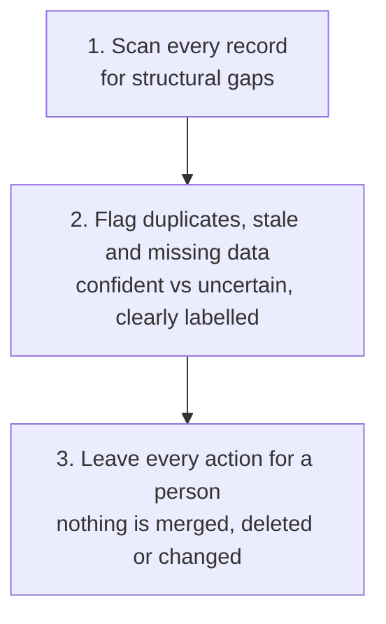

# CRM Hygiene Review

Audit a CRM export for the structural problems that quietly make it unreliable: duplicates, missing fields, stale records and dates that do not fit the stage, without touching anything or judging why a specific deal has stalled.

## 👀 At a Glance

| | |
| --- | --- |
| **Use this when** | You want to trust a CRM export before using it for a total, a review, or a report, or you suspect duplicates, gaps or stale records have built up |
| **What you need** | A CRM export or list covering the records you want checked: company, contact, owner, stage, value, close date, last activity |
| **What you get** | Likely and possible duplicates, records missing critical fields, stale records, and dates that do not fit their stage, all flagged for a person to act on |
| **Your responsibility** | Confirm any suggested duplicate before merging; make every field correction and every CRM change yourself |

## 🔄 How It Works

## 🚀 Start Here

- [Use the CRM Hygiene Review prompt](../templates/crm-hygiene-review-prompt.md)
- [See the fictional CRM export](../examples/fictional-crm-export.md)
- [See the completed review](../examples/fictional-crm-hygiene-review.md)
- [Read the honest review](../evaluations/fictional-crm-hygiene-review-eval.md)

<strong>See exactly what it produces</strong>

1. A short summary table of issue types and how many records carry each one
2. Likely duplicates, with a confidence level and what makes them likely
3. Possible duplicates that need a human check, kept clearly separate from confident ones
4. Records missing a critical field, such as a value, a stage, or an owner
5. Records that do not look like a real prospect at all, kept separate from a real prospect with a gap
6. Stale records, including ones that look complete but have not moved in a long time
7. Close dates that do not fit their recorded stage
8. An explicit note on records with no issue found, so the review does not read as a list of only problems

<strong>See the full method</strong>

### 1. Scan Every Record for Structural Gaps

Work through the export field by field, not deal by deal. Look for what is missing (a blank owner, contact, value, stage or close date) and what is inconsistent (a close date far too soon for an early stage, a company appearing more than once).

### 2. Flag Records That Are Not Real Prospects At All

Some records in a real export are not an incomplete prospect; they are not a prospect at all, a test entry, a practice run, an internal course or demo left behind in the live pipeline. This is a different finding from a missing field, which is a real prospect with a gap, and from a duplicate, which is the same real prospect twice. A deal name that reads like a course title, a project name, or an obvious placeholder, especially paired with no stage and no pipeline, is the signal to look for. Flag it separately, and suggest archiving or deleting it rather than treating it as a prospect that merely needs its fields filled in.

### 3. Separate Confident Findings From Uncertain Ones

A duplicate with a shared contact name at what reads as the same company, entered under two slightly different names, is a confident finding. A similar-sounding company name with no other shared detail is not; it needs a human to confirm before anything is merged. Keep these two kinds of finding visibly separate, and never merge on name similarity alone.

### 4. Identify Staleness Properly

A record can look unhealthy because every field is blank, or it can look healthy because every field is filled in while quietly being months overdue with no recent activity. Check both. Do not assume a complete-looking record is a current one.

### 5. Stay Out of the Stage-Accuracy Question

This review flags a close date that has passed, or that does not fit the stage, as a structural fact. It does not judge whether the underlying deal is paused, blocked or genuinely dead; that requires more evidence than a CRM export alone provides. Point to the [pipeline evidence review](06-pipeline-evidence-review.md) for that judgement once enough evidence exists.

### 6. Flag, Do Not Act

Every finding is a suggestion. Merging duplicates, filling in a missing field, archiving a non-prospect record, or reassigning an owner all stay with a person. Note where a scoring threshold, such as what counts as "stale," was used, and make clear it is illustrative, not a universal rule.

### 7. Call the Clean Records Clean

Where a record has every field present, a realistic close date for its stage, and recent activity, say so. A review that finds a problem on every record will not be trusted on the ones that genuinely have one.

## ✅ Check Before You Act on Anything

- Is every likely duplicate genuinely confident, based on more than a similar-sounding name?
- Have possible duplicates been kept clearly separate from confident ones, with a human check requested rather than a merge suggested?
- Are records that are not real prospects at all kept separate from records that are a real prospect with a missing field?
- Does the review stop at flagging an overdue or unsupported close date, rather than diagnosing why the deal has stalled?
- Is any staleness threshold used stated as illustrative, not as a fixed rule?
- Are at least some genuinely clean records called out as clean?
- Has nothing actually been merged, deleted or changed without your explicit action?

## 📏 What to Measure

- How many suggested duplicates are confirmed as real once checked, versus false positives
- How many records are missing a critical field at any given time, and whether that number falls after a review
- How often a record that looked complete turns out to be stale once last-activity dates are checked
- How much a pipeline total changes once confirmed duplicates and corrected fields are accounted for
