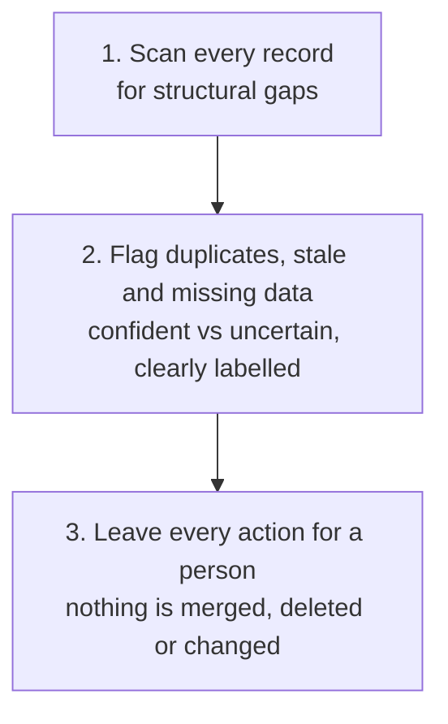

# CRM Hygiene Review

Check a CRM export for the problems that quietly make it unreliable: duplicates, missing fields, stale records and dates that don't fit the stage. It changes nothing and doesn't judge why a deal has stalled.

## 👀 At a Glance

| | |
| --- | --- |
| **Use this when** | You want to trust a CRM export before using it for a total, a review or a report, or you suspect duplicates, gaps or stale records have built up |
| **What you need** | A CRM export or list covering the records you want checked: company, contact, owner, stage, value, close date, last activity |
| **What you get** | Likely and possible duplicates, records missing key fields, stale records, and dates that don't fit their stage, all flagged for a person to act on |
| **Your responsibility** | Confirm any suggested duplicate before merging, and make every correction and CRM change yourself |

## 🔄 How It Works

```mermaid
flowchart TB
    A["1. Scan every record<br/>for structural gaps"]
    B["2. Flag duplicates, stale and missing data<br/>confident vs uncertain, clearly labelled"]
    C["3. Leave every action for a person<br/>nothing is merged, deleted or changed"]
    A --> B --> C
```

## 🚀 Start Here

- [Use the CRM Hygiene Review prompt](../templates/crm-hygiene-review-prompt.md)
- [See the fictional CRM export](../examples/fictional-crm-export.md)
- [See the fictional contact-level export](../examples/fictional-crm-contact-export.md)
- [See the completed review](../examples/fictional-crm-hygiene-review.md)
- [Read the honest review](../evaluations/fictional-crm-hygiene-review-eval.md)
- [Read the missing-record finding](../evaluations/crm-hygiene-missing-record-finding.md)
- [Use with AI: the crm-hygiene-review skill](../.agents/skills/crm-hygiene-review/SKILL.md)

<strong>See exactly what it produces</strong>

1. A short summary table of issue types and how many records have each one
2. Likely duplicates, with a confidence level and what makes them likely
3. Possible duplicates that need a person to check, kept apart from the confident ones
4. Records missing a key field, such as a value, a stage or an owner
5. Records that don't look like a real prospect at all, kept apart from a real prospect with a gap
6. Stale records, including ones that look complete but haven't moved in a long time
7. Close dates that don't fit their recorded stage
8. A note on records with no issue, so the review doesn't read as a list of problems

<strong>See the full method</strong>

### 1. Scan Every Record for Structural Gaps

Work through the export field by field, not deal by deal. Look for what is missing (a blank owner, contact, value, stage or close date) and what doesn't fit (a close date far too soon for an early stage, a company that appears more than once).

### 2. Separate a Missing Field From a Missing Record

A blank field sits on a record that exists. Sometimes the record itself is missing: a contact has a booked and attended meeting, logged calls and recent emails, and no opportunity at all. That doesn't belong with the blank owners and close dates. Filling in an owner corrects a record. Opening an opportunity creates one, and a blank column isn't enough reason to do it.

Two rows can both show no opportunity and mean opposite things. One has the trail an opportunity would normally follow; the other has nothing logged since the enquiry. Say which is which, and don't give them the same advice. An export can't tell you why a record is missing, and the reason decides what to do. So name the evidence outside the export (the booking, the attendance, the call, the emails, and any record of the process that should have created it) and create nothing until a person has checked those sources.

### 3. Flag Records That Are Not Real Prospects At All

Some records in a real export aren't an incomplete prospect. They aren't a prospect at all: a test entry, a practice run, an internal course or demo left behind in the live pipeline. That's a different finding from a missing field, which is a real prospect with a gap, and from a duplicate, which is the same real prospect twice. Look for a deal name that reads like a course title, a project name or an obvious placeholder, especially with no stage and no pipeline. Flag it separately, and suggest archiving or deleting it rather than treating it as a prospect that just needs its fields filled in.

### 4. Separate Confident Findings From Uncertain Ones

A shared contact name at what looks like the same company, entered under two slightly different names, is a confident duplicate. A similar-sounding company name with nothing else in common isn't. It needs a person to confirm before anything is merged. Keep these two kinds of finding clearly apart, and never merge on a similar name alone.

### 5. Identify Staleness Properly

A record can look unhealthy because every field is blank. Or it can look healthy because every field is filled in, while quietly being months overdue with no recent activity. Check both. Don't assume a record that looks complete is current.

### 6. Stay Out of the Stage-Accuracy Question

This review flags a close date that has passed, or that doesn't fit the stage, as a plain fact about the record. It doesn't judge whether the deal is paused, blocked or dead, because that needs more evidence than a CRM export holds. Once there's enough evidence, point to the [pipeline evidence review](06-pipeline-evidence-review.md) for that judgement.

### 7. Flag, Do Not Act

Every finding is a suggestion. Merging duplicates, filling in a missing field, archiving a record that isn't a prospect or reassigning an owner all stay with a person. Where you used a threshold, such as what counts as "stale," say so, and make clear it's an example, not a universal rule.

### 8. Call the Clean Records Clean

Where a record has every field filled in, a realistic close date for its stage and recent activity, say so. A review that finds a problem on every record won't be trusted on the ones that really have one.

## ✅ Check Before You Act on Anything

- Does every likely duplicate rest on more than a similar-sounding name?
- Are possible duplicates kept apart from confident ones, with a request for a person to check rather than a suggested merge?
- Are records that aren't real prospects at all kept apart from real prospects with a missing field?
- Is a record that doesn't exist kept apart from a field that is blank, with the outside evidence to check named and nothing created?
- Does the review stop at flagging an overdue or unsupported close date, rather than guessing why the deal has stalled?
- Is any staleness threshold given as an example, not a fixed rule?
- Are at least some clean records called clean?
- Has nothing been merged, deleted or changed unless you did it yourself?

## 📏 What to Measure

- How many suggested duplicates turn out to be real once checked, and how many are false alarms
- How many records are missing a key field at any one time, and whether that number falls after a review
- How often a record that looked complete turns out to be stale once you check last-activity dates
- How much a pipeline total changes once you account for confirmed duplicates and corrected fields

## 💬 Tried It?

[Share structured workflow feedback](https://github.com/shaunmarsden/practical-ai-sales-workflows/issues/new?template=workflow-feedback.md) about what worked, where you got stuck and what you would change. Please do not include customer, employer or confidential information.
