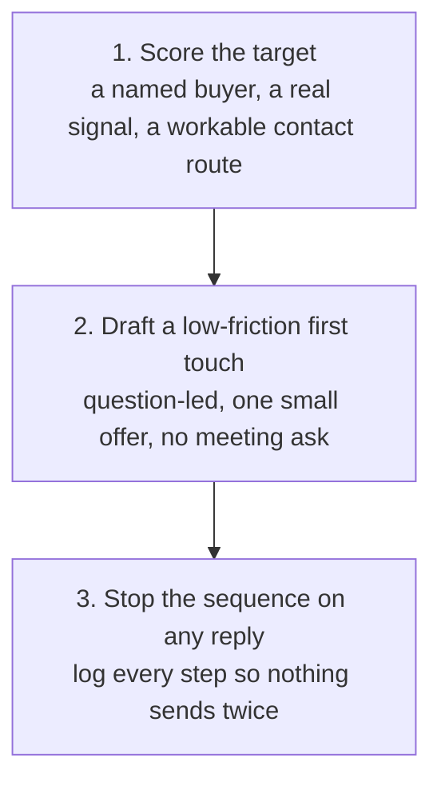

# Outbound Prospecting

Pick a target worth approaching and draft a first-touch message worth a reply, without a generic industry observation or a meeting-led ask.

## 👀 At a Glance

| | |
| --- | --- |
| **Use this when** | You need to find and reach a new prospect, rather than follow up with someone already in conversation |
| **What you need** | Your ideal customer profile, whatever tracker or CRM record already exists, and a specific public signal for the target you have in mind |
| **What you get** | A scored read on whether the target is worth approaching, and a short first-touch message built from a real, verifiable signal |
| **Your responsibility** | Verify the contact route, confirm every claim before sending, and approve the send and any CRM entry yourself |

## 🔄 How It Works

## 🚀 Start Here

- [Use the Outbound Prospecting prompt](../templates/outbound-prospecting-prompt.md)
- [See the fictional Cedarwell signal](../examples/cedarwell-outbound-input.md)
- [See the completed output](../examples/cedarwell-outbound-output.md)
- [Read the honest review](../evaluations/cedarwell-outbound-review.md)
- [Use with AI: the outbound-prospecting skill](../.agents/skills/outbound-prospecting/SKILL.md)

<strong>See exactly what it produces</strong>

1. A target score: what makes this a strong or weak fit, based on a named buyer, a verifiable signal and a workable contact route
2. A short first-touch message, question-led, tied to the actual signal found
3. One small, low-friction offer instead of a meeting ask
4. A single next step, usually a reply
5. What still needs a person: verifying the contact route, confirming every claim, and approving the send

<strong>See the full method</strong>

### 1. Score the Target

A target is worth approaching when it has a named, reachable buyer with plausible authority over this kind of decision, a specific and verifiable public signal tied to the actual problem being solved, not a generic industry trend, and a workable route to a real contact rather than a best-guess address. Score it down when the only available hook is a generic trend with nothing company-specific behind it, or when the company's size makes procurement and internal politics likely to slow everything down without an unusually strong contact route.

### 2. Draft a Low-Friction First Touch

Open with a question tied to the buyer's actual role and the specific signal found, not a generic observation about the company. Offer something small and genuinely useful that can be produced quickly, a short analysis, a first cut, a relevant example, rather than asking for a meeting straight away. State what that offer is worth to the reader in their own terms. End with a single, low-friction next step, usually a short reply, not a calendar booking, unless a meeting-led approach has been deliberately chosen for this specific prospect.

The offer is a front-end offer, never the actual paid engagement: small enough to produce quickly, and useful to the reader on its own even if nothing else follows. Give the subject line and preview text their own moment of attention too: a few words, lowercase, never naming the actual offer or mechanism, since a subject line that gives the pitch away measurably reduces opens. It should read like an internal message, not a marketing send.

### 3. Handle Whatever Happens Next

A reply, positive or otherwise, stops the cold sequence immediately; never let a second scheduled touch go out into a live reply. A positive reply means building whatever was offered next, not pushing straight for a meeting before it exists. Record every step, sent, bounced, replied, booked, so the same message never goes out twice to the same person.

## ✅ Check Before You Send

- Is the hook built from a real, specific, verifiable signal, not a generic industry observation?
- Does the named contact have plausible authority over this kind of decision, based on more than their job title alone?
- Has the contact route actually been verified, not just guessed?
- Is the first ask genuinely low-friction, a reply, not a meeting, unless that has been deliberately chosen for this prospect?
- Does every claim in the message reflect something actually confirmed, with nothing invented to sharpen the hook?
- Is this logged so the same message cannot go out twice, and is the sequence set to stop immediately on any reply?
- Does the subject line avoid naming the actual offer or mechanism, and does it read like an internal message rather than a marketing send?
- Does the message avoid implying the reader is already interested, or inventing a deadline or limited number of slots that is not real?

## 📏 What to Measure

- Reply rate against targets with a specific, verifiable signal, compared with any sent against a weaker or more generic one
- How often a target scored highly turns out to have a real, reachable buyer once contacted
- How often the same prospect is contacted twice because a reply or an existing record was missed
- How often a first-touch message needs a meeting-led approach instead of a low-friction reply, and why
