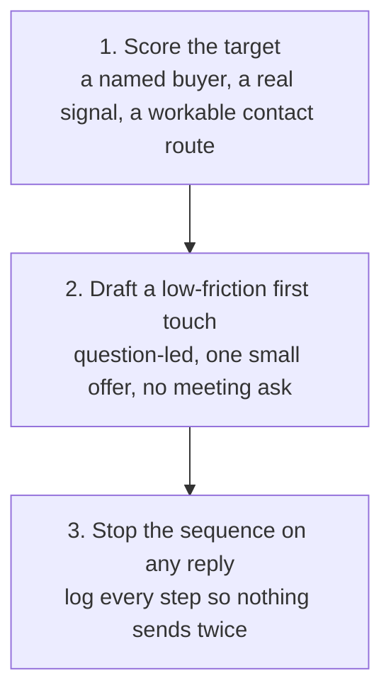

# Outbound Prospecting

Pick a prospect worth approaching and draft a first message worth replying to, without a generic remark about their industry or asking for a meeting straight away.

## 👀 At a Glance

| | |
| --- | --- |
| **Use this when** | You need to find and reach a new prospect, rather than follow up with someone you're already talking to |
| **What you need** | Your ideal customer profile, any tracker or CRM record you already have, and a specific public signal about the company you have in mind |
| **What you get** | A score for whether the company is worth approaching, and a short first message built on a real signal you can check |
| **Your responsibility** | Check the contact route and every claim before sending, and approve the send and any CRM entry yourself |

## 🔄 How It Works

```mermaid
flowchart TB
    A["1. Score the target<br/>a named buyer, a real signal, a workable contact route"]
    B["2. Draft a low-friction first touch<br/>question-led, one small offer, no meeting ask"]
    C["3. Stop the sequence on any reply<br/>log every step so nothing sends twice"]
    A --> B --> C
```

## 🚀 Start Here

- [Use the Outbound Prospecting prompt](../templates/outbound-prospecting-prompt.md)
- [See the fictional Cedarwell signal](../examples/cedarwell-outbound-input.md)
- [See the completed output](../examples/cedarwell-outbound-output.md)
- [See a deliberately weak version of the same message, and exactly why](../examples/cedarwell-outbound-weak-example.md)
- [Read the honest review](../evaluations/cedarwell-outbound-review.md)
- [Turn a public signal into a stated hypothesis](../.agents/skills/outbound-prospecting/references/signal-to-hypothesis.md), rather than treating the signal as proof on its own
- [Use with AI: the outbound-prospecting skill](../.agents/skills/outbound-prospecting/SKILL.md)

<strong>See exactly what it produces</strong>

1. A score for the company: what makes it a strong or weak fit, based on a named buyer, a signal you can check and a workable contact route
2. A short first message that opens with a question, tied to the signal found
3. One small, easy offer instead of asking for a meeting
4. A single next step, usually a reply
5. What still needs a person: checking the contact route, confirming every claim, and approving the send

<strong>See the full method</strong>

### 1. Score the Target

A company is worth approaching when it has three things. First, a named buyer you can reach, who could plausibly make this kind of decision. Second, a specific public signal you can check, tied to the problem you solve, not a general industry trend. Third, a workable route to a real contact, not a best-guess address. Score it down when the only hook is a general trend with nothing about the company behind it. Score it down, too, when its size means buying processes and internal politics will probably slow everything down, unless you have an unusually strong contact route.

### 2. Draft a Low-Friction First Touch

Open with a question tied to the buyer's role and the signal you found, not a generic remark about the company. Offer something small and useful you can produce quickly, such as a short analysis, a first cut or a relevant example, rather than asking for a meeting straight away. Say what that offer is worth to the reader in their own terms. End with one easy next step, usually a short reply rather than a calendar booking, unless you've deliberately chosen to lead with a meeting for this prospect.

The offer is a small opening offer, never the paid work itself. It should be quick to produce, and useful to the reader on its own even if nothing else follows. Give the subject line and preview text some thought too. Keep them to a few words, in lowercase, and never name the offer or how it works, because a subject line that gives the pitch away can reduce opens. It should read like an internal message, not a marketing email.

There are two valid shapes here, not one. If nothing exists yet for this company, promise a small offer and ask for a reply. If you already have an analysis specific to the company that you can share now rather than promise for later, it's reasonable to ask directly for time to walk through it, since you've already delivered the value rather than dangled it. Match the shape to what is true. Never promise something that already exists, and never ask for a meeting when you haven't shared anything yet.

### 3. Handle Whatever Happens Next

Any reply, positive or not, stops the cold sequence at once. Never let a second scheduled message go out after someone has replied. A positive reply means building what you offered, not pushing straight for a meeting before it exists. Record every step (sent, bounced, replied, booked) so the same message never goes out twice to the same person.

### 4. Apply the Guardrails

- Never make up a company signal or hook. If you found nothing specific you can check, say so rather than writing a generic opener anyway.
- Never claim a capability, statistic or outcome that hasn't been confirmed, even to sharpen the hook.
- Never imply the reader is already interested, already expecting this message or already partway into a decision when nothing confirms it.
- Never invent scarcity, a deadline or a limited number of slots that isn't real.
- Keep the message short. A first message that reads like a pitch deck gets deleted, not answered.

## ✅ Check Before You Send

- Is the hook built from a real, specific signal you can check, not a generic remark about the industry?
- Could the named contact plausibly make this kind of decision, based on more than their job title?
- Have you checked the contact route, not guessed it?
- Is the first ask easy, a reply rather than a meeting, unless you've deliberately chosen a meeting for this prospect?
- Does every claim in the message reflect something confirmed, with nothing invented to sharpen the hook?
- Is this logged so the same message can't go out twice, and is the sequence set to stop as soon as anyone replies?
- Does the subject line avoid naming the offer or how it works, and does it read like an internal message rather than a marketing email?
- Does the message avoid implying the reader is already interested, or inventing a deadline or limited number of slots that isn't real?

## 📏 What to Measure

- Reply rate for companies with a specific signal you could check, compared with any sent on a weaker or more generic one
- How often a company you scored highly turns out to have a real buyer you can reach, once contacted
- How often the same prospect is contacted twice because a reply or an existing record was missed
- How often a first message needs to lead with a meeting instead of asking for a reply, and why

## 💬 Tried It?

[Share structured workflow feedback](https://github.com/shaunmarsden/practical-ai-sales-workflows/issues/new?template=workflow-feedback.md) about what worked, where you got stuck and what you would change. Please do not include customer, employer or confidential information.
