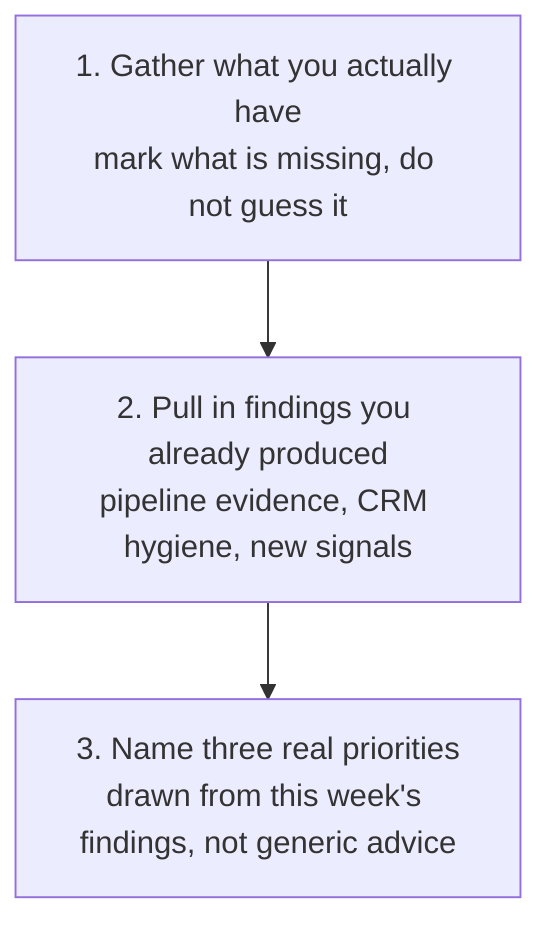

# Weekly Operating Review

Pull whatever pipeline, meeting, outreach and signal data you actually have this week into one honest report, clearly marking what is missing, without inventing a trend where no earlier report exists to compare against.

## 👀 At a Glance

| | |
| --- | --- |
| **Use this when** | You want a weekly view of your own patch without building a dashboard by hand, or repeating analysis you have already done elsewhere |
| **What you need** | Whatever you actually have this week: a CRM export, confirmed meetings, outreach activity if you have it, new signals, and any findings from other reviews you have already run |
| **What you get** | One report covering pipeline, meetings, outreach, signals and items needing attention, with missing sections marked as missing, and three evidence-backed priorities for next week |
| **Your responsibility** | Approve every suggested action; nothing here changes a CRM record, sends a message or books a meeting |

## 🔄 How It Works

## 🚀 Start Here

- [Use the Weekly Operating Review prompt](../templates/weekly-operating-review-prompt.md)
- [See what was actually available](../examples/fictional-weekly-operating-review-input.md)
- [See the completed report](../examples/fictional-weekly-operating-review-output.md)
- [Read the honest review](../evaluations/fictional-weekly-operating-review-eval.md)

<strong>See exactly what it produces</strong>

1. Pipeline movement, or an honest statement that no comparison is possible yet
2. Meetings and commitments, limited to what was actually supplied
3. Outreach activity, marked missing rather than assumed to be zero if it was not provided
4. New signals found this week
5. Items needing attention, pulled from other reviews already run, not re-derived
6. Three specific, evidence-backed priorities for next week

<strong>See the full method</strong>

### 1. Gather What You Actually Have

Collect whatever is genuinely available this week: a CRM export, a calendar, an outreach log, notes on new signals, and the output of any other review already run, such as a pipeline evidence review or a CRM hygiene review. If a section has nothing behind it, that is fine; it gets marked missing in the report rather than filled with a plausible guess.

### 2. Compose, Do Not Re-Derive

This workflow's job is to pull together findings that already exist, not repeat the underlying analysis. If a pipeline evidence review or a CRM hygiene review has already been run this week, use its headline findings directly and link to it, rather than re-analysing the same records from scratch.

### 3. Never Invent a Trend

A report can only show movement once a genuine earlier report exists to compare against. On a first report, or whenever no earlier snapshot exists, say so plainly. Never phrase a single snapshot as if it shows change over time.

### 4. Separate Missing From Zero

A section with no data behind it is missing, not zero. Outreach activity that was never logged is unmeasured, not "no outreach happened." Say which one it actually is.

### 5. Name Real Priorities

The three priorities for next week should come from what this week's data actually surfaced, a specific duplicate to confirm, a specific stale record to resolve, a specific signal to act on, rather than generic advice that would read the same in any week's report.

## ✅ Check Before You Rely On This

- Does the report claim any movement or trend without a genuine earlier report to compare against?
- Is every missing section marked as missing, rather than silently treated as zero or left out entirely?
- Are the items needing attention pulled from reviews already run, rather than a fresh, possibly inconsistent re-analysis?
- Are the three priorities specific to this week's actual findings, not advice generic enough to fit any week?
- Has nothing been sent, booked or changed in a CRM without your explicit approval?

## 📏 What to Measure

- How many weeks in a row a genuine, evidence-backed comparison becomes possible once a baseline exists
- How often a section is reported missing rather than quietly filled with an assumption
- How often this week's three priorities actually get addressed before the next report
- How much this report actually saves compared with pulling the same view together by hand
