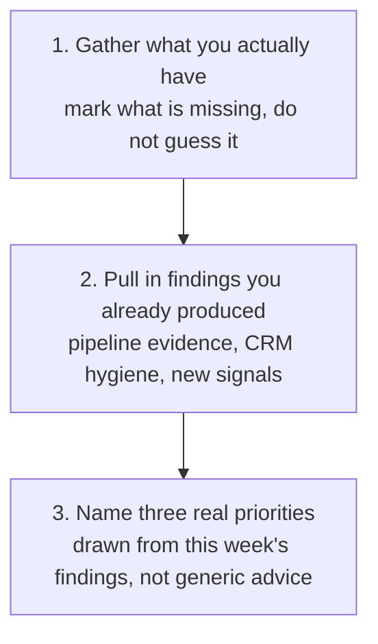

# Weekly Operating Review

Pull whatever pipeline, meeting, outreach and signal data you have this week into one honest report. Mark what is missing, and don't invent a trend when there's no earlier report to compare against.

## 👀 At a Glance

| | |
| --- | --- |
| **Use this when** | You want a weekly view of your own patch without building a dashboard by hand or repeating analysis you've already done |
| **What you need** | Whatever you have this week: a CRM export, confirmed meetings, outreach activity if you have it, new signals, and findings from any other reviews you've already run |
| **What you get** | One report covering pipeline, meetings, outreach, signals and anything needing attention. Missing sections are marked as missing, and you get three priorities for next week, each backed by evidence |
| **Your responsibility** | Approve every suggested action. Nothing here changes a CRM record, sends a message or books a meeting |

## 🔄 How It Works

```mermaid
flowchart TB
    A["1. Gather what you actually have<br/>mark what is missing, do not guess it"]
    B["2. Pull in findings you already produced<br/>pipeline evidence, CRM hygiene, new signals"]
    C["3. Name three real priorities<br/>drawn from this week's findings, not generic advice"]
    A --> B --> C
```

## 🚀 Start Here

- [Use the Weekly Operating Review prompt](../templates/weekly-operating-review-prompt.md)
- [See what was available](../examples/fictional-weekly-operating-review-input.md)
- [See the completed report](../examples/fictional-weekly-operating-review-output.md)
- [Read the honest review](../evaluations/fictional-weekly-operating-review-eval.md)

<strong>See exactly what it produces</strong>

1. Pipeline movement, or an honest statement that no comparison is possible yet
2. Meetings and commitments, limited to what you supplied
3. Outreach activity, marked missing rather than assumed to be zero if you didn't provide it
4. New signals found this week
5. Items needing attention, taken from other reviews already run, not worked out again
6. Three specific priorities for next week, each backed by evidence

<strong>See the full method</strong>

### 1. Gather What You Actually Have

Collect whatever you have this week: a CRM export, a calendar, an outreach log, notes on new signals, and the output of any other review you've already run, such as a pipeline evidence review or a CRM hygiene review. If a section has nothing behind it, that's fine. It gets marked missing in the report rather than filled with a plausible guess.

### 2. Compose, Do Not Re-Derive

This workflow pulls together findings that already exist. It doesn't repeat the analysis behind them. If you've already run a pipeline evidence review or a CRM hygiene review this week, use its main findings and link to it, rather than going through the same records again from scratch.

### 3. Never Invent a Trend

A report can only show movement once there's a real earlier report to compare against. On a first report, or whenever there's no earlier snapshot, say so plainly. Never word a single snapshot as if it shows change over time.

### 4. Separate Missing From Zero

A section with no data behind it is missing, not zero. Outreach that was never logged is unmeasured, not "no outreach happened." Say which it is.

### 5. Name Real Priorities

The three priorities for next week should come from what this week's data showed, such as a specific duplicate to confirm, a specific stale record to sort out or a specific signal to act on. They shouldn't be generic advice that would read the same in any week's report.

## ✅ Check Before You Rely On This

- Does the report claim any movement or trend without a real earlier report to compare against?
- Is every missing section marked as missing, rather than silently treated as zero or left out?
- Are the items needing attention taken from reviews already run, rather than a fresh analysis that might not agree with them?
- Are the three priorities specific to this week's findings, not advice that would fit any week?
- Has nothing been sent, booked or changed in a CRM without your approval?

## 📏 What to Measure

- How many weeks in a row a real comparison, backed by evidence, becomes possible once you have a first report to compare against
- How often a section is reported missing rather than quietly filled with an assumption
- How often this week's three priorities get dealt with before the next report
- How much time this report saves compared with pulling the same view together by hand

## 💬 Tried It?

[Share structured workflow feedback](https://github.com/shaunmarsden/practical-ai-sales-workflows/issues/new?template=workflow-feedback.md) about what worked, where you got stuck and what you would change. Please do not include customer, employer or confidential information.
