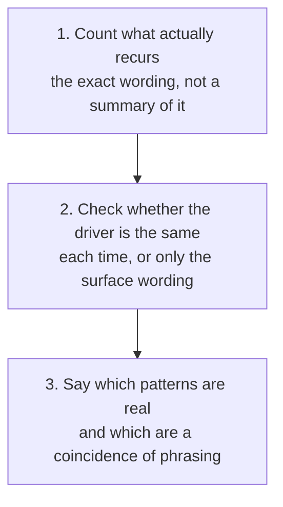

# Objection Pattern Review

Look across several deals for repeated objections, keeping what the data actually shows separate from what it looks like it shows, so a coincidence of wording is not mistaken for a systemic problem.

## 👀 At a Glance

| | |
| --- | --- |
| **Use this when** | You want to know whether an objection you keep hearing is one real, recurring issue or several unrelated situations that happen to sound similar |
| **What you need** | A log of objections across multiple deals: the exact wording, the stage, who raised it, how it was handled, and the outcome |
| **What you get** | Genuine patterns identified with a confidence level, and surface-level patterns explicitly flagged as not the same thing as a systemic cause |
| **Your responsibility** | Decide what to actually do with a confirmed pattern; nothing here changes a playbook, a product decision, or a CRM record on its own |

## 🔄 How It Works

## 🚀 Start Here

- [Use the Objection Pattern Review prompt](../templates/objection-pattern-review-prompt.md)
- [See the fictional objection log](../examples/fictional-objection-pattern-log.md)
- [See the completed analysis](../examples/fictional-objection-pattern-review.md)
- [Read the honest review](../evaluations/fictional-objection-pattern-review-eval.md)

<strong>See exactly what it produces</strong>

1. A summary of observed patterns: what recurs, how often, and across how many deals
2. For each pattern, whether the underlying driver is actually the same each time, or only the surface wording
3. A confidence level per pattern, not one confidence level for the whole log
4. A clear statement of which patterns are worth acting on, and which look real but are not
5. What this log is too small, or too narrow, to rule out either way

<strong>See the full method</strong>

### 1. Log the Exact Objection, Not a Summary

Work from the actual wording raised, the stage, who said it, and how it was handled and resolved. A summarised or rounded version of the objection loses exactly the detail needed to tell two similar-sounding objections apart.

### 2. Count the Surface Pattern First

Note what recurs and how often, by wording or topic, before deciding whether it means anything. This is the easy part and also the part most likely to mislead if stopped here.

### 3. Check the Driver, Not Just the Words

The same surface objection can have different underlying drivers in different deals, exactly as a single objection can (see [objection handling](05-objection-handling.md)). Before calling something a pattern, check whether the outcome and the reason behind it were actually similar each time, or only the wording was. A competitor name mentioned three times for three different underlying reasons is not one competitive problem.

### 4. Assign Confidence Per Pattern

A pattern built from genuinely similar underlying needs, even across unrelated deals or sectors, deserves higher confidence than one built only from similar wording. Say so explicitly, and do not let one high-confidence finding lend false credibility to a weaker one sitting next to it in the same log.

### 5. Say What the Sample Cannot Tell You

A small log can rule a pattern in with reasonable confidence but rarely rules one out completely. State plainly where the sample is too small, or too narrow across sectors or deal types, to treat a finding as settled either way.

## ✅ Check Before You Act on a Finding

- Is the pattern based on the same underlying driver each time, not just similar wording?
- Is the confidence level specific to this pattern, not borrowed from a stronger finding elsewhere in the same log?
- Has a loss, win, or outcome rate been avoided where the sample is too small or too mixed to support one?
- Is every suggested action, such as a new playbook item or a prepared answer, left for a person to build and approve?
- Does the review say plainly what it cannot yet confirm, rather than implying the finding is more settled than the data supports?

## 📏 What to Measure

- How often a surface-level pattern (same wording, different deals) turns out to have a different underlying driver once checked
- How often a confirmed, high-confidence pattern actually leads to a useful change, such as a prepared answer or a playbook update
- How the same pattern's confidence changes as the log grows from a handful of entries to a genuinely large sample
- How often an objection type first seen as isolated turns out, later, to be part of a real pattern
