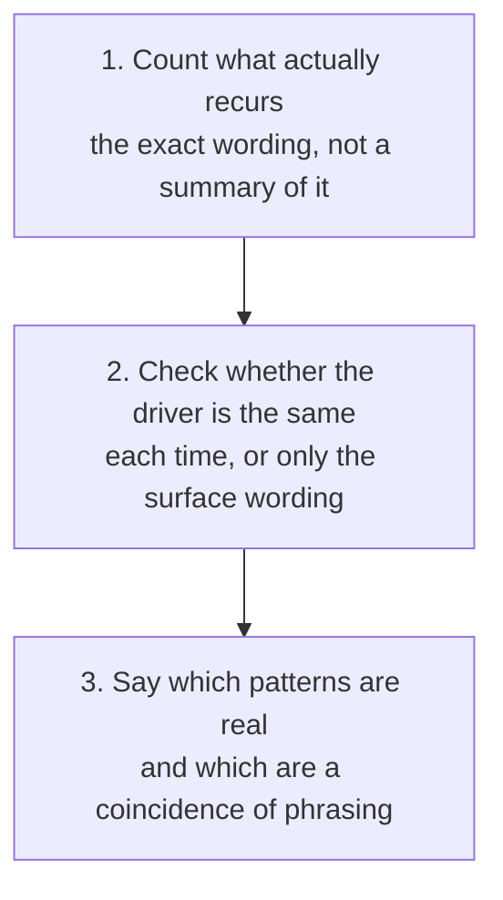

# Objection Pattern Review

Look across several deals for repeated objections. Keep what the data shows apart from what it seems to show, so you don't mistake similar wording for a problem that runs through the business.

## 👀 At a Glance

| | |
| --- | --- |
| **Use this when** | You want to know whether an objection you keep hearing is one real, recurring issue or several unrelated cases that happen to sound alike |
| **What you need** | A log of objections across multiple deals: the exact wording, the stage, who raised it, how it was handled, and the outcome |
| **What you get** | Real patterns, each with a confidence level, and patterns that exist only in the wording flagged as not the same as a shared cause |
| **Your responsibility** | Decide what to do with a confirmed pattern. Nothing here changes a playbook, a product decision or a CRM record on its own |

## 🔄 How It Works

```mermaid
flowchart TB
    A["1. Count what actually recurs<br/>the exact wording, not a summary of it"]
    B["2. Check whether the driver is the same<br/>each time, or only the surface wording"]
    C["3. Say which patterns are real<br/>and which are a coincidence of phrasing"]
    A --> B --> C
```

## 🚀 Start Here

- [Use the reusable Review Objection Patterns skill](../.agents/skills/review-objection-patterns/SKILL.md)
- [Use the Objection Pattern Review prompt](../templates/objection-pattern-review-prompt.md)
- [See the fictional objection log](../examples/fictional-objection-pattern-log.md)
- [See the completed analysis](../examples/fictional-objection-pattern-review.md)
- [Read the honest review](../evaluations/fictional-objection-pattern-review-eval.md)
- [See the harder second test](../examples/fictional-objection-pattern-review-two.md) and its [honest review](../evaluations/fictional-objection-pattern-second-eval.md)
- [See a third test with two decoy entries](../examples/fictional-objection-pattern-review-three.md) and its [honest review](../evaluations/fictional-objection-pattern-third-eval.md)
- [See a fourth test where opposite-looking behaviour shares one driver](../examples/fictional-objection-pattern-review-four.md) and its [honest review](../evaluations/fictional-objection-pattern-fourth-eval.md)

<strong>See exactly what it produces</strong>

1. A summary of the patterns found: what recurs, how often, and across how many deals
2. For each pattern, whether the cause is the same each time, or only the wording
3. A confidence level for each pattern, not one for the whole log
4. A clear statement of which patterns are worth acting on, and which look real but aren't
5. What this log is too small, or too narrow, to rule out either way

<strong>See the full method</strong>

### 1. Log the Exact Objection, Not a Summary

Work from the words used, the stage, who said it, and how it was handled and resolved. A summarised or rounded version of the objection loses the very detail you need to tell two similar-sounding objections apart.

### 2. Count the Surface Pattern First

Note what recurs and how often, by wording or topic, before deciding whether it means anything. This is the easy part, and the part most likely to mislead you if you stop here.

### 3. Check the Driver, Not Just the Words

The same objection can have different causes in different deals, just as a single objection can (see [objection handling](05-objection-handling.md)). Before calling something a pattern, check whether the outcome and the reason behind it were similar each time, or only the wording was. A competitor named three times for three different reasons isn't one competitive problem.

### 4. Assign Confidence Per Pattern

A pattern built on similar underlying needs, even across unrelated deals or sectors, deserves more confidence than one built only on similar wording. Say so, and don't let one high-confidence finding lend false weight to a weaker one next to it in the same log.

### 5. Say What the Sample Cannot Tell You

A small log can rule a pattern in with reasonable confidence, but it rarely rules one out completely. Say plainly where the sample is too small, or covers too few sectors or deal types, to treat a finding as settled either way.

## ✅ Check Before You Act on a Finding

- Does the pattern have the same cause each time, not just similar wording?
- Is the confidence level specific to this pattern, not borrowed from a stronger finding elsewhere in the log?
- Have you avoided giving a loss, win or outcome rate where the sample is too small or too mixed to support one?
- Is every suggested action, such as a new playbook item or a prepared answer, left for a person to build and approve?
- Does the review say plainly what it can't yet confirm, rather than implying the finding is more settled than the data supports?

## 📏 What to Measure

- How often a pattern in the wording alone (same words, different deals) turns out to have a different cause once checked
- How often a confirmed, high-confidence pattern leads to a useful change, such as a prepared answer or a playbook update
- How the same pattern's confidence changes as the log grows from a handful of entries to a large sample
- How often an objection first seen as a one-off turns out, later, to be part of a real pattern

## 💬 Tried It?

[Share structured workflow feedback](https://github.com/shaunmarsden/practical-ai-sales-workflows/issues/new?template=workflow-feedback.md) about what worked, where you got stuck and what you would change. Please do not include customer, employer or confidential information.
