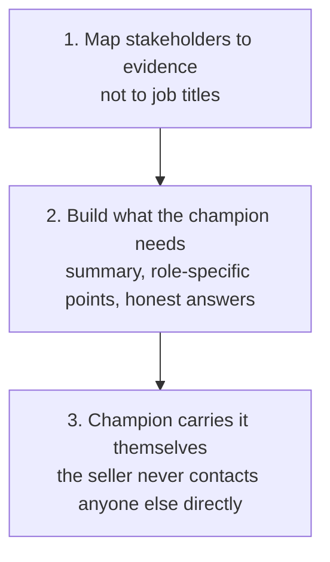

# Champion Enablement

Help an internal champion carry a well-evidenced case to other stakeholders, without assuming what they care about from their job title, and without the seller contacting anyone beyond the champion directly.

## 👀 At a Glance

| | |
| --- | --- |
| **Use this when** | A champion has agreed to present or forward your case internally, to a further stakeholder who was not on any call |
| **What you need** | The evidence already established (the call record, a business case if one exists), who the champion is actually presenting to, and anything genuinely known about that person's concerns |
| **What you get** | A decision summary the champion can speak from, role-specific evidence per stakeholder, honest answers to likely questions, and an internal note the champion can send in their own name |
| **Your responsibility** | Confirm every claim is one the champion is actually prepared to stand behind, and never let an outstanding item read as settled |

## 🔄 How It Works

## 🚀 Start Here

- [Use the Champion Enablement prompt](../templates/champion-enablement-prompt.md)
- [See the fictional Hartwell scenario](../examples/hartwell-champion-enablement-input.md)
- [See the completed output](../examples/hartwell-champion-enablement-output.md)
- [Read the honest review](../evaluations/hartwell-champion-enablement-review.md)
- [Use with AI: the champion-enablement skill](../.agents/skills/champion-enablement/SKILL.md)

<strong>See exactly what it produces</strong>

1. A decision summary the champion can speak from, not a document to hand over unread
2. Role-specific evidence, one short section per further stakeholder, using only what is actually known about their concern
3. Likely questions and an honest answer to each, including "not yet confirmed" where that is genuinely true
4. An internal note, if needed, drafted for the champion to send in their own name
5. What still needs a person: confirming every claim, and deciding what to actually present or send

<strong>See the full method</strong>

### 1. Map Stakeholders to Evidence, Not to Titles

For each further stakeholder, record only what is actually known about their concern. A job title suggests an area of responsibility; it does not confirm a priority. Where nothing is actually known beyond the title, say so rather than inventing a plausible-sounding concern to fill the gap.

### 2. Build the Enablement Package

Put together a decision summary for the champion to speak from, role-specific evidence per stakeholder, honest answers to the questions most likely to come up, and an internal note if the situation calls for one, addressed as the champion sending it, never the seller.

### 3. Keep the Seller Out of the Room

Everything produced here is for the champion to use, present or send themselves. The seller does not contact a further stakeholder directly, and nothing here should read as though it were written to be sent by anyone other than the champion.

## ✅ Check Before You Use It

- Is every stakeholder's concern grounded in something actually known, not assumed from their job title?
- Does the decision summary work as something the champion could actually speak from, not just a document?
- Is every outstanding or unconfirmed item still marked as outstanding, not quietly resolved to look more finished?
- Is any internal note addressed as though the champion is sending it, never the seller?
- Would anything here require contacting a stakeholder directly, rather than working through the champion?

## 📏 What to Measure

- How often a stakeholder's actual concern, once revealed, differs from what their job title alone would have suggested
- Whether the champion reports feeling genuinely prepared for the questions that came up
- How often an outstanding item was correctly left outstanding rather than assumed resolved
- Whether the case actually progresses after the champion presents it, and what changed as a result
