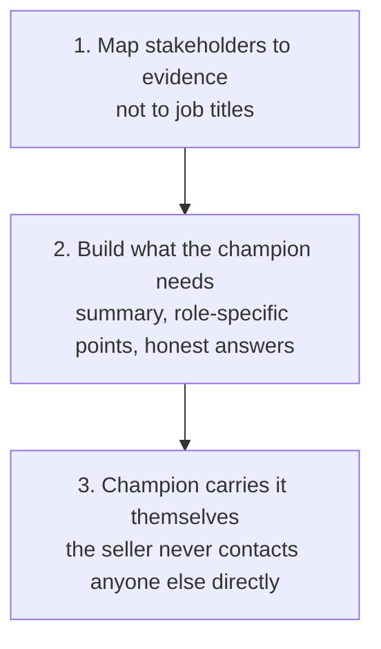

# Champion Enablement

Help an internal champion make a case, backed by evidence, to other stakeholders. Don't guess what they care about from their job title, and don't contact anyone but the champion yourself.

## 👀 At a Glance

| | |
| --- | --- |
| **Use this when** | A champion has agreed to present or forward your case internally, to another stakeholder who wasn't on any call |
| **What you need** | What you already know for sure (the call record, and a business case if there is one), who the champion is presenting to, and anything you know about what that person cares about |
| **What you get** | A decision summary the champion can speak from, evidence for each stakeholder matched to their role, honest answers to likely questions, and an internal note the champion can send in their own name |
| **Your responsibility** | Confirm the champion is prepared to stand behind every claim, and never let an open item read as settled |

## 🔄 How It Works

```mermaid
flowchart TB
    A["1. Map stakeholders to evidence<br/>not to job titles"]
    B["2. Build what the champion needs<br/>summary, role-specific points, honest answers"]
    C["3. Champion carries it themselves<br/>the seller never contacts anyone else directly"]
    A --> B --> C
```

## 🚀 Start Here

- [Use the Champion Enablement prompt](../templates/champion-enablement-prompt.md)
- [See the fictional Hartwell scenario](../examples/hartwell-champion-enablement-input.md)
- [See the completed output](../examples/hartwell-champion-enablement-output.md)
- [Read the honest review](../evaluations/hartwell-champion-enablement-review.md)
- [Use with AI: the champion-enablement skill](../.agents/skills/champion-enablement/SKILL.md)

<strong>See exactly what it produces</strong>

1. A decision summary the champion can speak from, not a document to hand over unread
2. Evidence matched to each stakeholder's role, one short section each, using only what you know about their concern
3. Likely questions and an honest answer to each, including "not yet confirmed" where that is true
4. An internal note, if needed, drafted for the champion to send in their own name
5. What still needs a person: confirming every claim, and deciding what to present or send

<strong>See the full method</strong>

### 1. Map Stakeholders to Evidence, Not to Titles

For each other stakeholder, record only what you know about their concern. A job title suggests what someone is responsible for. It doesn't tell you their priority. Where you know nothing beyond the title, say so rather than inventing a plausible concern to fill the gap.

### 2. Build the Enablement Package

Put together a decision summary for the champion to speak from, evidence for each stakeholder matched to their role, and honest answers to the questions most likely to come up. Add an internal note if the situation calls for one, written as the champion sending it, never the seller.

### 3. Keep the Seller Out of the Room

Everything here is for the champion to use, present or send themselves. The seller doesn't contact another stakeholder directly, and nothing here should read as though anyone but the champion wrote it to send.

## ✅ Check Before You Use It

- Does each stakeholder's concern rest on something you know, not a guess from their job title?
- Could the champion speak from the decision summary, rather than just hand it over?
- Is every open or unconfirmed item still marked as open, not quietly settled to make things look further along?
- Is any internal note written as though the champion is sending it, never the seller?
- Would anything here mean contacting a stakeholder directly, rather than working through the champion?

## 📏 What to Measure

- How often a stakeholder's real concern, once you learn it, differs from what their job title alone suggested
- Whether the champion says they felt prepared for the questions that came up
- How often an open item was rightly left open rather than assumed settled
- Whether the case moves forward after the champion presents it, and what changed as a result

## 💬 Tried It?

[Share structured workflow feedback](https://github.com/shaunmarsden/practical-ai-sales-workflows/issues/new?template=workflow-feedback.md) about what worked, where you got stuck and what you would change. Please do not include customer, employer or confidential information.
