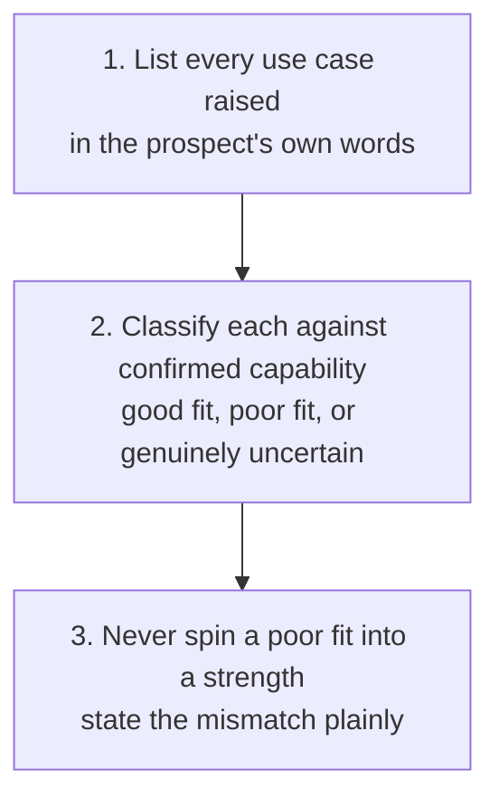

# Fit and Limitations Review

Work out where an offer is a good fit, a poor fit, or still uncertain for a specific prospect, before building a business case around a use case that was never actually going to work.

## 👀 At a Glance

| | |
| --- | --- |
| **Use this when** | A discovery call has surfaced more than one team, role or use case, and it matters which parts genuinely fit before you commit to building a case around them |
| **What you need** | Every use case the prospect actually described, and confirmed product capability, not what seems like it should probably work |
| **What you get** | Each use case classified as a good fit, a poor fit, or genuinely uncertain, with the reasoning stated plainly rather than softened |
| **Your responsibility** | Decide what to actually build a case around, what to disqualify, and what to tell the prospect |

## 🔄 How It Works

## 🚀 Start Here

- [Use the Fit and Limitations Review prompt](../templates/fit-and-limitations-review-prompt.md)
- [See the fictional Kellow scenario](../examples/kellow-fit-review-input.md)
- [See the completed review](../examples/kellow-fit-review-output.md)
- [Read the honest review](../evaluations/kellow-fit-review-review.md)
- [Use with AI: the fit-and-limitations-review skill](../.agents/skills/fit-and-limitations-review/SKILL.md)

<strong>See exactly what it produces</strong>

1. Every use case the prospect raised, listed separately, not blended into one overall impression
2. A classification for each: good fit, poor fit, or uncertain, with the specific reason
3. Poor fits stated as real mismatches, never reframed as hidden advantages
4. Uncertain cases named honestly as genuinely undecided, not a soft version of poor fit
5. What still needs a person: deciding what to build a case around, what to disqualify, and what to tell the prospect

<strong>See the full method</strong>

### 1. List Every Use Case Raised

Work from what the prospect actually described, team by team or role by role, in their own words. Do not blend several different use cases into one overall fit judgement.

### 2. Classify Against Confirmed Capability

For each use case, check it against what the offer is actually confirmed to do, not against a reasonable-sounding extension of that capability. A good fit is a direct match. A poor fit is a specific, named mismatch. Uncertain means there is not yet enough evidence, and stays a real category rather than a euphemism for poor fit.

### 3. Never Spin a Limitation Into a Strength

The most common failure here is not missing a poor fit outright; it is describing one so favourably that it reads as a bonus. State the actual mismatch plainly. A team's shared, ownerless structure is a genuine integration problem to solve, not evidence that the offer's adoption will spread itself.

## ✅ Check Before You Use It

- Is every use case classified separately, rather than one overall impression standing in for all of them?
- Does every good fit trace to a direct match with confirmed capability, not an assumed one?
- Is every poor fit stated as a real, specific mismatch, not reframed as a hidden advantage?
- Is "uncertain" used honestly, for cases where the evidence genuinely does not exist yet, not as a softer way of saying no?
- Would anything here need contacting the prospect to confirm capability that was actually just assumed?

## 📏 What to Measure

- How often a use case classified as a good fit turns out, once built into a business case, to actually be genuinely solid
- How often a poor fit correctly disqualified here would have caused a problem later if it had been built into a case instead
- How often "uncertain" resolves to good fit or poor fit once more evidence exists, and how long that takes
- Whether a prospect ever pushes back on a classification, and what that reveals about the evidence it was based on
