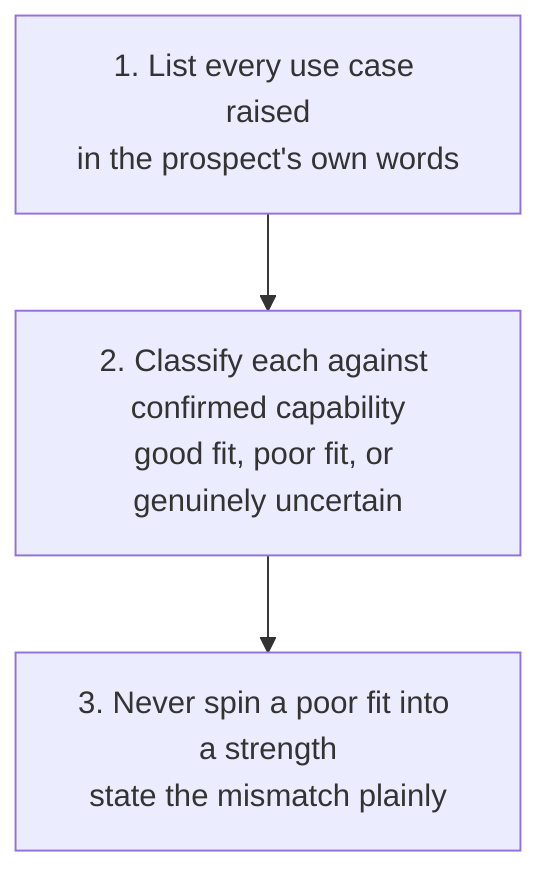

# Fit and Limitations Review

Work out where your offer is a good fit, a poor fit or still uncertain for one prospect, before you build a business case around a use case that was never going to work.

## 👀 At a Glance

| | |
| --- | --- |
| **Use this when** | A discovery call has turned up more than one team, role or use case, and you need to know which parts fit before you build a case around them |
| **What you need** | Every use case the prospect described, and what the product is confirmed to do, not what you think it probably could |
| **What you get** | Each use case marked as a good fit, a poor fit or uncertain, with the reasoning stated plainly, not softened |
| **Your responsibility** | Decide what to build a case around, what to disqualify, and what to tell the prospect |

## 🔄 How It Works

```mermaid
flowchart TB
    A["1. List every use case raised<br/>in the prospect's own words"]
    B["2. Classify each against confirmed capability<br/>good fit, poor fit, or genuinely uncertain"]
    C["3. Never spin a poor fit into a strength<br/>state the mismatch plainly"]
    A --> B --> C
```

## 🚀 Start Here

- [Use the Fit and Limitations Review prompt](../templates/fit-and-limitations-review-prompt.md)
- [See the fictional Kellow scenario](../examples/kellow-fit-review-input.md)
- [See the completed review](../examples/kellow-fit-review-output.md)
- [Read the honest review](../evaluations/kellow-fit-review-review.md)
- [See a harder test: the same word means two different things](../examples/aldermere-fit-review-output.md), [and its review](../evaluations/aldermere-fit-review-review.md)
- [Use with AI: the fit-and-limitations-review skill](../.agents/skills/fit-and-limitations-review/SKILL.md)

<strong>See exactly what it produces</strong>

1. Every use case the prospect raised, listed separately, not blended into one overall impression
2. A verdict for each: good fit, poor fit or uncertain, with the specific reason
3. Poor fits stated as real mismatches, never turned into hidden advantages
4. Uncertain cases named honestly as undecided, not a soft version of a poor fit
5. What still needs a person: deciding what to build a case around, what to disqualify, and what to tell the prospect

<strong>See the full method</strong>

### 1. List Every Use Case Raised

Work from what the prospect described, team by team or role by role, in their own words. Don't blend several use cases into one overall verdict.

### 2. Classify Against Confirmed Capability

Check each use case against what the offer is confirmed to do, not against a plausible stretch of it. A good fit is a direct match. A poor fit is a specific, named mismatch. Uncertain means there isn't enough evidence yet. It stays a real category, not a polite word for a poor fit.

Watch for one version of this in particular. A stakeholder's general description of a role, such as calling it clinical or interpretive, sometimes clashes with the specific, structured tasks described for that same role. Name that clash directly. Don't quietly pick whichever version makes the verdict easier, whether that's the tasks that support a good fit or the description that supports the objection.

### 3. Never Spin a Limitation Into a Strength

The most common failure here isn't missing a poor fit outright. It's describing one so kindly that it reads as a bonus. State the mismatch plainly. A team with a shared structure and no owner has a real integration problem to solve. That isn't evidence the offer will spread on its own.

## ✅ Check Before You Use It

- Is every use case judged separately, rather than one overall impression standing in for all of them?
- Does every good fit match something the product is confirmed to do, not something assumed?
- Is every poor fit stated as a real, specific mismatch, not turned into a hidden advantage?
- Is "uncertain" used honestly, for cases where the evidence doesn't exist yet, not as a softer way of saying no?
- If a stakeholder's general description of a role clashes with the specific tasks described for it, is that clash named rather than quietly settled one way?
- Would anything here need you to contact the prospect to confirm a capability you'd only assumed?

## 📏 What to Measure

- How often a use case marked as a good fit turns out to be solid once it's built into a business case
- How often a poor fit rightly disqualified here would have caused a problem later if it had gone into a case instead
- How often "uncertain" turns into a good fit or a poor fit once there's more evidence, and how long that takes
- Whether a prospect ever pushes back on a verdict, and what that shows about the evidence behind it

## 💬 Tried It?

[Share structured workflow feedback](https://github.com/shaunmarsden/practical-ai-sales-workflows/issues/new?template=workflow-feedback.md) about what worked, where you got stuck and what you would change. Please do not include customer, employer or confidential information.
