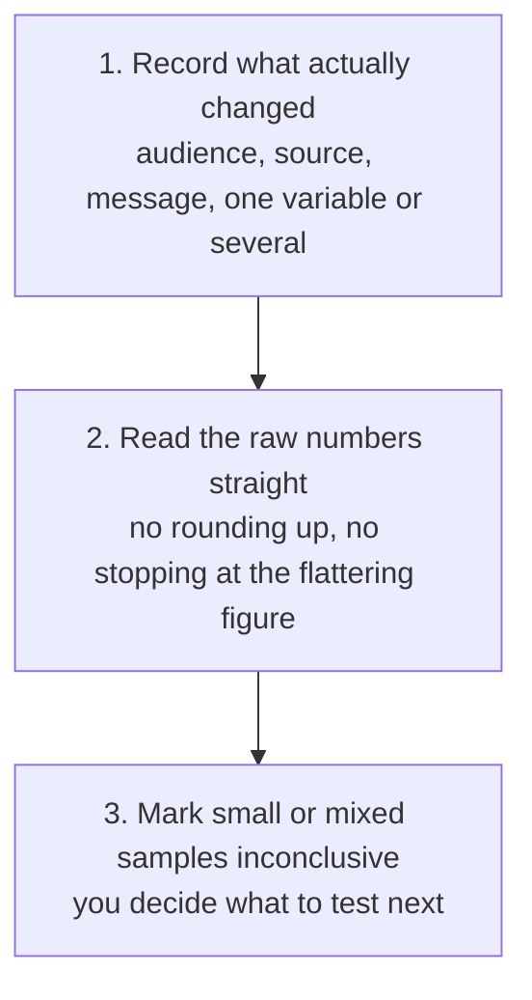

# Outbound Campaign Learning Review

Check what an outbound campaign's actual numbers support, rather than trusting the impression a good-looking reply rate leaves behind.

## 👀 At a Glance

| | |
| --- | --- |
| **Use this when** | An outbound campaign has run its course and you want an honest read of what changed and why, before running the next one |
| **What you need** | The audience, the signal or list source used, the message and offer, what changed since the last comparable campaign, and the raw numbers |
| **What you get** | A read of what the numbers actually support, whether the comparison is genuinely conclusive, and what to keep, stop, or test next |
| **Your responsibility** | Decide what to actually keep, stop, or test next; this proposes a read of the numbers, not the decision |

## 🔄 How It Works

## 🚀 Start Here

- [Use the Outbound Campaign Learning Review prompt](../templates/outbound-campaign-learning-review-prompt.md)
- [See the fictional Cedarwell-style campaign data](../examples/cedarwell-campaign-review-input.md)
- [See the completed review](../examples/cedarwell-campaign-review-output.md)
- [Read the honest review](../evaluations/cedarwell-campaign-review-eval.md)

<strong>See exactly what it produces</strong>

1. The audience, signal or list source, offer, message and call to action, recorded plainly rather than tidied up
2. What actually changed since the last comparable campaign, one variable or several, stated honestly
3. The raw numbers: delivered, replies, positive replies, meetings booked and attended, qualified opportunities
4. What makes the comparison uncertain: a small sample, more than one variable changed at once, a benchmark from somewhere else being used as if it were this campaign's own
5. What to keep, stop, or test next, based only on what the numbers actually support

<strong>See the full method</strong>

### 1. Record What Actually Changed

Before reading any numbers, state the audience, the signal or list source, the offer, the message and the call to action, exactly as they were, not a tidied-up version. Name every variable that changed since the last comparable campaign. If more than one changed at once, say so plainly rather than picking one to credit for whatever the numbers show.

### 2. Read the Raw Numbers Straight

Use only the numbers actually available: messages delivered, total replies, positive replies, meetings booked, meetings attended, and qualified opportunities that came from them. Reply rate alone is not the result. If reply rate looks good but meetings or qualified opportunities do not follow, say so rather than stopping the review at the more flattering number.

### 3. Mark Uncertainty Honestly

A small sample, a mixed audience, more than one variable changed at once, or a benchmark from somewhere else being treated as this campaign's own baseline all make a comparison less conclusive than it might look. Mark it as inconclusive rather than reading a trend into it. State what to keep, stop, or test next based only on what the numbers actually support, leaving the decision itself to a person.

## ✅ Check Before You Use It

- Is every variable that changed since the last comparable campaign named, rather than one credited when several changed at once?
- Does the review use only the raw numbers given, without implying a conclusion the sample size cannot actually support?
- Is a small or mixed sample marked genuinely inconclusive, not quietly treated as a result?
- If reply rate looks good but meetings or qualified opportunities do not follow, is that said plainly rather than left out?
- Is the actual next-test decision, what to keep, stop, or run next, left for you to decide?

## 📏 What to Measure

- Whether a genuine like-for-like test, one variable changed, a large enough sample, ever gets run as a direct result of this review's "test next" suggestion
- How often a flattering reply rate on a small sample turns out, once the sample grows, to have been noise rather than a real difference
- Whether this structure actually led to a better next test, or just produced a tidy-looking report; log this honestly in the [time and quality log](../templates/time-and-quality-log.md)
## 💬 Tried It?

[Share structured workflow feedback](https://github.com/shaunmarsden/practical-ai-sales-workflows/issues/new?template=workflow-feedback.md) about what worked, where you got stuck and what you would change. Please do not include customer, employer or confidential information.
