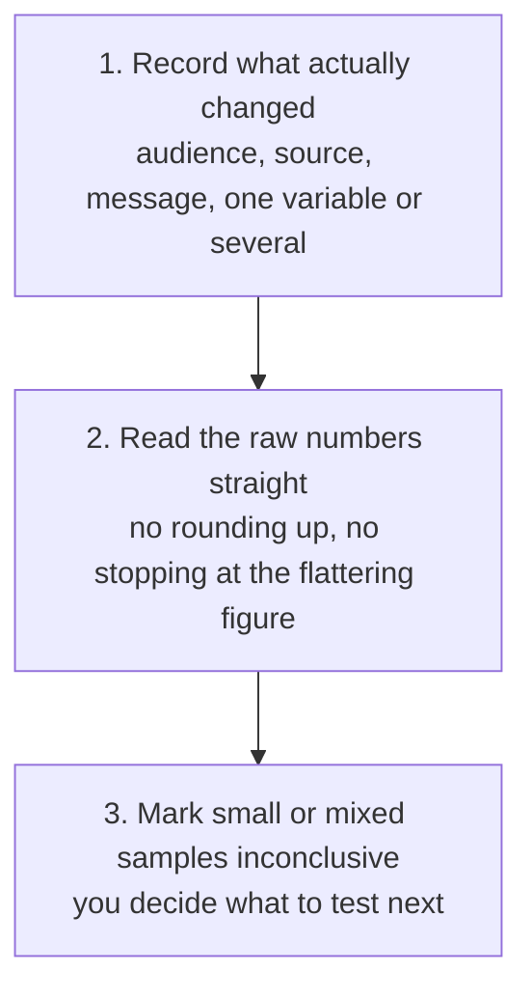

# Outbound Campaign Learning Review

Check what a finished outbound campaign's numbers support, rather than trusting the impression a good reply rate leaves.

## 👀 At a Glance

| | |
| --- | --- |
| **Use this when** | An outbound campaign has finished and you want an honest view of what changed and why, before running the next one |
| **What you need** | The audience, the signal or list source used, the message and offer, what changed since the last comparable campaign, and the raw numbers |
| **What you get** | What the numbers support, whether the comparison is conclusive, and what to keep, stop or test next |
| **Your responsibility** | Decide what to keep, stop or test next. This offers a reading of the numbers, not the decision |

## 🔄 How It Works

```mermaid
flowchart TB
    A["1. Record what actually changed<br/>audience, source, message, one variable or several"]
    B["2. Read the raw numbers straight<br/>no rounding up, no stopping at the flattering figure"]
    C["3. Mark small or mixed samples inconclusive<br/>you decide what to test next"]
    A --> B --> C
```

## 🚀 Start Here

- [Use the Outbound Campaign Learning Review prompt](../templates/outbound-campaign-learning-review-prompt.md)
- [See the fictional Cedarwell-style campaign data](../examples/cedarwell-campaign-review-input.md)
- [See the completed review](../examples/cedarwell-campaign-review-output.md)
- [Read the honest review](../evaluations/cedarwell-campaign-review-eval.md)

<strong>See exactly what it produces</strong>

1. The audience, signal or list source, offer, message and call to action, recorded as they were, not tidied up
2. What changed since the last comparable campaign, whether one thing or several
3. The raw numbers: delivered, replies, positive replies, meetings booked and attended, qualified opportunities
4. What makes the comparison uncertain: a small sample, more than one thing changed at once, or a benchmark from somewhere else used as if it were this campaign's own
5. What to keep, stop or test next, based only on what the numbers support

<strong>See the full method</strong>

### 1. Record What Actually Changed

Before reading any numbers, write down the audience, the signal or list source, the offer, the message and the call to action exactly as they were, not a tidied-up version. Name everything that changed since the last comparable campaign. If more than one thing changed at once, say so plainly rather than picking one to credit for whatever the numbers show.

### 2. Read the Raw Numbers Straight

Use only the numbers you have: messages delivered, total replies, positive replies, meetings booked, meetings attended, and qualified opportunities that came from them. Reply rate alone isn't the result. If the reply rate looks good but meetings or qualified opportunities don't follow, say so rather than stopping at the more flattering number.

### 3. Mark Uncertainty Honestly

A small sample, a mixed audience, more than one thing changed at once, or a benchmark from somewhere else treated as this campaign's own starting point all make a comparison less conclusive than it looks. Mark it as inconclusive rather than reading a trend into it. Say what to keep, stop or test next based only on what the numbers support, and leave the decision to a person.

## ✅ Check Before You Use It

- Is everything that changed since the last comparable campaign named, rather than one change credited when several happened at once?
- Does the review use only the raw numbers given, without implying a conclusion the sample size can't support?
- Is a small or mixed sample marked inconclusive, not quietly treated as a result?
- If the reply rate looks good but meetings or qualified opportunities don't follow, is that said plainly rather than left out?
- Is the decision on what to keep, stop or run next left for you?

## 📏 What to Measure

- Whether a fair like-for-like test (one thing changed, a large enough sample) ever gets run because of this review's "test next" suggestion
- How often a flattering reply rate on a small sample turns out, once the sample grows, to have been noise rather than a real difference
- Whether this structure led to a better next test, or just a tidy-looking report. Log this honestly in the [time and quality log](../templates/time-and-quality-log.md)

## 💬 Tried It?

[Share structured workflow feedback](https://github.com/shaunmarsden/practical-ai-sales-workflows/issues/new?template=workflow-feedback.md) about what worked, where you got stuck and what you would change. Please do not include customer, employer or confidential information.
