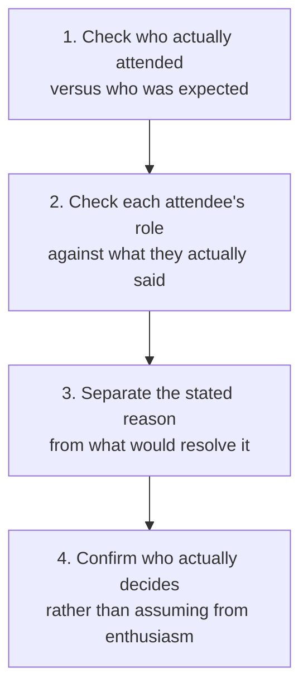

# Real Blocker Diagnosis

Check whether the person on a sales call is actually the decision-maker, and whether their stated objection is the real one or standing in for something unstated, using only what was actually said.

## 👀 At a Glance

| | |
| --- | --- |
| **Use this when** | A call had an unplanned attendee, or someone's role and their stated concern do not obviously match |
| **What you need** | Who was expected on the call, who actually attended, each attendee's role where known, what each of them actually said, and anything already confirmed about who holds sign-off authority |
| **What you get** | An attendee check, a role-versus-concern check, the stated reason kept separate from what would actually resolve it, an honest read on who actually decides, and a specific next question |
| **Your responsibility** | Decide whether and how to raise anything flagged, and confirm authority yourself before treating a deal as further along than it is |

## 🔄 How It Works

## 🚀 Start Here

- [Use the Real Blocker Diagnosis prompt](../templates/real-blocker-diagnosis-prompt.md)
- [See the fictional Rowcastle scenario](../examples/rowcastle-real-blocker-input.md)
- [See the completed diagnosis](../examples/rowcastle-real-blocker-output.md)
- [Read the honest review](../evaluations/rowcastle-real-blocker-review.md)
- [See a harder test: enrolling by stealth](../examples/oakriven-real-blocker-output.md), [and its review](../evaluations/oakriven-real-blocker-review.md)
- [Use with AI: the real-blocker-diagnosis skill](../.agents/skills/real-blocker-diagnosis/SKILL.md)

<strong>See exactly what it produces</strong>

1. Who was actually on the call, with any unplanned or last-minute attendee named explicitly
2. Each attendee's role checked against what they actually said, with any mismatch, or any concern that shifted partway through, named plainly
3. Each stated concern kept separate from what would actually resolve it, with no invented motive behind it
4. An honest read on who actually holds sign-off authority, not an assumption from enthusiasm or being the point of contact
5. A specific next question or person to identify, not a generic follow-up

<strong>See the full method</strong>

### 1. Check Who Actually Attended

Compare who was expected with who actually joined. Name any unplanned or last-minute attendee explicitly, even before anything they said suggests it will matter.

### 2. Check Role Against Stated Concern

A title suggests an area of responsibility; it does not confirm what a specific person is actually thinking about today. Flag any mismatch plainly. If someone's concern shifted partway through the call, once the first was resolved, say which one stayed open rather than treating the exchange as fully closed.

### 3. Separate the Stated Reason From the Checkable Fact

State each concern exactly as given, then note, separately, what would actually resolve it. An unplanned join or a title mismatch is a reason to ask a further question, never a reason to assume the real answer is already known.

### 4. Confirm Who Actually Decides

Do not treat enthusiasm, or being the point of contact, as confirmation of authority. If nobody has explicitly confirmed holding it, say so, and name anyone else mentioned as a further approver, without assuming they are definitely the real blocker.

## ✅ Check Before You Use It

- Is every flagged mismatch actually supported by something someone said or did, not just speculation?
- If a concern shifted partway through the call, is the one that stayed open still being treated as open, not quietly folded into the one that got answered?
- Is anyone's authority being assumed from enthusiasm or being the point of contact, rather than from an explicit confirmation?
- Has a name someone mentioned once, under a direct question, been treated as confirmed rather than as a lead worth checking?
- Would raising any of this require contacting someone not already on the thread?

## 📏 What to Measure

- How often an unplanned attendee's stated concern turns out to be the one that actually mattered
- How often a role-versus-concern mismatch, once checked, changes what happens next
- How often "who actually decides" turns out to be someone other than the enthusiastic point of contact
- Whether the specific next question actually gets asked, and what it reveals

## 💬 Tried It?

[Share structured workflow feedback](https://github.com/shaunmarsden/practical-ai-sales-workflows/issues/new?template=workflow-feedback.md) about what worked, where you got stuck and what you would change. Please do not include customer, employer or confidential information.
