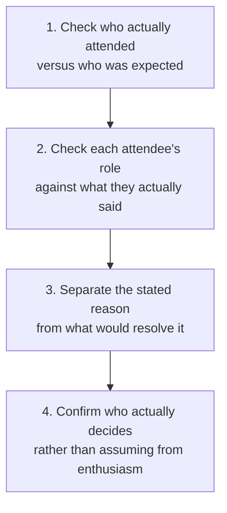

# Real Blocker Diagnosis

Check whether the person on a sales call is the decision-maker, and whether their objection is the real one or a cover for something unsaid. Use only what was said.

## 👀 At a Glance

| | |
| --- | --- |
| **Use this when** | A call had someone you didn't expect, or someone's role and their concern don't obviously match |
| **What you need** | Who you expected on the call, who came, each attendee's role where known, what each of them said, and anything already confirmed about who holds sign-off authority |
| **What you get** | A check of who attended, a check of each role against each concern, the stated reason kept apart from what would resolve it, an honest view of who decides, and a specific next question |
| **Your responsibility** | Decide whether and how to raise anything flagged, and confirm authority yourself before treating a deal as further along than it is |

## 🔄 How It Works

```mermaid
flowchart TB
    A["1. Check who actually attended<br/>versus who was expected"]
    B["2. Check each attendee's role<br/>against what they actually said"]
    C["3. Separate the stated reason<br/>from what would resolve it"]
    D["4. Confirm who actually decides<br/>rather than assuming from enthusiasm"]
    A --> B --> C --> D
```

## 🚀 Start Here

- [Use the Real Blocker Diagnosis prompt](../templates/real-blocker-diagnosis-prompt.md)
- [See the fictional Rowcastle scenario](../examples/rowcastle-real-blocker-input.md)
- [See the completed diagnosis](../examples/rowcastle-real-blocker-output.md)
- [Read the honest review](../evaluations/rowcastle-real-blocker-review.md)
- [See a harder test: enrolling by stealth](../examples/oakriven-real-blocker-output.md), [and its review](../evaluations/oakriven-real-blocker-review.md)
- [Use with AI: the real-blocker-diagnosis skill](../.agents/skills/real-blocker-diagnosis/SKILL.md)

<strong>See exactly what it produces</strong>

1. Who was on the call, with anyone unexpected or last-minute named
2. Each attendee's role checked against what they said, with any mismatch, or any concern that shifted partway through, named plainly
3. Each stated concern kept apart from what would resolve it, with no invented motive behind it
4. An honest view of who holds sign-off authority, not an assumption based on someone being keen or being the main contact
5. A specific next question or person to identify, not a generic follow-up

<strong>See the full method</strong>

### 1. Check Who Actually Attended

Compare who you expected with who joined. Name anyone unexpected or last-minute, even before anything they said suggests it will matter.

### 2. Check Role Against Stated Concern

A title suggests what someone is responsible for. It doesn't tell you what that person is thinking about today. Flag any mismatch plainly. If someone's concern shifted partway through the call, once the first was answered, say which one stayed open rather than treating the exchange as closed.

### 3. Separate the Stated Reason From the Checkable Fact

State each concern exactly as given. Then, separately, note what would resolve it. Someone joining unexpectedly, or a title that doesn't match the concern, is a reason to ask another question. It's never a reason to assume you already know the real answer.

### 4. Confirm Who Actually Decides

Don't take enthusiasm, or being the main contact, as proof of authority. If nobody has confirmed they hold it, say so. Name anyone else mentioned as a further approver, without assuming they must be the real blocker.

Recommend the next question rather than sending it. Never contact anyone who isn't already on the thread to test any of this, including a further approver whose name has just come up.

## ✅ Check Before You Use It

- Is every flagged mismatch supported by something someone said or did, not speculation?
- If a concern shifted partway through the call, is the one that stayed open still treated as open, not quietly folded into the one that got answered?
- Is anyone's authority assumed because they're keen or because they're the main contact, rather than because they confirmed it?
- Has a name someone mentioned once, in answer to a direct question, been treated as confirmed rather than as a lead worth checking?
- Would raising any of this mean contacting someone not already on the thread?

## 📏 What to Measure

- How often the concern raised by someone you didn't expect turns out to be the one that mattered
- How often a mismatch between role and concern, once checked, changes what happens next
- How often "who actually decides" turns out to be someone other than the keen main contact
- Whether the specific next question gets asked, and what it shows

## 💬 Tried It?

[Share structured workflow feedback](https://github.com/shaunmarsden/practical-ai-sales-workflows/issues/new?template=workflow-feedback.md) about what worked, where you got stuck and what you would change. Please do not include customer, employer or confidential information.
